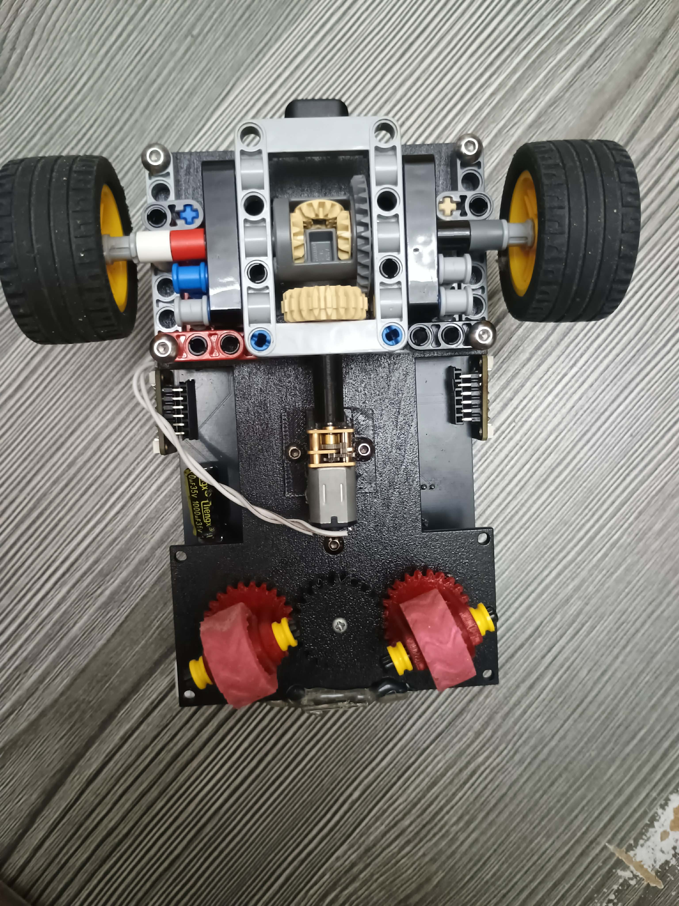
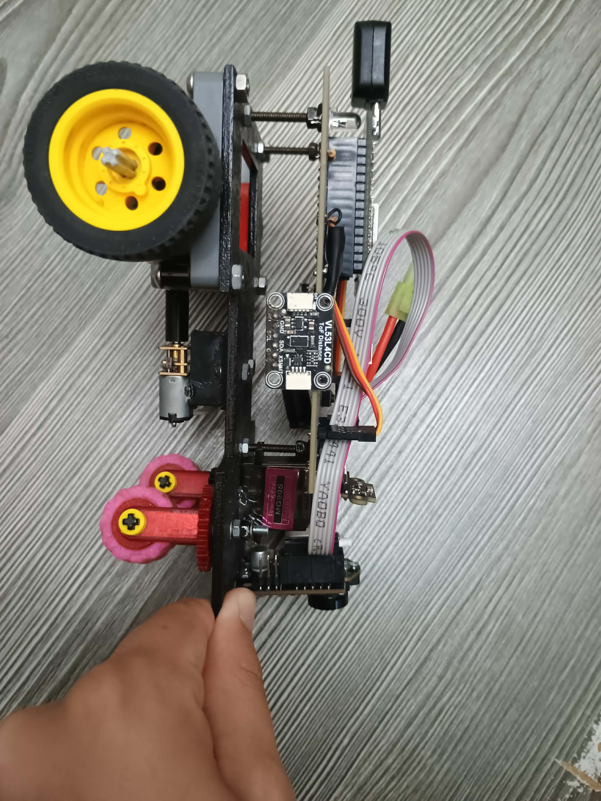
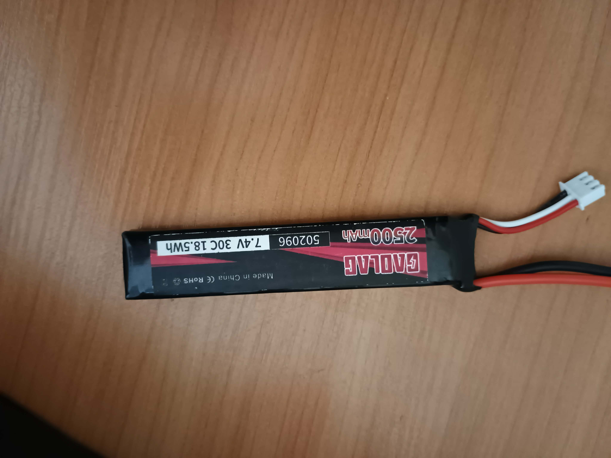
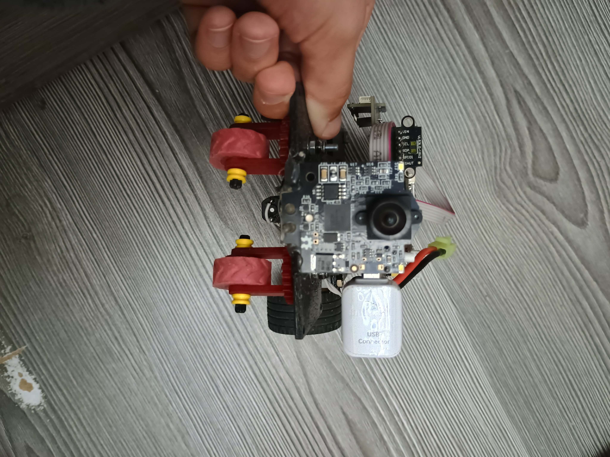

# KU STEAM Pinkies - WRO 2026 Future Engineers

We are KU STEAM Pinkies, a WRO Future Engineers team. We will compete at the Open Championship in Croatia. This README documents our robot's mechanical design, electronics, software, and the decisions behind it. We will continue expanding the testing section as measurements are finalized.

Last year, we competed at the Open Championship in Slovenia. Our main lesson was simple: keep the robot small, simple, and easy to control. We followed that idea this year and kept the design simpler. In our case, David beats Goliath by being smaller and less complicated.

## Table of contents

- [1. Review and changes](#1-review-and-changes)
- [2. Mechanical design](#2-mechanical-design)
  - [2.1 Chassis](#21-chassis)
  - [2.2 Drive motor](#22-drive-motor)
  - [2.3 Steering servo](#23-steering-servo)
  - [2.4 Differential and wheels](#24-differential-and-wheels)
- [3. Engineering / Design](#3-engineering--design)
  - [3.1 Mechanical engineering](#31-mechanical-engineering)
  - [3.2 Drive transmission](#32-drive-transmission)
  - [3.3 Differential comparison](#33-differential-comparison)
  - [3.4 Drivebase and mounting](#34-drivebase-and-mounting)
  - [3.5 Steering and wheels](#35-steering-and-wheels)
  - [3.6 System simplification and engineering decisions](#36-system-simplification-and-engineering-decisions)
- [4. Power and sense management](#4-power-and-sense-management)
  - [4.1 Battery and power distribution](#41-battery-and-power-distribution)
  - [4.2 Main electronics](#42-main-electronics)
  - [4.3 Sensors and obstacle recognition](#43-sensors-and-obstacle-recognition)
  - [4.4 Custom PCB and wiring layout](#44-custom-pcb-and-wiring-layout)
  - [4.5 ESP32 pinout and control links](#45-esp32-pinout-and-control-links)
  - [4.6 Button and LEDs](#46-button-and-leds)
  - [4.7 Firmware reproducibility](#47-firmware-reproducibility)
- [5. Obstacle management and control](#5-obstacle-management-and-control)
  - [5.1 Software structure](#51-software-structure)
  - [5.2 Start and initialization](#52-start-and-initialization)
  - [5.3 Heading control](#53-heading-control)
  - [5.4 Corner detection and driving direction](#54-corner-detection-and-driving-direction)
  - [5.5 Wall-distance correction](#55-wall-distance-correction)
  - [5.6 Pixy2 obstacle detection](#56-pixy2-obstacle-detection)
  - [5.7 Obstacle avoidance steering](#57-obstacle-avoidance-steering)
  - [5.8 Steering controller](#58-steering-controller)
  - [5.9 Lap completion and stop logic](#59-lap-completion-and-stop-logic)
- [6. Testing and iteration](#6-testing-and-iteration)

## 1. Review and changes

Before building this robot, we had a larger car with a more complicated rack-and-gearbox layout. It helped us test ideas, but it took more work to turn and tune. The extra parts also made its behavior inconsistent from one run to the next and made everything harder to fit together.

That experience shaped this design. We made the frame smaller, kept the drivetrain easy to trace, and gave each part a clear job. The steering servo no longer carries loads from parts we do not need. This version uses a smaller frame and a simpler drive path.

The same simplification principle was also applied to the electronics and software. The previous architecture used a Raspberry Pi between the camera and the main controller. In the current robot, image processing is handled by Pixy2 and the driving logic runs directly on the ESP32. This makes both the software and hardware easier to manage and removes the larger communication delay of the previous camera -> Raspberry Pi -> ESP32 chain.

We also moved from a prototyping board to a custom PCB after the hardware design had become stable. Once we were confident that the main electronics no longer needed frequent rewiring, a custom PCB allowed us to reduce the space used by electronics, remove most loose wiring, and make assembly more convenient.

Other important changes were moving from a Li-ion battery arrangement to a compact 2S LiPo battery, replacing the MPU6050 with the BNO085 because yaw drift was a problem, and reducing the distance-sensor count from five sensors to three. The reduced sensor layout became possible because the software now uses the IMU yaw directly as the angular reference instead of trying to derive the robot angle mathematically from multiple distance measurements.

<table>
  <tr>
    <td align="center"><strong>Previous robot base and steering</strong></td>
    <td align="center"><strong>Previous robot drivetrain</strong></td>
  </tr>
  <tr>
    <td align="center"></td>
    <td align="center"></td>
  </tr>
  <tr>
    <td align="center">The old base and steering assembly was much larger than the current one.</td>
    <td align="center">The old drivetrain showed us where the mechanical complexity came from.</td>
  </tr>
</table>

## 2. Mechanical design

We built the robot around a compact rear-wheel-drive chassis with front-wheel steering. Its smaller size makes it easier to turn and park, and leaves us with a simpler mechanical layout.

### 2.1 Chassis

The frame is made from wood. The complete drivebase and all of its mounting parts are LEGO. The robot is about 21 cm long, 10 cm wide, and 8 cm high.

| Part | Final choice |
|---|---|
| Drive layout | Rear-wheel drive |
| Drivebase | LEGO drivebase, including its mounts |
| Steering layout | Front-wheel steering |
| Robot size | Approximately 21 x 10 x 8 cm |
| Main structure | Custom wood frame with LEGO drivebase |

### 2.2 Drive motor

We use a small 6 V N20 geared motor rated at 600 rpm. It fits the compact chassis and gives the robot enough speed without making it difficult to control.

The motor shaft goes into a converter. The converter produces an X-shaped LEGO axle, which drives a LEGO gear and then the official LEGO differential used in the drivetrain.

<table>
  <tr>
    <th colspan="2">N20 6 V, 600 rpm geared motor</th>
  </tr>
  <tr>
    <td colspan="2" align="center">
      <br>
      <em>Reference photo. Source: <a href="https://zbotic.in/product/n20-6v-600-rpm-micro-metal-gear-motor/">Zbotic product page</a>.</em>
    </td>
  </tr>
  <tr>
    <th colspan="2">Specifications</th>
  </tr>
  <tr><td>Voltage</td><td>6 V</td></tr>
  <tr><td>Type</td><td>N20 geared DC motor</td></tr>
  <tr><td>Speed</td><td>600 rpm</td></tr>
  <tr><td>Power transfer</td><td>N20 shaft -> converter -> LEGO cross axle -> LEGO gear -> LEGO differential</td></tr>
</table>

### 2.3 Steering servo

For steering, we use an MG90S servo with a small gear mechanism. The direct layout keeps the mechanism compact and gives us a useful steering angle.

We center the servo before fixing the linkage. This helps both front wheels move symmetrically and keeps the robot steadier on straight sections.

<table>
  <tr>
    <th colspan="2">MG90S metal-gear micro servo</th>
  </tr>
  <tr>
    <td colspan="2" align="center">
      <br>
      <em>Reference photo. Source: <a href="https://hitechxyz.in/products/tower-pro-9g-micro-sg90s-180-metal-gear-servo-motor-original-tower-pro">Hi Tech XYZ product page</a>.</em>
    </td>
  </tr>
  <tr>
    <th colspan="2">Specifications</th>
  </tr>
  <tr><td>Servo</td><td>MG90S metal-gear micro servo</td></tr>
  <tr><td>Operating voltage</td><td>4.8 - 6 V</td></tr>
  <tr><td>Control</td><td>PWM</td></tr>
  <tr><td>Use</td><td>Front-wheel steering</td></tr>
</table>

### 2.4 Differential and wheels

The entire drivebase is LEGO: the rear axle, differential, gears, and the mounts that hold the drive system in place. The LEGO gear driven by the cross axle turns the differential, so the inside and outside wheels can rotate at different speeds in a turn.

All four wheels are custom silicone wheels. They give us more grip for driving and steering.

| Part | Final choice |
|---|---|
| Drivebase | LEGO drivebase |
| Drive mounts | LEGO mounting parts |
| Rear axle | Official LEGO mechanical differential |
| Rear wheels | Custom silicone wheels |
| Front wheels | Custom silicone wheels |
| Steering range | About 60 degrees of useful motion |

## 3. Engineering / Design

### 3.1 Mechanical engineering

The whole drivebase, including its mounts, is LEGO. The rear axle, differential, gears, and the pieces that hold them in place all belong to the same system.

The rear wheels drive the robot and the front wheels steer it. Keeping those jobs separate made testing easier.

### 3.2 Drive transmission

The final mechanical transfer is:

```text
N20 shaft -> converter -> X-shaped LEGO axle -> LEGO gear -> LEGO differential
```

The N20 shaft goes into a converter, which gives us an X-shaped LEGO axle. The axle turns a LEGO gear and the gear turns the differential. That is how the motor reaches the driven wheels.

### 3.3 Differential comparison

We compared an earlier metal differential with the LEGO differential. We kept the LEGO version because it fit the simpler layout we chose for the final drivebase.

<table>
  <tr>
    <td align="center"><strong>Earlier metal differential</strong></td>
    <td align="center"><strong>Final LEGO differential</strong></td>
  </tr>
  <tr>
    <td align="center"></td>
    <td align="center"></td>
  </tr>
</table>

### 3.4 Drivebase and mounting

LEGO is used for more than the differential. It makes up the rear axle, the gears, and every mount holding the drivetrain. The drive section is one LEGO system.

The motor sits with its shaft aligned with the converter. The X-shaped LEGO axle carries the rotation through the gear and into the differential.

<table>
  <tr>
    <td align="center"><strong>Final drivebase from above</strong></td>
    <td align="center"><strong>Drivebase and steering from the side</strong></td>
  </tr>
  <tr>
    <td align="center"></td>
    <td align="center"></td>
  </tr>
  <tr>
    <td align="center">The rear axle, gearing, differential and mounts are visible as one compact LEGO drive system.</td>
    <td align="center">Side view showing how the drivebase and front steering fit into the compact chassis.</td>
  </tr>
</table>

### 3.5 Steering and wheels

An MG90S servo moves the front-wheel steering. The front axle is separate from the driven rear axle, so the servo only moves the steering mechanism.

All four wheels use custom silicone wheels. Using the same material at all four corners keeps contact with the track more predictable and gives the front axle the grip it needs when the servo changes direction.

The steering geometry was not kept as a single first attempt. The repository records an earlier steering version and the final CAD geometry used for the current design.

<table>
  <tr>
    <td align="center"><strong>Earlier steering version</strong></td>
    <td align="center"><strong>Final steering geometry</strong></td>
  </tr>
  <tr>
    <td align="center"></td>
    <td align="center"></td>
  </tr>
</table>

| Part | Final choice |
|---|---|
| Frame | Wood, approximately 21 x 10 x 8 cm |
| Drivebase | LEGO rear axle, differential, gears, and all drive mounts |
| Drive motor | 6 V N20 geared motor, 600 rpm |
| Motor transfer | Converter, X-shaped LEGO axle, and LEGO gear |
| Steering | MG90S servo with front-wheel steering |
| Wheels | Custom silicone wheels on all four corners |

### 3.6 System simplification and engineering decisions

A major design goal for the 2026 robot is reducing unnecessary complexity. Several design changes follow the same principle:

| Previous approach | Current approach | Reason for the change |
|---|---|---|
| Camera -> Raspberry Pi -> ESP32 | Pixy2 + ESP32 | Simpler software and hardware architecture and lower communication delay |
| Prototyping/perfboard wiring | Custom PCB | Smaller electronics footprint, fewer loose wires, easier assembly once the hardware design became stable |
| Li-ion battery arrangement | 2S LiPo | More convenient and takes less space in the compact chassis |
| MPU6050 | BNO085 | The previous IMU solution suffered from yaw drift |
| Five distance sensors | Three distance sensors + BNO085 yaw | The robot angle is now obtained directly from IMU yaw, reducing the need to derive orientation mathematically from several distance measurements |
| More complicated previous chassis | Smaller and simpler chassis | Easier packaging, steering, tuning and more repeatable mechanical behaviour |

These changes are related rather than independent. Removing the Raspberry Pi reduced the number of processors and communication stages. The custom PCB then made the smaller electronics layout easier to package. Using BNO085 yaw directly simplified the navigation logic enough to reduce the number of distance sensors. The overall direction of development was therefore to remove components and calculations that were no longer necessary instead of adding more hardware.

## 4. Power and sense management

The robot has one main controller, an `ESP32-WROOM-32`. We do not use a Raspberry Pi. The Pixy2 has its own processor, so it processes the camera image and provides obstacle-recognition information without requiring the previous camera-to-Raspberry-Pi-to-ESP32 processing chain.

The ESP32 handles the low-level and high-level driving control. It reads the IMU and three ToF sensors, controls the drive motor and steering servo, and uses the button and LEDs for state feedback and obstacle-detection debugging.

### 4.1 Battery and power distribution

The robot runs from a 2S LiPo battery. Its label shows `7.4 V`, `2500 mAh`, `18.5 Wh`, and `30C`. We chose the 2S LiPo format because it is convenient and uses less space in the compact robot than the previous battery arrangement.

<table>
  <tr>
    <td align="center"></td>
  </tr>
  <tr>
    <td align="center">The 2S LiPo battery used in the current compact robot.</td>
  </tr>
</table>

Power enters the custom PCB through the connector marked `Power`. The board then distributes it to the motor-driver branch and to the controller and peripheral connections. The drive motor runs through the motor driver, while the ESP32 receives power through a Matek Micro BEC.

We use a [Matek Micro BEC 6S](https://www.rcdalys.lt/detales/0/27234/MATEK-MICRO-BEC-6S-6-30V-5V9V-ADJUSTABLE-3PCS). It accepts a 6-30 V input and has an adjustable 5 V or 9 V output. In this robot, it supplies the ESP32 from the 7.4 V battery. The motor has its own battery-side path through the motor driver.

The PCB puts the power and signal connections in one place. That makes the battery path easier to trace, keeps a common ground, and lets us disconnect individual modules during testing.

### 4.2 Main electronics

| Component | Final choice | Function |
|---|---|---|
| Main controller | `ESP32-WROOM-32` | Reads sensors and runs the driving logic |
| Camera | `Pixy2` | Processes colour-connected components for obstacle recognition |
| IMU | `BNO085` | Measures the robot's yaw and orientation |
| Front distance sensor | `VL53L1X` | Measures the distance ahead of the robot |
| Side distance sensors | `2x VL53L4CD` | Measure the left and right side distances |
| Drive motor driver | [Makeblock MegaPi Encoder DC Motor Driver](https://cpc.farnell.com/makeblock/12040/megapi-encoder-dc-motor-driver/dp/HK01693) | Controls the one rear drive motor |
| Drive motor | `6 V N20, 600 rpm` | Provides power to the rear LEGO drivetrain |
| Steering actuator | `MG90S` servo | Moves the front steering mechanism |
| Battery | `2S LiPo, 7.4 V, 2500 mAh` | Main energy source |
| Voltage regulator | Matek Micro BEC | Provides regulated power for the ESP32 |

### 4.3 Sensors and obstacle recognition

The current sensor layout uses three ToF sensors instead of the five-distance-sensor approach used earlier in development. The software no longer needs several distance measurements to estimate the robot's angular orientation because the BNO085 supplies yaw directly.

The three ToF sensors provide the measurements needed for the current control strategy:

- the front `VL53L1X` checks the space in front of the robot and triggers the corner sequence;
- the left `VL53L4CD` measures the left side distance;
- the right `VL53L4CD` measures the right side distance.

The BNO085 provides the heading reference. Pixy2 provides obstacle position and signature information. This gives the ESP32 three different kinds of information: heading from the IMU, local geometry from the ToF sensors, and obstacle information from the camera.

The ToF sensors share the ESP32 I2C bus. The ESP32 starts them one at a time using separate shutdown lines and then assigns each sensor a different I2C address:

| Sensor | Type | I2C address | ESP32 shutdown pin |
|---|---|---:|---:|
| Front | `VL53L1X` | `0x30` | `GPIO15` |
| Left | `VL53L4CD` | `0x31` | `GPIO5` |
| Right | `VL53L4CD` | `0x32` | `GPIO2` |

This startup sequence keeps the three ToF modules from conflicting on the shared bus.

### 4.4 Custom PCB and wiring layout

The electronics are mounted and connected through a custom PCB measuring approximately `90 x 100 mm`. The board is installed in the robot, not just shown in the schematic.

Earlier development used a prototyping/perfboard-style wiring arrangement. We moved to the custom PCB after the hardware design had become stable enough that frequent rewiring was no longer necessary. The custom board takes less space, is more convenient to assemble, and removes most loose point-to-point wiring.

The PCB has labeled areas and connectors for:

- `Power`: battery input;
- `Camera`: Pixy2 connection;
- `ToF`: the three distance-sensor connections;
- `Servo`: MG90S steering connection;
- `Motor Driver`: Makeblock motor-driver connection;
- `DC-DC Converter`: Matek Micro BEC connection;
- red and green LEDs;
- the push button used during debugging.

The basic electrical path is:

```text
2S LiPo battery, 7.4 V
  -> custom PCB Power input
     -> Makeblock motor driver -> 6 V N20 motor -> LEGO differential
     -> Matek Micro BEC -> ESP32-WROOM-32
     -> PCB peripheral connections -> Pixy2, BNO085, 3x ToF, and MG90S servo
```

The board layout keeps the high-current motor path separate from the controller and sensor connections where possible. All modules use the PCB's common ground reference.

<table>
  <tr>
    <td align="center"><strong>Custom PCB component layout</strong></td>
    <td align="center"><strong>Custom PCB routing view</strong></td>
  </tr>
  <tr>
    <td align="center"></td>
    <td align="center"></td>
  </tr>
</table>

### 4.5 ESP32 pinout and control links

The controller code currently uses these ESP32 connections:

| Function | ESP32 connection |
|---|---:|
| Motor driver direction 1 | `GPIO25` |
| Motor driver direction 2 | `GPIO26` |
| Motor driver PWM / enable | `GPIO27` |
| MG90S steering PWM | `GPIO33` |
| Front ToF shutdown | `GPIO15` |
| Left ToF shutdown | `GPIO5` |
| Right ToF shutdown | `GPIO2` |
| BNO085 reset | `GPIO32` |
| Push button | `GPIO12` |

The ESP32 sends the motor-driver direction and PWM signals, while the servo receives its own PWM steering signal. The current Pixy2 implementation is initialized through the Pixy2 library with `pixy.init()`; the control code does not define separate UART2 RX/TX pins for the camera.

### 4.6 Button and LEDs

The push button toggles the robot between waiting and driving states. The red and green LEDs provide visual feedback during debugging and obstacle recognition, including different feedback for the detected obstacle signature.

### 4.7 Firmware reproducibility

The current firmware source is developed in the public repository [`mapdevelopment/pinkies3`](https://github.com/mapdevelopment/pinkies3). It is a PlatformIO project for the ESP32 using the Arduino framework.

The project configuration identifies the target as `esp32doit-devkit-v1` and records the main library dependencies:

- STM32duino VL53L4CD;
- Pololu VL53L1X;
- Adafruit BNO08x;
- ESP32Servo;
- RunningAverage;
- Pixy2;
- Wire/I2C.

To reproduce the firmware build:

```text
1. Clone https://github.com/mapdevelopment/pinkies3.git
2. Open the repository in VS Code with PlatformIO installed.
3. Let PlatformIO install the dependencies listed in platformio.ini.
4. Build the esp32doit-devkit-v1 environment.
5. Connect the ESP32 and use PlatformIO Upload to flash the firmware.
```

The code is split between `src/main.cpp`, configuration headers in `include/`, and hardware-specific classes in `lib/`. The documentation repository contains the robot design, photographs, PCB information and mechanical models, while the firmware repository contains the actively developed control code.

## 5. Obstacle management and control

The current software is implemented on the ESP32 and combines heading information, three distance measurements, and Pixy2 colour-block detection into one continuous steering loop. The code is organized around small hardware classes for the motor, IMU, distance sensors, and lights, while `main.cpp` contains the high-level driving decisions.

The main control flow is:

```text
Start / wait for button
        |
        v
Store current BNO085 yaw as target heading
        |
        v
Drive motor at configured speed
        |
        v
Read BNO085 + front/left/right ToF + Pixy2
        |
        v
Is front wall within corner threshold?
   | yes                         | no
   v                             v
Determine/keep CW or CCW      Continue heading control
Update target by 90 degrees      |
Perform corner turn              |
   |                             |
   +-------------+---------------+
                 v
         Is an obstacle selected?
            | yes        | no
            v            v
       Pixy X control   Outer-wall correction
            \            /
             \          /
              v        v
          Add derivative correction
                 |
                 v
        Constrain servo command
                 |
                 v
              Steer
```

### 5.1 Software structure

The main software components are:

| Software component | Responsibility |
|---|---|
| `main.cpp` | High-level driving logic, corner handling, obstacle selection, steering combination, and stopping logic |
| `Engine` | Motor direction and PWM output |
| `Compass` | BNO085 initialization and conversion of rotation-vector data to yaw |
| `Distance_Sensor` | ToF initialization, unique I2C addressing, measurement status, and running-average distance filtering |
| `Pixy2` library | Colour Connected Components (CCC) obstacle detection |
| `Lights` | Visual state and obstacle-debug feedback |
| `Config.h` | Central configuration of GPIO pins, steering limits, target distance, corner threshold, speed, and obstacle-round mode |

This separation keeps low-level hardware access outside the main decision loop and makes the configurable values easier to tune without rewriting the control logic.

### 5.2 Start and initialization

At startup, the ESP32 initializes I2C, the motor driver, servo, three distance sensors, BNO085 and Pixy2. The distance sensors are enabled sequentially and assigned different I2C addresses so that devices sharing the bus do not conflict.

The robot does not begin driving immediately. It waits for the push button. A button press toggles the `started` state and stores the current BNO085 yaw as `targetAngle`. This makes the starting orientation the first reference direction instead of requiring one fixed absolute compass direction.

When the robot is not started, the motor is stopped and the control loop returns without issuing driving commands.

### 5.3 Heading control

The BNO085 is configured to provide its Game Rotation Vector. The `Compass` class converts the returned quaternion into yaw in degrees from `0` to `360`.

The BNO085 replaced the previous MPU6050-based solution because yaw drift was a practical problem. The current strategy therefore uses the BNO085 yaw as the direct angular reference instead of estimating the vehicle angle mathematically from several distance sensors.

During driving, the heading error is calculated as:

```text
heading = targetAngle - currentYaw
```

The error is normalized to the range `-180° ... +180°`. This prevents a heading near the `0°/360°` boundary from producing an unnecessarily large steering correction.

The basic angular correction uses:

```text
angle = Kg * heading
```

with the current code using `Kg = 0.5`. The purpose of this term is to keep the robot aligned with the current straight section of the track and to recover the target heading after a corner or avoidance manoeuvre.

### 5.4 Corner detection and driving direction

The front distance reading is used as the corner trigger. The current configuration uses a front threshold of `600 mm`. When the front measured distance becomes equal to or lower than this value, the robot enters its turning sequence.

During the first corner, the robot determines the travel direction from the side measurements. The result is stored in `isClockwise`, and `sideLock` prevents the program from re-deciding the direction at every later corner.

The target heading changes in exact quarter-turn increments:

```text
clockwise:         targetAngle -= 90°
counter-clockwise: targetAngle += 90°
```

The steering servo is then sent temporarily to one of its mechanical steering limits. The current implementation holds the corner command for about `750 ms`, recenters the steering, and waits about `600 ms` before normal closed-loop correction continues.

This approach separates two jobs: the front ToF decides when a corner has been reached, while the BNO085 provides the heading reference used after the turn.

### 5.5 Wall-distance correction

The robot also uses a side sensor to control lateral position in a straight section. The program deliberately follows the outer wall:

- clockwise driving uses the left distance sensor;
- counter-clockwise driving uses the right distance sensor.

The error is calculated as:

```text
distance error = measured outer-wall distance - target distance
```

and converted into an additional steering term:

```text
Kp * distance_error
```

with the sign reversed for the opposite driving direction. The current proportional coefficient is `Kp = 0.09`.

The configured target distance depends on the run mode. The current configuration uses `250 mm` when obstacle-round mode is disabled and `500 mm` when obstacle-round mode is enabled.

Combining wall distance with BNO085 heading helps solve two different errors: heading control keeps the robot parallel to the track direction, while the side ToF correction prevents gradual lateral drift.

### 5.6 Pixy2 obstacle detection

Obstacle recognition uses Pixy2 Colour Connected Components. Every loop calls `pixy.ccc.getBlocks()` and examines the blocks returned by the camera.

<table>
  <tr>
    <td align="center"></td>
  </tr>
  <tr>
    <td align="center">Pixy2 mounted at the front of the current robot, next to the front mechanism and sensing area.</td>
  </tr>
</table>

The program does not automatically use the first detected object. It selects the valid block with the greatest `y` coordinate, because an object lower in the camera image is normally closer to the robot. Blocks are accepted only when their detected height is between `8` and `70` pixels. This removes very small detections and rejects unusually large blocks from this selection stage.

The selected Pixy block provides:

- `m_signature` for obstacle class/colour;
- `m_x` for horizontal position;
- `m_y` for closeness in the image;
- block width and height for filtering/debugging.

The camera LEDs are disabled during initialization and the robot's own red/green LEDs are used for debugging the selected obstacle signature.

### 5.7 Obstacle avoidance steering

When obstacle-round mode is enabled and a valid Pixy block is present, camera steering temporarily becomes the dominant steering input.

The program assigns a different horizontal target offset depending on the Pixy signature. In the current code:

```text
signature 1 -> offset = -105 pixels
other       -> offset = +55 pixels
```

The camera error is then calculated from the desired image position and the obstacle's measured `x` coordinate:

```text
camera_error = frame_center + offset - obstacle_x
```

and the obstacle steering correction is:

```text
angle = 0.32 * camera_error
```

This means the robot does not simply steer away from the centre of the obstacle. It aims for a signature-dependent position in the camera frame, producing a different passing path for the two obstacle classes.

While this obstacle correction is active, the normal wall-distance contribution is suppressed. After the obstacle disappears, the program uses a short `450 ms` timing lock before fully returning to the usual wall-following behaviour. This reduces an immediate control-mode switch while the robot is still completing the avoidance manoeuvre.

### 5.8 Steering controller

The final servo command can contain several terms depending on the current situation:

1. BNO085 heading correction;
2. outer-wall distance correction;
3. derivative correction based on the change in heading error;
4. Pixy2 camera correction during obstacle avoidance.

The current controller values were established through testing rather than selected from a theoretical model alone. The present implementation uses `Kg = 0.5`, `Kp = 0.09` and `Kd = 0.05`. The corner timing, `600 mm` front threshold and Pixy2 passing offsets were also tuned during robot testing.

A derivative coefficient `Kd = 0.05` is used. The derivative term is based on how quickly the heading-related error changes with time and is added to the steering command to react to rapid changes rather than only the absolute error.

Very small steering corrections are removed:

```text
if abs(angle) < 1 -> angle = 0
```

This dead band is used to reduce unnecessary servo jitter when the calculated correction is extremely small.

Finally, the calculated correction is added to the calibrated straight-servo angle. The current steering calibration is:

| Parameter | Value |
|---|---:|
| Minimum servo command | `45°` |
| Straight servo command | `85°` |
| Maximum servo command | `125°` |

The command is constrained to this range before being sent to the MG90S, preventing the controller from requesting steering beyond the configured mechanical limits.

### 5.9 Lap completion and stop logic

Every detected corner increments the `edge` counter. A normal three-lap WRO run contains twelve corners, so after `edge >= 12` the software starts a stop timer.

After approximately `2500 ms`, the motor is stopped and the ESP32 restarts. The delay allows the car to continue past the twelfth corner before the run is terminated instead of stopping immediately at the corner trigger.

The current implementation therefore tracks progress using discrete corner events rather than wheel odometry or GPS. The BNO085 maintains orientation, the front ToF identifies corner approach, the side ToF sensor controls lateral position, and Pixy2 takes over steering when obstacle avoidance is active.

## 6. Testing and iteration

Testing is used directly to tune the control constants and timing values in the firmware. The current values for heading correction, wall-distance correction, derivative correction, corner timing, front-wall threshold and Pixy2 passing offsets were selected through robot testing.

The current software exposes the main tuning parameters centrally in `Config.h` or near the top of `main.cpp`, allowing one parameter to be changed without rewriting the complete controller. Examples include:

| Parameter | Current value | Purpose |
|---|---:|---|
| Heading gain `Kg` | `0.5` | Correct heading error from BNO085 yaw |
| Wall-distance gain `Kp` | `0.09` | Correct lateral distance from the outer wall |
| Derivative gain `Kd` | `0.05` | React to rapid changes in steering error |
| Front corner threshold | `600 mm` | Trigger the corner sequence |
| Corner steering time | `750 ms` | Initial strong steering command during a corner |
| Post-turn delay | `600 ms` | Allow the robot to leave the corner before normal correction resumes |
| Obstacle steering gain | `0.32` | Convert Pixy2 horizontal error into steering correction |
| Signature 1 target offset | `-105 px` | Target passing position for one obstacle class |
| Other-signature target offset | `+55 px` | Target passing position for the other obstacle class |
| Obstacle recovery lock | `450 ms` | Prevent an immediate switch back to wall following |

The design itself also records several completed iteration steps:

1. The previous larger and more complicated chassis was replaced by the smaller current layout.
2. The Raspberry Pi processing stage was removed, leaving Pixy2 and ESP32 as the main processing architecture.
3. Prototyping-board wiring was replaced by a custom PCB once the hardware configuration was stable.
4. The battery arrangement was changed to a compact 2S LiPo.
5. The MPU6050 was replaced by BNO085 because yaw drift affected the earlier approach.
6. The number of distance sensors was reduced from five to three after yaw-based heading control removed the need to calculate the robot angle from multiple range measurements.

These are confirmed design iterations. Quantitative repeatability results, success-rate measurements and before/after controller comparisons will be added only after they have been measured consistently; they are not estimated here.