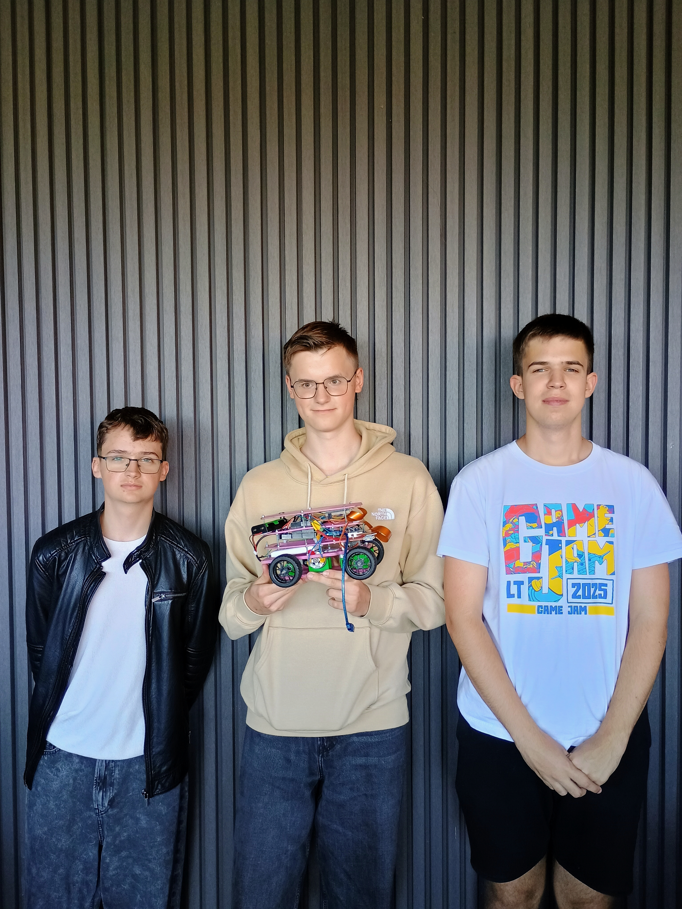
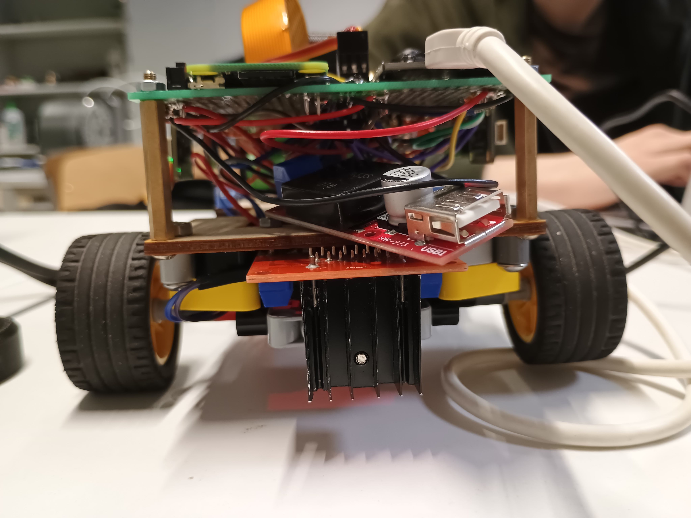
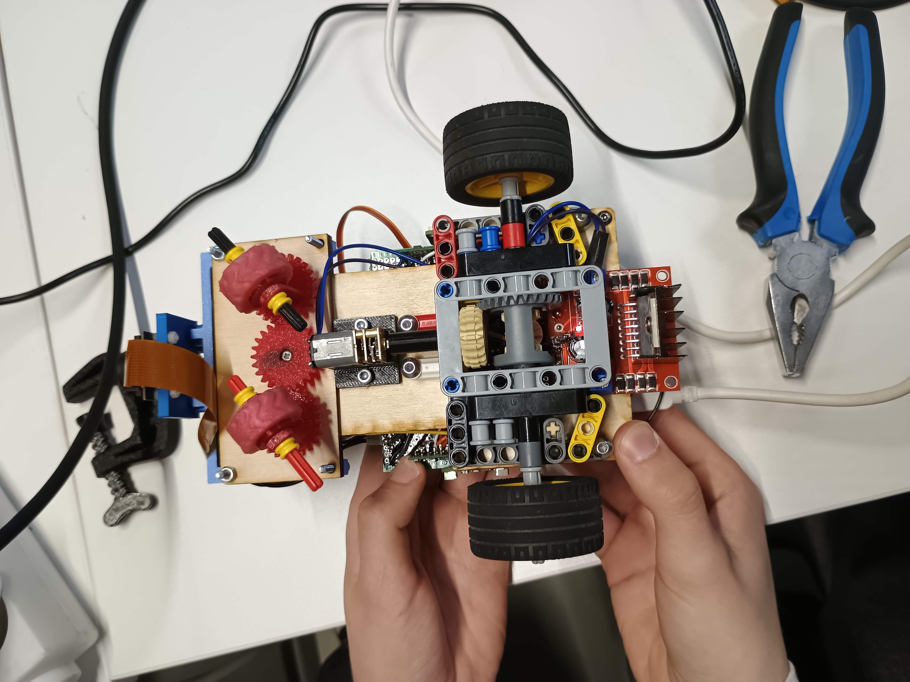

# KU STEAM Pinkies - WRO 2026 Future Engineers

This repository contains the documentation, design decisions, and embedded control code for our WRO 2026 Future Engineers robot.

## Table Of Contents

- [Challenge Overview](#challenge-overview)
- [Team](#team)
- [Robot At A Glance](#robot-at-a-glance)
- [Quick Visual Overview](#quick-visual-overview)
- [What Makes This Repository Judge-Friendly](#what-makes-this-repository-judge-friendly)
- [What The Code Shows](#what-the-code-shows)
- [How The Full System Is Intended To Work](#how-the-full-system-is-intended-to-work)
- [System Modules](#system-modules)
- [Assembly And Rebuild Path](#assembly-and-rebuild-path)
- [Code Structure](#code-structure)
- [How The Software Relates To The Hardware](#how-the-software-relates-to-the-hardware)
- [Build, Compile, And Upload](#build-compile-and-upload)
- [Main Engineering Files](#main-engineering-files)
- [Technical Drawings And Fabrication Evidence](#technical-drawings-and-fabrication-evidence)
- [Where To Start](#where-to-start)
- [Repository Layout](#repository-layout)
- [Photo Gallery](#photo-gallery)
- [Video Submission](#video-submission)
- [Submission Media](#submission-media)
- [Submission Status](#submission-status)
- [Cost Analysis](#cost-analysis)
- [Reproducibility Note](#reproducibility-note)

## Challenge Overview

In WRO Future Engineers, the robot must drive autonomously, stay mechanically reliable, and show clear engineering reasoning across hardware, software, and testing.

For our team, the central engineering problem was not only making the robot move, but making it move in a controlled and repeatable way despite steering friction, wheel grip changes, power variation, and sensor noise. Because of that, this repository documents the robot as one integrated system rather than as isolated components.

## Team

We are **KU STEAM Pinkies**, competing in **WRO 2026 Future Engineers**.

### Marius

- software development;
- mechanical design;
- controller refinement and integration work.

### Domas

- project coordination;
- testing and iteration tracking;
- documentation structure and submission preparation.

### Jonas

- electronics and hardware design;
- wiring, component layout, and implementation support.

We divided responsibilities, but the final robot was developed and tested as one shared engineering project.

## Robot At A Glance

Our robot is a compact self-driving car with:

- rear-wheel drive;
- front-wheel steering;
- an `ESP32` for low-level control;
- a `Raspberry Pi Zero` and camera for perception;
- a `BNO085` IMU;
- three `VL53L4CD` distance sensors for front and side feedback;
- an `MG90S` steering servo, `N20` drive motor, and `L298N` motor driver.

The main idea is simple: perception chooses the driving reference, and the low-level controller keeps the robot on that reference as smoothly and consistently as possible.

The robot was developed as one system, not as a collection of separate parts. During the season we repeatedly found that steering geometry, wheel grip, sensor quality, software tuning, and power stability all affected each other. Because of that, this repository is organized to show both the final solution and the reasoning that led us there.

## Quick Visual Overview

### Steering Layout

Final steering version with the refined geometry used in the robot.

### Rear Drivetrain

Rear drivetrain with the `LEGO` differential that gave the most stable result in our tests.

### Electronics Structure

Main electronics overview showing the control boards, motor driver, and power structure.

## What Makes This Repository Judge-Friendly

This repository is organized so that a judge can quickly verify:

- what the final robot is made of;
- how the steering, drivetrain, sensors, and control system connect;
- where the active embedded code lives;
- which files provide rebuild evidence;
- where the required submission media is stored.

If you want the quickest entry path, start with [START_HERE.md](START_HERE.md), then continue into [docs/README.md](docs/README.md) and [docs/reproducibility/evidence_map.md](docs/reproducibility/evidence_map.md).

## What The Code Shows

The clearest software example in this repository is [src/src/main.cpp](src/src/main.cpp).

That code shows the low-level `ESP32` controller:

1. wait for the start button;
2. store the current yaw as the heading reference;
3. drive forward at fixed power;
4. read front, left, and right distance sensors together with yaw;
5. keep heading and wall offset under control;
6. make a hard turn when the front sensor detects a close boundary;
7. count sector turns and stop after the required sequence.

So the code here shows the low-level controller, not the whole robot software stack by itself.

## How The Full System Is Intended To Work

In the full robot architecture, the `Raspberry Pi Zero` and camera handle the perception layer. That layer can decide which line the robot should follow or which side it should use around an obstacle.

The `ESP32` remains responsible for:

- reading the IMU and distance sensors;
- generating steering and motor output;
- executing the real-time control loop.

This is why some hardware documents describe a broader `Pi Zero + camera + ESP32` system while the published code shows mainly the `ESP32` side.

## System Modules

The robot can be understood as a set of connected modules.

### 1. Perception Module

The perception module is built around the `Raspberry Pi Zero` and camera. Its role is to interpret the wider scene ahead of the robot. In our intended final architecture, this layer can:

- detect relevant lane or obstacle information;
- choose which side should be used around an obstacle;
- provide the low-level controller with a preferred driving line or reference shift.

This module is connected to the electromechanical system indirectly. It does not drive the servo or motor by itself. Instead, it sends a higher-level reference to the control side.

### 2. Low-Level Control Module

The low-level control module is the `ESP32` firmware. This is the controller that is visible most directly in the repository under `src/`.

Its role is to:

- read the `BNO085` yaw heading;
- read the front, left, and right `VL53L4CD` distance sensors;
- compute steering corrections;
- trigger and execute hard turns;
- drive the motor and steering servo.

This module is directly connected to the electromechanical components of the robot:

- `BNO085` IMU
- three `VL53L4CD` distance sensors
- `MG90S` steering servo
- `L298N` motor driver
- `N20` drive motor
- start button and status lights

### 3. Mechanical Module

The mechanical module includes the chassis, drivetrain, front steering layout, rear differential, wheel mounting, and custom printed parts. These parts matter because they directly affect how well the low-level controller can work. A good steering algorithm is much less useful if the wheels slip, the steering binds, or the differential resists turning.

### 4. Power Module

The robot uses a `2x 18650` battery pack together with regulated power branches. The power layout matters because motor and servo loads can disturb logic and sensor signals if the electrical system is not organized carefully.

### 5. Documentation And Reproducibility Module

The repository itself is also part of the final solution. It contains:

- source code;
- mechanical explanations;
- electronics and wiring information;
- CAD exports;
- testing notes;
- team, robot, and video submission material.

## Assembly And Rebuild Path

If another team wanted to understand or rebuild the robot efficiently, we would suggest this order:

1. [README.md](README.md)
2. [docs/hardware/parts_list.md](docs/hardware/parts_list.md)
3. [docs/hardware/pcb_wiring_diagrams.md](docs/hardware/pcb_wiring_diagrams.md)
4. [schemes/Wro_customPCBs.pdf](schemes/Wro_customPCBs.pdf)
5. [docs/design/drivetrain_and_steering.md](docs/design/drivetrain_and_steering.md)
6. [models/README.md](models/README.md)

This path is intentionally practical: parts first, wiring second, mechanics third, and only then the deeper design trade-off documents.

## Code Structure

The active embedded controller project is inside [src/README.md](src/README.md).

The main software pieces are:

- `src/src/main.cpp` - main runtime loop
- `src/lib/Compass/Compass.h` - yaw heading support
- `src/lib/Lidar/Lidar.h` - distance sensor handling
- `src/lib/Engine/Engine.h` - motor control wrapper
- `src/lib/Lights/` - status lights
- `src/platformio.ini` - PlatformIO project configuration

Together, these files show how the code is split into sensing, control, and actuation responsibilities.

## How The Software Relates To The Hardware

The software is tightly connected to the electromechanical layout of the vehicle.

- The `ESP32` reads yaw from the `BNO085` to keep the robot aligned with the current heading target.
- The front `VL53L4CD` sensor helps decide when a turn should begin.
- The side `VL53L4CD` sensors provide local spacing information used for steering correction.
- The `MG90S` servo receives the final steering command.
- The `L298N` and `N20` motor provide forward movement under control of the `ESP32`.
- The `Raspberry Pi Zero` and camera can provide higher-level scene interpretation above this control loop.

This relationship between code and hardware is the reason we documented both sides together. The robot cannot be understood correctly if software, electronics, and mechanics are described in isolation.

## Build, Compile, And Upload

The low-level controller is built as a PlatformIO project.

### Environment

- project folder: `src/`
- build configuration: `src/platformio.ini`
- target controller: `ESP32`

### Basic Steps

1. Open the `src/` folder as a PlatformIO project.
2. Use PlatformIO to install the required libraries defined in `platformio.ini`.
3. Build the firmware environment from that configuration.
4. Connect the `ESP32` board by USB.
5. Upload the compiled firmware to the controller.
6. Use the physical start button on the robot to begin the run.

### What Gets Uploaded

The uploaded program includes:

- sensor startup and address assignment for the three distance sensors;
- compass startup;
- PWM setup for the drive motor and servo;
- the main control loop for straight driving and hard turns.

### What Another Team Needs

To reproduce the controller side, another team would mainly need:

- the `ESP32` board;
- the `src/` PlatformIO project;
- the same or equivalent sensors and motor-control hardware;
- the wiring described in `docs/hardware/` and `schemes/`;
- the mechanical layout described in `docs/design/` and `models/`.

## Main Engineering Files

If you want the fastest high-value reading path, these are the most important files:

- [Start Here](START_HERE.md)
- [Documentation Index](docs/README.md)
- [Drivetrain and Steering](docs/design/drivetrain_and_steering.md)
- [Engineering Decisions](docs/design/engineering_decisions.md)
- [Electronics Overview](docs/hardware/electronics_overview.md)
- [PCB And Wiring Diagrams](docs/hardware/pcb_wiring_diagrams.md)
- [Software Architecture](docs/code/software_architecture_improved.md)
- [Control Algorithms](docs/code/control_algorithms.md)
- [Mechanical and Software Testing](docs/testing/mechanical_and_software_testing.md)
- [Embedded Controller README](src/README.md)

## Technical Drawings And Fabrication Evidence

The main build evidence is distributed across:

- `models/` for custom part exports and CAD-related material;
- `schemes/` for schematics, PCB, and wiring evidence;
- `docs/design/` for steering, drivetrain, and chassis explanations;
- `docs/hardware/` for parts, sensors, and electronics decisions.

These files are important because the robot cannot be reproduced from source code alone.

## Where To Start

If you want the fastest overview, start here:

1. [Start Here](START_HERE.md)
2. [Documentation Index](docs/README.md)
3. [Drivetrain and Steering](docs/design/drivetrain_and_steering.md)
4. [Electronics Overview](docs/hardware/electronics_overview.md)
5. [Software Architecture](docs/code/software_architecture_improved.md)
6. [Mechanical and Software Testing](docs/testing/mechanical_and_software_testing.md)

## Repository Layout

- `docs/design/` - mechanical design, trade-offs, and system-level decisions
- `docs/hardware/` - electronics, sensors, wiring, and parts
- `docs/code/` - software logic, state flow, and control explanations
- `docs/testing/` and `docs/evaluation/` - test results and lessons learned
- `schemes/` - schematic material and wiring overview
- `models/` - exported CAD files for custom parts
- `src/` - published embedded controller project
- `t-photos/`, `v-photos/`, `video/` - submission media

## Photo Gallery

### Team Photos

### Robot Photos

<table>
  <tr>
    <td align="center"><strong>Front View</strong></td>
    <td align="center"><strong>Back View</strong></td>
  </tr>
  <tr>
    <td align="center"></td>
    <td align="center"></td>
  </tr>
  <tr>
    <td align="center"><strong>Left View</strong></td>
    <td align="center"><strong>Right View</strong></td>
  </tr>
  <tr>
    <td align="center"></td>
    <td align="center"></td>
  </tr>
  <tr>
    <td align="center"><strong>Top View</strong></td>
    <td align="center"><strong>Bottom View</strong></td>
  </tr>
  <tr>
    <td align="center"></td>
    <td align="center"></td>
  </tr>
</table>

## Video Submission

The final driving video link is stored in [video/video.md](video/video.md).

Current state:

- competition: `WRO 2026 Future Engineers`
- YouTube URL: pending final publication
- minimum autonomous segment target: `30 seconds`

The final published video should show stable autonomous driving, obstacle response, and repeatable behavior without manual assistance.

## Submission Media

The repository also includes the media required for the final submission package:

- `t-photos/` for the team photo
- `v-photos/` for the robot photos
- `video/` for the published driving video link

These media files matter because the rules require that the repository includes both technical documentation and final competition evidence.

## Submission Status

Current repository submission status based on the internal checklist:

| Item | Status | Main reference |
|---|---|---|
| Team photo folder | Ready | `t-photos/` |
| Robot photo folder | Ready | `v-photos/` |
| Embedded controller project | Ready | `src/` |
| Electronics and wiring documentation | Ready | `docs/hardware/`, `schemes/` |
| Mechanical design documentation | Ready | `docs/design/` |
| Testing and evaluation notes | Ready | `docs/testing/`, `docs/evaluation/` |
| Video link | Pending final link | `video/video.md` |
| Cost analysis summary in root README | Not yet added | `docs/hardware/parts_list.md` |

For the full submission check path, see [docs/reproducibility/submission_checklist.md](docs/reproducibility/submission_checklist.md).

## Cost Analysis

The repository already contains the main hardware list in [docs/hardware/parts_list.md](docs/hardware/parts_list.md). A full itemized price table is still pending, but the major cost groups are already clear:

| Cost group | Main items | Status |
|---|---|---|
| Control electronics | `ESP32`, `Raspberry Pi Zero`, camera | Identified |
| Sensors | `BNO085`, `3x VL53L4CD` | Identified |
| Motion components | `MG90S`, `N20`, `L298N` | Identified |
| Power system | `2x 18650`, regulators, wiring | Identified |
| Mechanical parts | chassis, printed parts, drivetrain, wheels | Identified |
| Manufacturing extras | fasteners, connectors, support materials | Partially documented |

Current note:

- the component groups are documented;
- the final numeric budget summary is not yet published in the root `README`;
- we prefer stating this directly rather than implying a finished cost table that is not yet in the repository.

## Reproducibility Note

For software, the most direct evidence is the `ESP32` project under `src/`.

For the full robot, the hardware, design, and testing documents matter just as much because they explain the wider architecture, the mechanical choices, and how the system was tuned in practice.

Our goal with this repository is that another team should be able to understand:

- what the robot is made of;
- how the main modules are connected;
- what the control code does;
- how the firmware is built and uploaded;
- why the final design choices were made.
