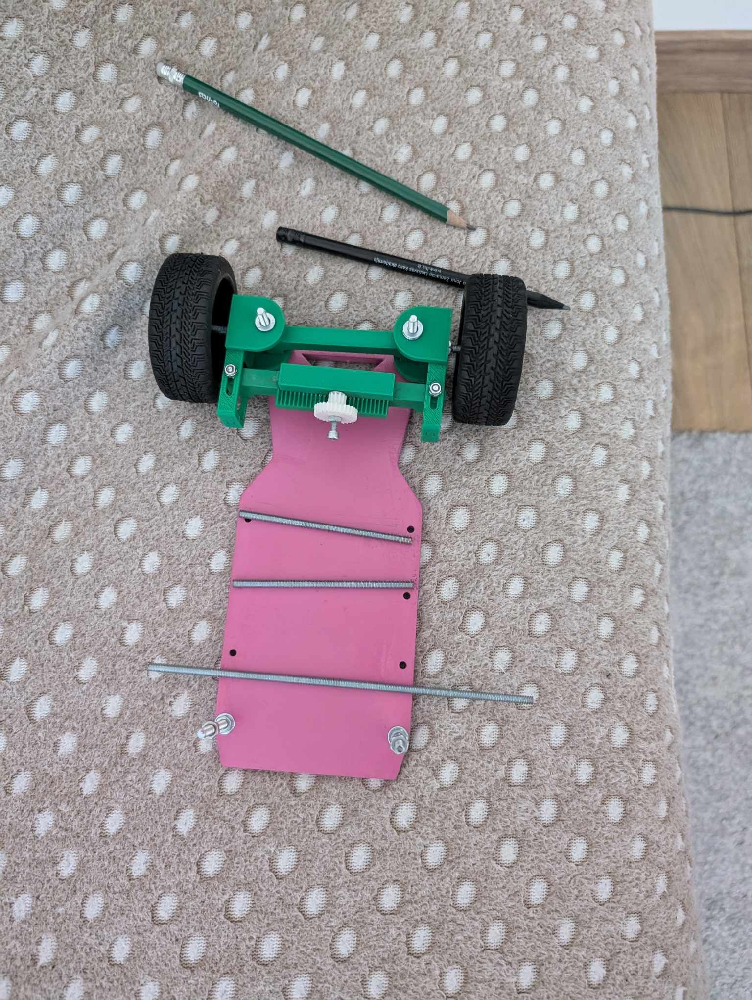
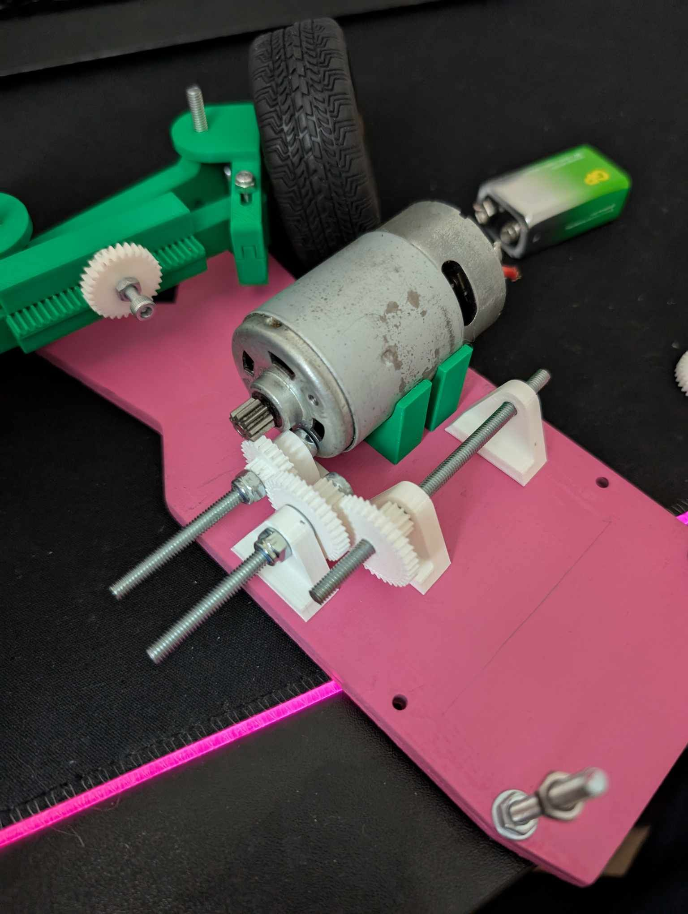
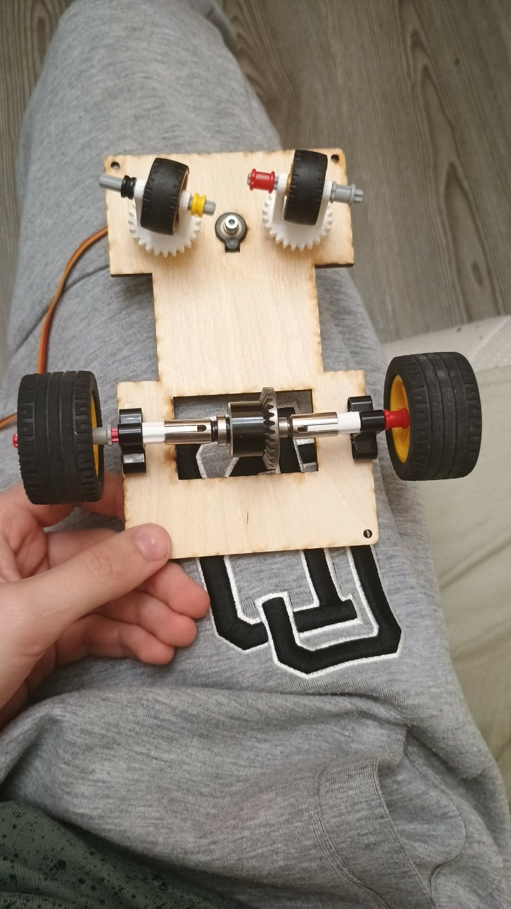

# KU STEAM Pinkies - WRO 2026 Future Engineers

We are **KU STEAM Pinkies**, a WRO 2026 Future Engineers team building a compact autonomous self-driving car.

This repository tells the story of how the robot developed. We started with an older, larger robot that used a more complicated rack/gearbox-style mechanical idea. That robot was useful because it showed us what was difficult to control. From that point, we redesigned the new robot to be smaller, simpler, lower-friction, and easier to tune.

The README gives the quick judging path. The detailed proof is still kept in the `docs/`, `schemes/`, `models/`, `src/`, `v-photos/`, `t-photos/`, and `video/` folders. At the end of each major section, there is a short **Go deeper** note that points to the full documentation file.

## Table Of Contents

- [1. What We Learned From The Previous Robot](#1-what-we-learned-from-the-previous-robot)
- [2. What We Wanted The New Robot To Do Better](#2-what-we-wanted-the-new-robot-to-do-better)
- [3. Final Robot Overview](#3-final-robot-overview)
- [4. Team Roles](#4-team-roles)
- [5. Mechanical Development](#5-mechanical-development)
- [6. Electronics, Power, And Sensors](#6-electronics-power-and-sensors)
- [7. Software And Control Logic](#7-software-and-control-logic)
- [8. Testing Results](#8-testing-results)
- [9. System Risks And Fixes](#9-system-risks-and-fixes)
- [10. Build And Upload](#10-build-and-upload)
- [11. Where The Evidence Is](#11-where-the-evidence-is)
- [12. Photos And Video](#12-photos-and-video)
- [13. Repository Layout](#13-repository-layout)
- [14. Final Conclusion](#14-final-conclusion)

## 1. What We Learned From The Previous Robot

Our final robot did not appear immediately. Before this version, we had a larger robot with a more complicated rack/gearbox-style mechanical direction. It looked strong and interesting, but during testing it was harder to make consistent.

<table>
  <tr>
    <td align="center"><strong>Previous Robot Overall View</strong></td>
    <td align="center"><strong>Previous Robot Drivetrain / Steering Area</strong></td>
  </tr>
  <tr>
    <td align="center"></td>
    <td align="center"></td>
  </tr>
  <tr>
    <td align="center">The older robot was larger and mechanically more complicated.</td>
    <td align="center">This drivetrain and steering area helped us see where friction and tuning problems came from.</td>
  </tr>
</table>

The older robot taught us several important lessons:

- more parts and more complicated mechanics do not automatically make the robot better;
- steering friction can make the software look worse than it really is;
- a larger robot is harder to turn and package cleanly;
- a servo should not have to fight the whole mechanism;
- the best design is the one that repeats the same behaviour on the field.

Because of that, the new robot was designed around one main idea:

> build a smaller autonomous car where every subsystem helps consistency instead of adding unnecessary complexity.

**Go deeper:** previous-robot comparison and chassis reasoning are in [`docs/design/chassis_design_improved.md`](docs/design/chassis_design_improved.md). The broader design trade-offs are in [`docs/design/engineering_decisions.md`](docs/design/engineering_decisions.md).

## 2. What We Wanted The New Robot To Do Better

For the new robot, we did not only want more speed. We wanted the car to be easier to control and easier to repeat.

The main goals were:

- drive straighter;
- turn more predictably;
- reduce steering load;
- reduce random slipping;
- keep the electronics stable;
- separate camera/perception work from real-time motor control;
- make the repository understandable for judges and for another team trying to rebuild the robot.

This meant that every decision had to answer the same question: **does this make the robot more repeatable on the field?**

**Go deeper:** final system-level design is described in [`docs/design/system_overview.md`](docs/design/system_overview.md). The comparison with the initial goals is in [`docs/evaluation/comparison_initial_goals.md`](docs/evaluation/comparison_initial_goals.md).

## 3. Final Robot Overview

The final robot is a compact self-driving car with:

- rear-wheel drive;
- front-wheel steering;
- an `ESP32` for low-level control;
- a `Raspberry Pi Zero` and camera for perception;
- a `BNO085` IMU for yaw feedback;
- three `VL53L4CD` distance sensors;
- an `MG90S` steering servo;
- an `N20 6 V 600 rpm` drive motor;
- an `L298N` motor driver;
- a `2x 18650` Li-ion battery pack;
- a rear differential;
- custom steering and mounting parts.

<table>
  <tr>
    <td align="center"><strong>Final Steering Layout</strong></td>
    <td align="center"><strong>Rear Drivetrain</strong></td>
  </tr>
  <tr>
    <td align="center"></td>
    <td align="center"></td>
  </tr>
  <tr>
    <td align="center">The final steering geometry reduced friction and made the servo movement more useful.</td>
    <td align="center">The selected differential made cornering smoother and more repeatable.</td>
  </tr>
</table>

<table>
  <tr>
    <td align="center"><strong>Electronics Structure</strong></td>
  </tr>
  <tr>
    <td align="center"></td>
  </tr>
</table>

The overall system is simple:

1. the camera/perception layer can choose the driving reference or obstacle side;
2. the `ESP32` keeps the robot stable using IMU and distance feedback;
3. the mechanical design makes those commands physically repeatable.

**Go deeper:** parts are listed in [`docs/hardware/parts_list.md`](docs/hardware/parts_list.md). Mechanical layout is explained in [`docs/design/drivetrain_and_steering.md`](docs/design/drivetrain_and_steering.md). Electronics are detailed in [`docs/hardware/electronics_overview.md`](docs/hardware/electronics_overview.md).

## 4. Team Roles

### Marius

- software development;
- mechanical design;
- controller refinement and integration work.

### Domas

- project coordination;
- testing and iteration tracking;
- documentation structure and submission preparation.

### Jonas

- electronics and hardware design;
- wiring, component layout, and implementation support.

The responsibilities were divided, but the final robot was developed as one shared system. When one subsystem changed, the others often had to be checked again.

**Go deeper:** project navigation is available in [`START_HERE.md`](START_HERE.md) and [`docs/README.md`](docs/README.md).

## 5. Mechanical Development

### 5.1 Why We Simplified The Mechanism

The previous robot showed that a complex mechanical design can make the robot harder to tune. For the final robot, we focused on a compact front-steering layout with less friction and more predictable response.

The main mechanical principles were:

- fix steering resistance before using a stronger servo;
- choose a motor that is controllable, not only fast;
- use a differential that turns smoothly;
- improve front-wheel grip so steering commands become real movement;
- keep the robot compact enough for easier turning and parking.

### 5.2 Mechanical Comparison Photos

<table>
  <tr>
    <td align="center"><strong>Earlier Metal Differential</strong></td>
    <td align="center"><strong>Final LEGO Differential</strong></td>
  </tr>
  <tr>
    <td align="center"></td>
    <td align="center"></td>
  </tr>
  <tr>
    <td align="center">The metal differential looked stronger, but it was not the best practical choice for smooth turning.</td>
    <td align="center">The LEGO differential stayed because it gave smoother, more repeatable corner exits.</td>
  </tr>
</table>

<table>
  <tr>
    <td align="center"><strong>Final Steering Detail</strong></td>
  </tr>
  <tr>
    <td align="center"></td>
  </tr>
  <tr>
    <td align="center">The final steering version reduced mechanical load and improved steering response.</td>
  </tr>
</table>

### 5.3 Motor Choice

We tested three `N20` motor options:

| Motor option | What was good | What was bad | Decision |
|---|---|---|---|
| `300 rpm` | easy to control slowly | too slow | rejected |
| `600 rpm` | best speed/torque balance | still required tuning | selected |
| `1000 rpm` | high theoretical speed | weaker usable torque and less stable under load | rejected |

The `600 rpm` motor became the final choice because it gave the best practical balance between speed and torque.

### 5.4 Differential Choice

Cornering consistency depended strongly on drivetrain resistance. The earlier metal differential looked stronger, but the final `LEGO` differential gave smoother and more repeatable cornering.

It helped with:

- less binding in turns;
- smoother corner exits;
- more repeatable behaviour between runs;
- easier controller tuning.

### 5.5 Steering Iterations

The steering system went through three main versions:

| Version | Problem or improvement | Result |
|---|---|---|
| `V1` | large lever arm and high steering load | servo worked too hard |
| `V2` | bad lever arm reduced | steering became easier and more predictable |
| `V3` | bearings and silicone front wheels added | best precision, lower friction, better grip |

The most important lesson was that a stronger servo was not the best first fix. The better fix was to reduce the mechanical load.

### 5.6 Steering Range

The servo can rotate further, but we limited the useful steering range to about `60` degrees. More steering angle looked useful, but too much angle made the robot less stable. A controlled range made the robot easier to tune.

**Go deeper:** complete drivetrain, motor, differential, wheel, and steering reasoning is in [`docs/design/drivetrain_and_steering.md`](docs/design/drivetrain_and_steering.md). Chassis reasoning is in [`docs/design/chassis_design_improved.md`](docs/design/chassis_design_improved.md). CAD and custom part evidence is in [`models/README.md`](models/README.md).

## 6. Electronics, Power, And Sensors

The robot uses a split control system:

- `Raspberry Pi Zero` + camera for perception;
- `ESP32` for low-level real-time control.

This split made the robot easier to understand. The camera side can focus on scene interpretation, while the `ESP32` keeps motor and steering control predictable.

| Subsystem | Main parts | Purpose |
|---|---|---|
| perception | `Raspberry Pi Zero`, camera | lane and obstacle interpretation |
| low-level control | `ESP32-WROOM-32` | control loop, motor, servo, sensors |
| orientation | `BNO085` IMU | yaw feedback and heading reference |
| distance sensing | `3x VL53L4CD` | front trigger and side-distance feedback |
| drive | `N20 600 rpm`, `L298N` | vehicle movement |
| steering | `MG90S` servo | front-wheel steering |
| power | `2x 18650`, regulators | stable supply branches |

### Perfboard-Based Wiring Evidence

The photo below shows the real perfboard-based electronics integration stage. This matters because the wiring was not only theoretical. The battery input, regulator, motor driver, controller wiring, signal routing, and power distribution had to be physically assembled and tested on the robot.

<table>
  <tr>
    <td align="center"></td>
  </tr>
  <tr>
    <td align="center">As-built perfboard wiring used as real build evidence for the electronics and power system.</td>
  </tr>
</table>

### Power Budget

| Subsystem | Design assumption |
|---|---:|
| logic compute | `0.8 A` continuous |
| sensors | `0.35 A` continuous |
| steering | `1.0 A` peak |
| drive | `1.5 A` peak |
| total | about `3.7 A` peak |

We separated power branches because motors and servos can create voltage sag and noise. Stable logic and sensor power made the robot easier to debug and more reliable.

### Sensor Placement

- camera: wider scene ahead;
- front `VL53L4CD`: turn timing and close boundary detection;
- left/right `VL53L4CD`: local wall or obstacle spacing;
- `BNO085`: rigidly mounted yaw feedback.

We tried richer ToF sensing with `VL53L5CX`, but `VL53L4CD` was more practical for the final system because it was easier to integrate and tune.

**Go deeper:** electronics architecture is in [`docs/hardware/electronics_overview.md`](docs/hardware/electronics_overview.md). Wiring, pin assignments, and perfboard evidence are in [`docs/hardware/pcb_wiring_diagrams.md`](docs/hardware/pcb_wiring_diagrams.md). Sensor choices are in [`docs/hardware/sensor_list.md`](docs/hardware/sensor_list.md). Schematic material is in [`schemes/README.md`](schemes/README.md).

## 7. Software And Control Logic

The low-level controller in [`src/src/main.cpp`](src/src/main.cpp) follows this pattern:

1. wait for the start button;
2. store current yaw as target heading;
3. start motor output;
4. read front, left, and right ToF sensors;
5. read IMU yaw;
6. apply heading and wall-distance correction;
7. trigger a hard turn when the front distance becomes small;
8. update the target angle after the turn;
9. count sectors and stop after the required sequence.

### State Machine Summary

| State | Main inputs | Main output | Exit condition |
|---|---|---|---|
| `Idle` | start button | motor off, steering centered | button press |
| `StraightControl` | yaw, front ToF, side ToF | heading hold and wall-offset correction | obstacle packet or corner trigger |
| `ObstacleDecision` | camera result, confidence, packet age | choose legal side | left/right avoidance or fallback |
| `AvoidLeft` | camera command, IMU, ToF | shift reference left | obstacle cleared or fallback |
| `AvoidRight` | camera command, IMU, ToF | shift reference right | obstacle cleared or fallback |
| `HardTurn` | front ToF, side ToF, yaw | full-lock turn and target angle update | open space ahead |
| `Finish` | sector count | stop motor and center steering | wait for restart |

### Obstacle Rule Logic

The obstacle rule is:

- red pillar -> pass on the right side;
- green pillar -> pass on the left side.

The intended full-system data path is:

1. camera detects obstacle and side;
2. Pi sends a vision packet to the `ESP32`;
3. `ESP32` checks packet age and confidence;
4. fresh data shifts the driving reference;
5. stale or weak data falls back to neutral wall/heading control.

Important fallback thresholds:

- `age_ms > 250` -> ignore obstacle guidance;
- `confidence < 0.40` -> treat guidance as weak;
- `frontDistance <= 400 mm` -> hard-turn trigger.

The current published `ESP32` runtime shows the verified low-level controller. The Pi/camera layer and obstacle packet interface are documented as the full-system architecture and integration path.

**Go deeper:** the judge-facing state machine is in [`docs/code/software_state_machine_and_obstacle_flow.md`](docs/code/software_state_machine_and_obstacle_flow.md). Control logic is explained in [`docs/code/control_algorithms.md`](docs/code/control_algorithms.md). Architecture overview is in [`docs/code/software_architecture_improved.md`](docs/code/software_architecture_improved.md). The active embedded project is described in [`src/README.md`](src/README.md).

## 8. Testing Results

We tested mechanics and software together because they affected each other. A steering change changed controller tuning, and better wheel grip changed how much correction was needed.

Our method was simple:

1. change one part or subsystem;
2. run the same scenario several times;
3. check if the same weakness repeats;
4. compare with the previous version;
5. keep the version that improves repeatability, not one lucky run.

### Main Results

| Test case | Before | After | Sample size | Why it mattered |
|---|---:|---:|---:|---|
| straight corridor drift after `2 m` | `9 cm` | `4 cm` | `10` runs | better lane stability |
| corner overshoot | `14 cm` | `6 cm` | `10` runs | lower wall-contact risk |
| successful `3`-lap runs | `6/10` | `9/10` | `10` runs | higher consistency |
| recovery after obstacle correction | `1.2 s` | `0.6 s` | `10` runs | faster return to target line |

The most important improvement was consistency: successful `3`-lap runs improved from `60%` to `90%`.

**Go deeper:** combined mechanical/software testing is documented in [`docs/testing/mechanical_and_software_testing.md`](docs/testing/mechanical_and_software_testing.md). Additional test structure is in [`docs/testing/tests.md`](docs/testing/tests.md). Evaluation notes are in [`docs/evaluation/what_worked.md`](docs/evaluation/what_worked.md) and [`docs/evaluation/what_didnt.md`](docs/evaluation/what_didnt.md).

## 9. System Risks And Fixes

The final robot worked better because mechanics, electronics, sensing, and software were treated as one connected system.

| Risk / failure mode | Likely effect | Fix / mitigation |
|---|---|---|
| steering resistance | servo load and inconsistent steering | redesigned steering geometry |
| front wheel slip | weak real steering effect | silicone front wheels |
| wrong motor speed | too slow or unstable under load | selected `600 rpm` after comparison |
| differential binding | rough corner exits | selected smoother final differential |
| servo/motor voltage sag | unstable sensors or controller | separated power branches |
| ToF address conflict | missing readings | staged startup and address assignment |
| stale camera data | wrong obstacle reaction | age/confidence fallback |
| flexible IMU mounting | bad yaw estimate | rigid mounting and checks |

**Go deeper:** risk and failure reasoning is expanded in [`docs/design/risk_and_failures.md`](docs/design/risk_and_failures.md). Decision logic is in [`docs/design/engineering_decisions.md`](docs/design/engineering_decisions.md). The full evidence index is in [`docs/reproducibility/evidence_map.md`](docs/reproducibility/evidence_map.md).

## 10. Build And Upload

The active embedded controller project is inside [`src/`](src/).

1. Open `src/` as a PlatformIO project.
2. Use [`src/platformio.ini`](src/platformio.ini) as the build configuration.
3. Build the firmware for the `ESP32`.
4. Connect the `ESP32` by USB.
5. Upload the firmware.
6. Place the robot on the field switched off.
7. Switch the robot on.
8. Press the physical start button when the round begins.

Main software files:

- [`src/src/main.cpp`](src/src/main.cpp)
- [`src/lib/Compass/Compass.h`](src/lib/Compass/Compass.h)
- [`src/lib/Lidar/Lidar.h`](src/lib/Lidar/Lidar.h)
- [`src/lib/Engine/Engine.h`](src/lib/Engine/Engine.h)
- [`src/platformio.ini`](src/platformio.ini)
- [`docs/code/vision_interface.md`](docs/code/vision_interface.md)

**Go deeper:** firmware build and source structure are explained in [`src/README.md`](src/README.md). Exact rebuild and startup references are in [`docs/reproducibility/exact_rebuild_wiring_upload_start.md`](docs/reproducibility/exact_rebuild_wiring_upload_start.md).

## 11. Where The Evidence Is

| Area | Main evidence files |
|---|---|
| Mechanical design | [`docs/design/chassis_design_improved.md`](docs/design/chassis_design_improved.md), [`docs/design/drivetrain_and_steering.md`](docs/design/drivetrain_and_steering.md), [`models/README.md`](models/README.md) |
| Power and sensors | [`docs/hardware/electronics_overview.md`](docs/hardware/electronics_overview.md), [`docs/hardware/pcb_wiring_diagrams.md`](docs/hardware/pcb_wiring_diagrams.md), [`schemes/wiring_overview.md`](schemes/wiring_overview.md) |
| Software and obstacle strategy | [`docs/code/software_state_machine_and_obstacle_flow.md`](docs/code/software_state_machine_and_obstacle_flow.md), [`docs/code/control_algorithms.md`](docs/code/control_algorithms.md), [`src/README.md`](src/README.md) |
| Systems thinking | [`docs/design/engineering_decisions.md`](docs/design/engineering_decisions.md), [`docs/design/risk_and_failures.md`](docs/design/risk_and_failures.md), [`docs/evaluation/what_worked.md`](docs/evaluation/what_worked.md) |
| Submission quality | [`START_HERE.md`](START_HERE.md), [`docs/reproducibility/evidence_map.md`](docs/reproducibility/evidence_map.md), [`docs/reproducibility/submission_checklist.md`](docs/reproducibility/submission_checklist.md) |

Fast rebuild path:

1. [`README.md`](README.md)
2. [`START_HERE.md`](START_HERE.md)
3. [`docs/hardware/parts_list.md`](docs/hardware/parts_list.md)
4. [`docs/hardware/pcb_wiring_diagrams.md`](docs/hardware/pcb_wiring_diagrams.md)
5. [`schemes/Wro_customPCBs.pdf`](schemes/Wro_customPCBs.pdf)
6. [`docs/design/drivetrain_and_steering.md`](docs/design/drivetrain_and_steering.md)
7. [`models/README.md`](models/README.md)
8. [`src/README.md`](src/README.md)

**Go deeper:** the most complete criterion-by-criterion index is [`docs/reproducibility/evidence_map.md`](docs/reproducibility/evidence_map.md). The submission checklist is [`docs/reproducibility/submission_checklist.md`](docs/reproducibility/submission_checklist.md).

## 12. Photos And Video

### Team Photo

<table>
  <tr>
    <td align="center"></td>
  </tr>
</table>

### Robot Photos

<table>
  <tr>
    <td align="center"><strong>Front</strong></td>
    <td align="center"><strong>Right</strong></td>
  </tr>
  <tr>
    <td align="center"></td>
    <td align="center"></td>
  </tr>
  <tr>
    <td align="center"><strong>Back</strong></td>
    <td align="center"><strong>Left</strong></td>
  </tr>
  <tr>
    <td align="center"></td>
    <td align="center"></td>
  </tr>
  <tr>
    <td align="center"><strong>Top</strong></td>
    <td align="center"><strong>Bottom</strong></td>
  </tr>
  <tr>
    <td align="center"></td>
    <td align="center"></td>
  </tr>
</table>

Video information is documented in [`video/video.md`](video/video.md).

Current published link:

- Open Challenge: [YouTube video](https://www.youtube.com/watch?v=PdYDFbR_HfI)

**Go deeper:** official robot photos are stored in [`v-photos/`](v-photos/), the team photo is in [`t-photos/`](t-photos/), and video evidence is described in [`video/video.md`](video/video.md).

## 13. Repository Layout

- `docs/design/` - mechanical design, trade-offs, risk, and system-level decisions
- `docs/hardware/` - electronics, sensors, wiring, power, and parts
- `docs/code/` - software logic, state flow, control algorithms, and obstacle strategy
- `docs/testing/` - practical testing and tuning evidence
- `docs/evaluation/` - what worked, what did not, and comparison to goals
- `docs/reproducibility/` - evidence map, checklist, and rebuild support
- `schemes/` - schematic material and wiring overview
- `models/` - CAD and custom part evidence
- `src/` - embedded controller and software material
- `t-photos/` - team photo
- `v-photos/` - robot photos
- `video/` - video submission information
- `output/doc/` - continuous DOCX report version

**Go deeper:** [`docs/README.md`](docs/README.md) is the full documentation index, and [`START_HERE.md`](START_HERE.md) is the fastest judge-facing entry point.

## 14. Final Conclusion

The final robot is simpler than the previous rack/gearbox-style robot, but it is better suited to WRO autonomous driving. The previous robot taught us that complexity can create friction, tuning difficulty, and inconsistent behaviour.

The final robot focuses on controlled repeatability:

- balanced `600 rpm` motor instead of extreme motor choices;
- smoother differential instead of rougher drivetrain behaviour;
- improved steering geometry instead of forcing the servo to overcome bad mechanics;
- silicone front wheels instead of accepting steering slip;
- split perception and control instead of one overloaded system;
- regulated power branches instead of unstable shared power;
- state-machine logic instead of unclear behaviour;
- measured testing evidence instead of only final claims.

The core result: straight drift improved from `9 cm` to `4 cm`, corner overshoot from `14 cm` to `6 cm`, successful `3`-lap runs from `60%` to `90%`, and recovery time from `1.2 s` to `0.6 s`.

That is the story of this project: we used the weaknesses of the previous robot to build a smaller, cleaner, more controllable, and better documented autonomous vehicle.
