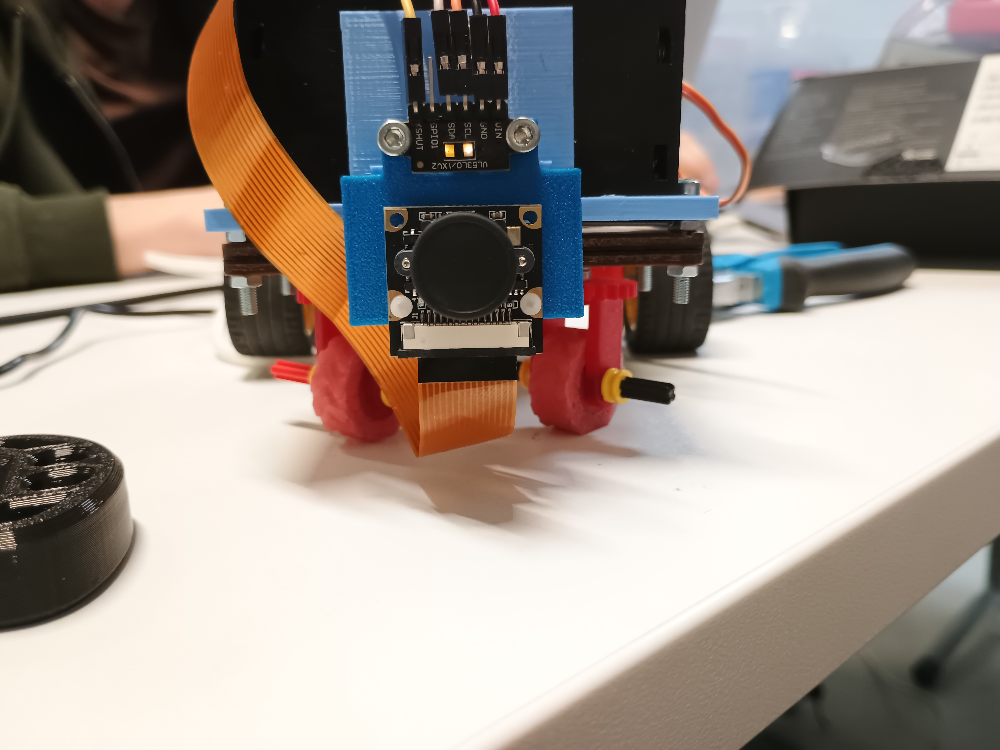
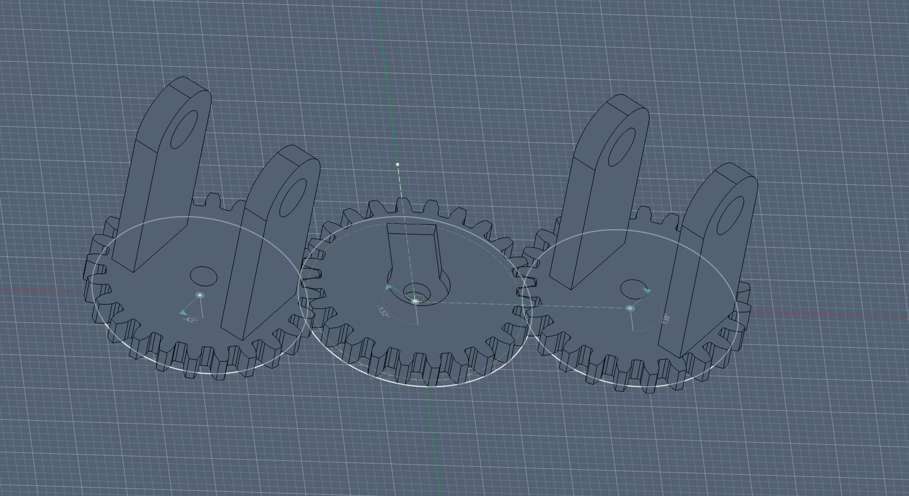
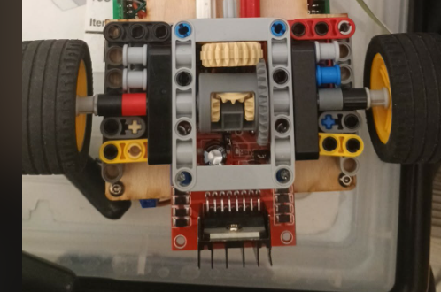
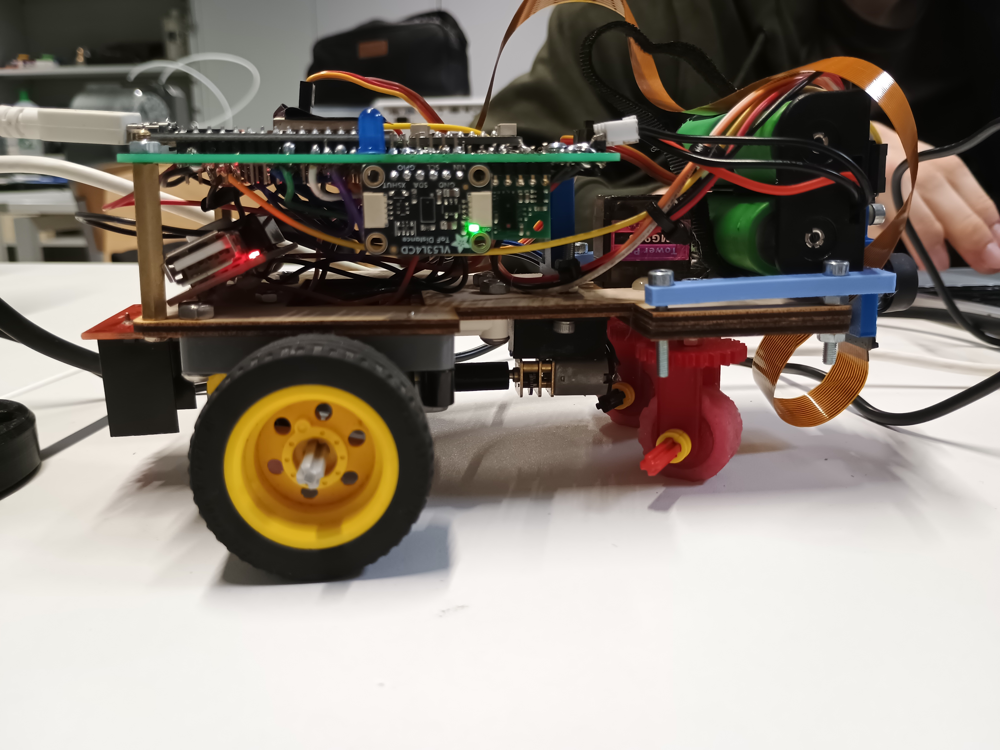
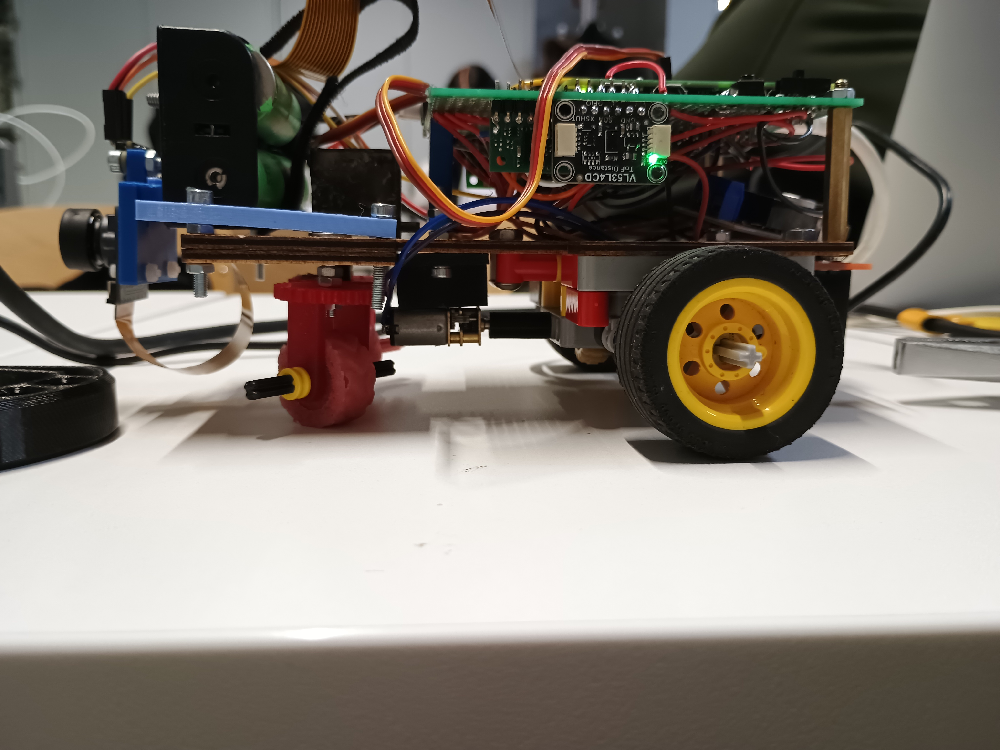
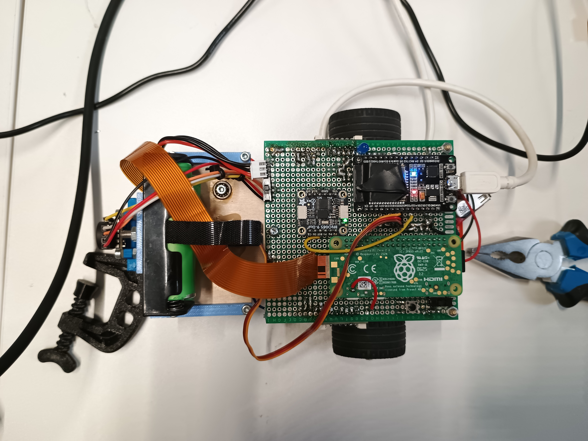
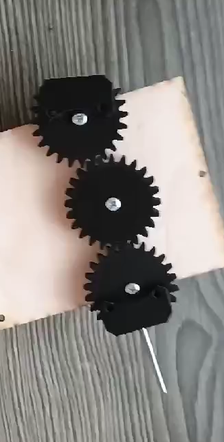
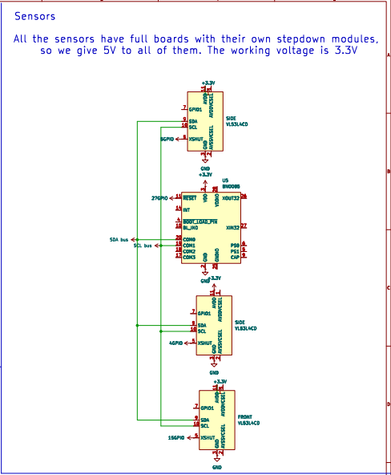
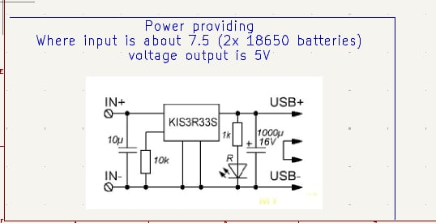

# KU STEAM Pinkies

WRO 2026 Future Engineers

Technical Project Report

Prepared: 2026-04-24

<table>
  <tr>
    <td>Team</td>
    <td>KU STEAM Pinkies</td>
  </tr>
  <tr>
    <td>Competition</td>
    <td>WRO 2026 Future Engineers</td>
  </tr>
  <tr>
    <td>Document type</td>
    <td>Technical project report</td>
  </tr>
  <tr>
    <td>Scope</td>
    <td>Mechanics, electronics, software logic, testing, reproducibility, media</td>
  </tr>
</table>

## Table Of Contents

Click a section title below to jump to that part of the document.

Project Overview

Mechanical Design

System Overview

Chassis Design

Drivetrain And Steering

Engineering Decisions

Risk and Failure Analysis

Electronics And Power

Electronics Overview

Sensor List

Motor And Servo Selection

Wiring Overview

Software And Control

Software Architecture

Software Flow And State Logic

Control Algorithms

Navigation Strategy

Vision Interface

Testing And Results

Testing Workflow

Performance Measurements

Track Testing

Final Performance

What Worked

What Did Not Work

Reproducibility And Submission

Evidence Map

Exact Rebuild, Wiring, Upload, And Start Procedure

Final Submission Checklist

Visual Material

Robot photos

Team photo

Design and electronics images

## Project Overview

A short overview of the project context, team, robot concept, and main engineering decisions.

<table>
  <tr>
    <td>Steering Layout</td>
    <td>Rear Drivetrain</td>
    <td>Electronics Structure</td>
  </tr>
  <tr>
    <td></td>
    <td></td>
    <td></td>
  </tr>
</table>

*Steering Layout*

*Rear Drivetrain*

*Electronics Structure*

<table>
  <tr>
    <td>Official Team Photo</td>
  </tr>
  <tr>
    <td></td>
  </tr>
</table>

*Official Team Photo*

<table>
  <tr>
    <td>Front View</td>
    <td>Right View</td>
    <td>Back View</td>
  </tr>
  <tr>
    <td></td>
    <td></td>
    <td></td>
  </tr>
</table>

<table>
  <tr>
    <td>Left View</td>
    <td>Top View</td>
    <td>Bottom View</td>
  </tr>
  <tr>
    <td></td>
    <td></td>
    <td></td>
  </tr>
</table>

*Front View*

*Right View*

*Back View*

*Left View*

*Top View*

*Bottom View*

### KU STEAM Pinkies - WRO 2026 Future Engineers

#### Team And Project Introduction

We are KU STEAM Pinkies, competing in WRO 2026 Future Engineers.

##### Marius

- software development;

- mechanical design;

- controller refinement and integration work.

##### Domas

- project coordination;

- testing and iteration tracking;

- documentation structure and submission preparation.

##### Jonas

- electronics and hardware design;

- wiring, component layout, and implementation support.

We divided responsibilities, but the final robot was developed and tested as one shared engineering project.

This repository contains the documentation, design decisions, and embedded control code for our WRO 2026 Future Engineers robot.

#### Single DOCX Report

For a continuous, judge-friendly Word version of the repository documentation, use:

- KU-STEAM-Pinkies-project-report.docx

#### Robot At A Glance

Our robot is a compact self-driving car with:

- rear-wheel drive;

- front-wheel steering;

- an ESP32 for low-level control;

- a Raspberry Pi Zero and camera for perception;

- a BNO085 IMU;

- one front VL53L1X and two VL53L1CD distance sensors for front and side feedback;

- an MG90S steering servo, N20 drive motor, and L298N motor driver.

The main idea is simple: perception chooses the driving reference, and the low-level controller keeps the robot on that reference as smoothly and consistently as possible.

The robot was developed as one system, not as a collection of separate parts. During the season we repeatedly found that steering geometry, wheel grip, sensor quality, software tuning, and power stability all affected each other. Because of that, this repository is organized to show both the final solution and the reasoning that led us there.

#### Challenge Overview

In WRO Future Engineers, the robot must drive autonomously, stay mechanically reliable, and show clear engineering reasoning across hardware, software, and testing.

For our team, the central engineering problem was not only making the robot move, but making it move in a controlled and repeatable way despite steering friction, wheel grip changes, power variation, and sensor noise. Because of that, this repository documents the robot as one integrated system rather than as isolated components.

One clear software tuning result was that straight-line drift after 2 m improved from 9 cm to 4 cm, corner overshoot from 14 cm to 6 cm, 3-lap success from 60% to 90%, and recovery time from 1.2 s to 0.6 s.

#### Version Milestones

To make the development path easier to judge, we track a small set of repository milestones instead of only keeping undated edits.

<table>
  <tr>
    <td>Version</td>
    <td>Status</td>
    <td>Meaning</td>
  </tr>
  <tr>
    <td>v0.8</td>
    <td>regional-ready</td>
    <td>Robot and documentation stable enough for regional presentation and validation runs</td>
  </tr>
  <tr>
    <td>v1.0</td>
    <td>documentation submission</td>
    <td>Main repository package aligned for official submission and evidence review</td>
  </tr>
  <tr>
    <td>v1.1</td>
    <td>final improvements</td>
    <td>Small post-submission refinements, wording cleanups, and non-structural improvements</td>
  </tr>
</table>

#### What Makes This Repository Judge-Friendly

This repository is organized so that a judge can quickly verify:

- what the final robot is made of;

- how the steering, drivetrain, sensors, and control system connect;

- where the active embedded code lives;

- which files provide rebuild evidence;

- where the required submission media is stored.

The most direct evidence files are:

#### What The Code Shows

The clearest software example in this repository is

That code shows the low-level ESP32 controller:

1. wait for the start button;

1. store the current yaw as the heading reference;

1. drive forward at fixed power;

1. read front, left, and right distance sensors together with yaw;

1. keep heading and wall offset under control;

1. make a hard turn when the front sensor detects a close boundary;

1. count sector turns and stop after the required sequence.

So the code here shows the low-level controller, not the whole robot software stack by itself.

#### How The Full System Is Intended To Work

In the full robot architecture, the Raspberry Pi Zero and camera handle the perception layer. That layer can decide which line the robot should follow or which side it should use around an obstacle.

The ESP32 remains responsible for:

- reading the IMU and distance sensors;

- generating steering and motor output;

- executing the real-time control loop.

This is why the repository documents both the low-level ESP32 controller and the Pi-side perception architecture, with the ESP32 still holding the real-time control responsibility.

#### System Modules

The robot can be understood as a set of connected modules.

##### 1. Perception Module

The perception module is built around the Raspberry Pi Zero and camera. Its role is to interpret the wider scene ahead of the robot. In our intended final architecture, this layer can:

- detect relevant lane or obstacle information;

- choose which side should be used around an obstacle;

- provide the low-level controller with a preferred driving line or reference shift.

This module is connected to the electromechanical system indirectly. It does not drive the servo or motor by itself. Instead, it sends a higher-level reference to the control side.

##### 2. Low-Level Control Module

The low-level control module is the ESP32 firmware. This is the controller that is visible most directly in the repository under

Its role is to:

- read the BNO085 yaw heading;

- read the front, left, and right VL53L1CD distance sensors;

- compute steering corrections;

- trigger and execute hard turns;

- drive the motor and steering servo.

This module is directly connected to the electromechanical components of the robot:

- BNO085 IMU

- one front VL53L1X and two VL53L1CD distance sensors

- MG90S steering servo

- L298N motor driver

- N20 drive motor

- start button and status lights

##### 3. Mechanical Module

The mechanical module includes the chassis, drivetrain, front steering layout, rear differential, wheel mounting, and custom printed parts. These parts matter because they directly affect how well the low-level controller can work. A good steering algorithm is much less useful if the wheels slip, the steering binds, or the differential resists turning.

##### 4. Power Module

The robot uses a 2x 18650 battery pack together with regulated power branches. The power layout matters because motor and servo loads can disturb logic and sensor signals if the electrical system is not organized carefully.

##### 5. Documentation And Reproducibility Module

The repository itself is also part of the final solution. It contains:

- source code;

- mechanical explanations;

- electronics and wiring information;

- CAD exports;

- testing notes;

- team, robot, and video submission material.

#### Assembly And Rebuild Path

If another team wanted to understand or rebuild the robot efficiently, we would suggest this order:

This path is intentionally practical: parts first, wiring second, mechanics third, and only then the deeper design trade-off documents.

#### Code Structure

The main software pieces are:

Together, these files show how the code is split into sensing, control, and actuation responsibilities.

#### How The Software Relates To The Hardware

The software is tightly connected to the electromechanical layout of the vehicle.

- The ESP32 reads yaw from the BNO085 to keep the robot aligned with the current heading target.

- The front VL53L1X sensor helps decide when a turn should begin.

- The side VL53L1CD sensors provide local spacing information used for steering correction.

- The MG90S servo receives the final steering command.

- The L298N and N20 motor provide forward movement under control of the ESP32.

- The Raspberry Pi Zero and camera can provide higher-level scene interpretation above this control loop.

This relationship between code and hardware is the reason we documented both sides together. The robot cannot be understood correctly if software, electronics, and mechanics are described in isolation.

#### Build, Compile, And Upload

The low-level controller is built as a PlatformIO project.

##### Basic Steps

1. Open the

1. Use PlatformIO to install the required libraries defined in platformio.ini.

1. Build the firmware environment from that configuration.

1. Connect the ESP32 board by USB.

1. Upload the compiled firmware to the controller.

1. Use the physical start button on the robot to begin the run.

##### What Gets Uploaded

The uploaded program includes:

- sensor startup and address assignment for the three distance sensors;

- compass startup;

- PWM setup for the drive motor and servo;

- the main control loop for straight driving and hard turns.

##### What Another Team Needs

To reproduce the controller side, another team would mainly need:

- the ESP32 board;

- the;

- the same or equivalent sensors and motor-control hardware;

- the wiring described in;

- the mechanical layout described in

#### Technical Drawings And Fabrication Evidence

The main build evidence is distributed across:

- ;

- , PCB, and wiring evidence;

- , drivetrain, and chassis explanations;

- , sensors, and electronics decisions.

These files are important because the robot cannot be reproduced from source code alone.

#### Video Submission

Current published link:

- Open Challenge: YouTube video

The submission videos are intended to show:

- autonomous driving without manual assistance;

- stable lane-following and turn transitions;

- obstacle response and recovery behavior;

- repeatable robot performance on the field.

#### Submission Media

The repository also includes the media required for the final submission package:

These media files matter because the rules require that the repository includes both technical documentation and final competition evidence.

#### Cost Analysis

<table>
  <tr>
    <td>Cost group</td>
    <td>Main items</td>
  </tr>
  <tr>
    <td>Control electronics</td>
    <td>ESP32, Raspberry Pi Zero, camera</td>
  </tr>
  <tr>
    <td>Sensors</td>
    <td>BNO085, front VL53L1X + 2x VL53L1CD</td>
  </tr>
  <tr>
    <td>Motion components</td>
    <td>MG90S, N20, L298N</td>
  </tr>
  <tr>
    <td>Power system</td>
    <td>2x 18650, regulators, wiring</td>
  </tr>
  <tr>
    <td>Mechanical parts</td>
    <td>chassis, printed parts, drivetrain, wheels</td>
  </tr>
  <tr>
    <td>Manufacturing extras</td>
    <td>fasteners, connectors, support materials</td>
  </tr>
</table>

This grouped view matches the way the robot was designed and documented: electronics, sensing, motion, power, and fabrication were treated as connected engineering subsystems rather than as isolated purchases.

#### Reproducibility Note

For software, the most direct evidence is the ESP32 project under

For the full robot, the hardware, design, and testing documents matter just as much because they explain the wider architecture, the mechanical choices, and how the system was tuned in practice.

Our goal with this repository is that another team should be able to understand:

- what the robot is made of;

- how the main modules are connected;

- what the control code does;

- how the firmware is built and uploaded;

- why the final design choices were made.

## Mechanical Design

The mechanical design logic: chassis, steering, drivetrain, and the reasoning behind the selected solutions.

### System Overview

#### Purpose of the System

Our robot was designed as a complete autonomous driving system, not as a collection of unrelated parts.

To perform well in WRO Future Engineers, it is not enough to have good mechanics or good code alone. The robot only works reliably when the chassis, drivetrain, steering, sensors, and software support each other.

For this reason, our development process increasingly focused on how subsystems interact.

#### Main Subsystems

The robot can be understood as five main subsystems:

1. Chassis and frame

Provides structure, mounting precision, and mechanical stability.

1. Drivetrain

Converts motor power into forward motion through the rear axle and differential.

1. Steering system

Controls the front-wheel direction and determines how precisely the robot can turn and recover.

1. Perception and control system

Interprets the environment and converts that information into steering and speed output.

1. Wheel-ground interaction

Transfers the mechanical command into real motion through grip and rolling behaviour.

#### Why Subsystem Interaction Matters

A robot can fail even when each separate part seems acceptable.

For example:

- good software cannot fully compensate for slipping front wheels,

- a strong servo cannot fix poor steering geometry,

- a good motor cannot guarantee precise turning if the differential behaviour is poor,

- and a compact chassis is only helpful if its geometry stays aligned.

This is why we treated the robot as one connected system.

#### Interaction 1: Chassis and Steering

The chassis and steering system are directly linked.

The steering system needs:

- stable mounting,

- low friction,

- and good geometric precision.

If the chassis allows too much play, bending, or asymmetry, straight driving becomes worse. That means the frame does not only hold the steering system - it also affects the quality of the steering result.

This was one of the reasons why better wheel mounting and better steering geometry improved straight driving.

#### Interaction 2: Steering and Front-Wheel Grip

Steering is only effective if the front wheels can actually follow the commanded direction.

Earlier front-wheel versions could slip. Even if the servo turned correctly, the real motion on the field was weaker than expected. After switching to silicone front wheels, the steering command translated into more reliable real movement.

This is a clear systems-thinking example:

- the servo alone was not the problem,

- the steering concept alone was not the problem,

- the wheel-floor interaction was also part of the steering performance.

#### Interaction 3: Drivetrain and Turning Behaviour

The drivetrain affects more than speed.

The motor choice and the differential both influenced:

- turning smoothness,

- resistance in corners,

- and overall controllability.

The 250 rpm motor worked best because it balanced speed and torque. The LEGO differential improved precision and reduced binding. These decisions made the robot easier to control, not just faster or slower.

#### Interaction 4: Software and Mechanics

Software performance depended on mechanical quality.

For example, sensor-regulated navigation works best when the robot responds predictably to steering commands. If the mechanics introduce slipping, sticking, or asymmetry, then the controller has to fight unstable behaviour.

So software quality depended partly on:

- steering smoothness,

- wheel grip,

- and differential behaviour.

Likewise, improved mechanics made the software easier to tune.

#### Interaction 5: Compact Size and Parking Performance

The compact chassis helped with:

- easier turning,

- a more suitable geometry for parking,

- and better fit to the challenge conditions.

However, compact size also created a packaging challenge. The robot had to stay small while still fitting the main functional systems.

This is another trade-off example:

- smaller size improved manoeuvrability,

- but made layout and integration more demanding.

#### Main Constraint Areas

During development, the most important constraints were:

- stability during straight driving,

- turning precision,

- suitable speed without losing torque,

- parking suitability,

- mechanical simplicity,

- and repeatability across runs.

Most of our design decisions came from balancing these constraints against each other.

#### System Summary

If we had to summarize the robot as one engineering system, the key relationships are:

- chassis precision determines whether steering geometry can work as intended;

- steering quality determines whether the controller can produce repeatable motion;

- wheel grip determines whether steering commands become real movement;

- drivetrain smoothness determines whether turns remain controllable;

- sensing quality determines whether the controller is correcting the right problem;

- software logic determines how safely and consistently all of these subsystems are used together.

This summary is important because it makes the subsystem interaction visible in one place instead of spreading it only across separate documents.

#### Example of Whole-System Improvement

One of the best examples of systems thinking in our project was improving straight driving.

Straight driving did not improve because of one isolated change. It improved because several changes worked together:

- better steering geometry,

- better front-wheel grip,

- better wheel mounting,

- improved differential behaviour.

Only after these parts supported each other did the overall result improve significantly.

#### Engineering Lesson

One of the most important lessons from our project was that a robot should be evaluated as a system, not as separate parts.

A part can look strong in isolation but still reduce the performance of the whole robot. That is why many of our final design decisions were based on practical system behaviour rather than only on theoretical advantages.

#### Final Conclusion

Our final robot performs better than the earlier versions because the subsystems work together more effectively.

The final design is not just:

- a smaller chassis,

- a better steering system,

- a better motor,

- or a better differential.

It is the combination of these elements into a more balanced and repeatable autonomous driving system.

### Chassis Design

#### Overview

Our final robot was designed as a compact rear-wheel-drive vehicle with front-wheel steering.

The main goal of the chassis was not to make the robot mechanically complicated, but to make it stable, predictable, and easier to control during autonomous driving.

The final outer dimensions of the robot are approximately:

- Length: 21 cm

- Width: 10 cm

- Height: 8 cm

These dimensions were selected intentionally. In our opinion, this size was close to ideal for our robot because it was:

- small enough to turn more easily,

- compact enough to package the main systems inside the body,

- and well suited for the parking area requirements in the WRO challenge.

#### Why We Moved Away from the Previous Robot

Before building the final robot, we had an older and larger robot with a more powerful motor and gearbox.

The photos below show the previous-season robot concept that taught us an important lesson about complexity.

Previous robot overall view

Overall view of the previous robot from the earlier competition season.

Previous robot drivetrain view

Close-up of the previous robot drivetrain and steering-related mechanical layout.

Although that robot was mechanically impressive, in practice it had important disadvantages:

- it was harder to turn,

- the engineering solution was more complicated,

- and the steering system was less practical for stable autonomous driving.

This was one of our most important engineering lessons: a more complex robot is not automatically a better robot.

From the previous year's competition robot, we learned that too much mechanical complexity made the system harder to tune, harder to control, and less repeatable in real driving. Because of that lesson, we decided that the new robot should be built in a simpler and more practical way.

For the final version, we deliberately moved toward a simpler, smaller, and more controllable chassis concept.

#### Chassis Philosophy

The robot chassis was designed around four main priorities:

1. compact size for easier turning and better parking suitability,

1. mechanical simplicity to reduce unnecessary resistance and make the robot easier to tune,

1. stable wheel alignment for repeatable straight driving,

1. good mounting quality so that steering and drivetrain parts keep their geometry during driving.

In practice, our robot performance depended strongly on whether the chassis could keep the steering system aligned and moving smoothly. Even small play or friction in the front part of the chassis affected the driving result.

#### Frame Material and Custom Parts

The main frame of the robot is made from wood.

We selected this because it was practical for building a custom structure and gave us enough freedom to place the drivetrain, steering, sensors, and camera where we needed them.

The robot also uses several custom-made parts, including:

- 3D-printed steering components,

- motor mount,

- camera mount,

- and other custom support elements required for our final layout.

These parts are important for reproducibility because another team would need to know that the robot is not built only from standard ready-made components.

#### Drive Layout

The final robot uses:

- rear-wheel drive,

- front-wheel steering,

- mechanical rear differential.

We chose this layout because it gave us a good balance between controllability, simplicity, and turning performance.

The rear axle is responsible for propulsion, while the front axle is responsible only for steering. This separation made the robot behaviour easier to understand and easier to optimise.

#### Why Compact Size Helped

One of the main reasons for the final dimensions was turning performance.

A robot that is too large can require more space to rotate, can be harder to package cleanly, and can become less convenient for parking manoeuvres. In our testing and design thinking, a smaller chassis gave practical advantages:

- the robot could turn more easily,

- the robot geometry was better suited to the challenge,

- and the robot fit our parking goals better.

This does not mean that smaller is always better. A compact robot is harder to package internally. However, for our design, this trade-off was worth it.

#### Weight Distribution

We also paid attention to component placement inside the chassis.

The goal was to avoid a badly unbalanced robot and keep the overall behaviour more predictable. A mechanically stable robot is not only about the frame itself, but also about how all components are placed inside it.

#### Main Mechanical Goal: Straight Driving

One of the biggest practical mechanical challenges during development was straight driving.

At different stages of the project, the robot could drift slightly to either side. This was not caused by only one part. Instead, it depended on several mechanical details working together:

- steering symmetry,

- wheel mounting quality,

- grip at the front wheels,

- differential behaviour,

- and overall assembly precision.

The final robot still drifted only minimally, but compared to earlier versions the result was much better and more repeatable.

#### What Improved the Chassis Performance Most

The two most important improvements for the real driving result were:

- better wheel mounting,

- switching to a LEGO differential.

These changes helped the robot become more precise and less prone to unwanted mechanical resistance.

#### Iteration Summary

<table>
  <tr>
    <td>Stage</td>
    <td>Main idea</td>
    <td>Main weakness</td>
    <td>What we learned</td>
  </tr>
  <tr>
    <td>Previous larger robot</td>
    <td>More powerful motor, gearbox, more complex engineering</td>
    <td>Harder turning, more complexity</td>
    <td>Bigger and stronger was not automatically better</td>
  </tr>
  <tr>
    <td>Early compact concept</td>
    <td>Smaller and simpler chassis</td>
    <td>Needed steering and drivetrain refinement</td>
    <td>Compact size gave a better foundation</td>
  </tr>
  <tr>
    <td>Final chassis</td>
    <td>Compact frame, improved wheel mounting, LEGO differential, better front grip</td>
    <td>Only minimal remaining drift</td>
    <td>Best overall balance of size, control, and repeatability</td>
  </tr>
</table>

#### Final Conclusion

Our final chassis was selected because it gave the best practical balance between:

- turning ability,

- parking suitability,

- mechanical simplicity,

- and repeatable driving.

The most important engineering conclusion from this development was that a robot should be designed for controllability and repeatability, not only for power or complexity.

### Drivetrain And Steering

Our robot uses rear-wheel drive, a mechanical rear differential, and servo-based front steering.

We chose that combination because it gave the best overall control on the field. The robot needed to turn cleanly, recover after turns, and stay predictable on straights.

#### Motor Testing

Before choosing the final motor, we tested three N20 options:

- 300 rpm

- 250 rpm

- 1000 rpm

All three were small enough for the robot, but they behaved differently on the track.

##### 300 rpm

This option was too slow for the performance we wanted.

##### 1000 rpm

This option was faster, but its usable torque was weaker in practice.

##### 250 rpm

The 250 rpm motor gave the best balance between speed and torque, so it became the final choice.

#### Why The Motor Choice Mattered

For this robot, speed alone was not enough. It also needed predictable motion and reliable response during turning and correction.

<table>
  <tr>
    <td>Motor option</td>
    <td>Practical strength</td>
    <td>Practical weakness</td>
    <td>Final decision</td>
  </tr>
  <tr>
    <td>300 rpm</td>
    <td>easy to control at low speed</td>
    <td>too slow</td>
    <td>rejected</td>
  </tr>
  <tr>
    <td>250 rpm</td>
    <td>balanced speed and usable torque</td>
    <td>normal tuning still required</td>
    <td>selected</td>
  </tr>
  <tr>
    <td>1000 rpm</td>
    <td>high theoretical speed</td>
    <td>less stable under load</td>
    <td>rejected</td>
  </tr>
</table>

#### Differential Choice

From earlier experience, we already knew that the rear axle needed a good differential. Without it, the robot became harder to turn and less predictable in corners.

In the final robot, we used a LEGO differential.

##### Differential Comparison

Metal differential version

Earlier drivetrain version with the metal differential.

LEGO differential version

Final drivetrain version with the LEGO differential.

##### Why The LEGO Differential Stayed

Compared with the earlier metal differential, the LEGO version gave:

- smoother cornering;

- less binding;

- more repeatable behavior between runs.

That made it the better choice for this robot, even if it looked simpler.

#### Steering Overview

The steering is based on a servo-driven three-gear layout. The servo turns the center gear, and that motion is transferred symmetrically to the two steering sides.

We wanted the steering to be:

- smooth;

- repeatable;

- mechanically efficient;

- stable in straight driving.

#### Steering Angle

The servo itself can rotate further, but on the robot we intentionally limit the useful steering range to about 60 degrees.

This was one of the most important trade-offs in the whole robot:

- more steering angle looked attractive in theory;

- too much angle reduced stability in practice.

So we kept the range that gave the most controlled driving.

#### Why We Used MG90S

We selected an MG90S servo because it was compact, simple to integrate, and strong enough once the steering geometry was improved.

Instead of solving the problem by installing a heavier servo, we reduced steering resistance and improved the mechanism itself.

#### Steering Iterations

The steering went through three main versions.

##### Version 1

The first version used the same main idea, but the wheel support created a large lever arm. That made the servo work much harder than it should.

##### Version 2

The biggest improvement from V1 to V2 was removing that bad lever arm. This made the steering much easier to move and lowered the servo load significantly.

##### Version 3

The final version kept the improved geometry and added:

- bearings in the frame;

- custom silicone front wheels.

That combination improved grip, reduced friction, and made the steering more repeatable.

#### Front And Rear Wheel Roles

We did not try to make every wheel do the same job.

##### Front Wheels

The front axle needed grip, because the steering command only matters if the wheels actually follow it. After switching to silicone front wheels:

- slip decreased;

- steering effect increased;

- turning became more reliable.

##### Rear Wheels

The rear axle needed stable drive transmission through the differential, so the rear setup stayed simpler and more focused on dependable traction.

#### Straight-Driving Challenge

One of the main steering-related problems was straight driving. The robot could drift slightly to either side until the steering geometry, wheel grip, and differential behavior improved enough to work together.

The biggest improvements came from:

- better steering geometry;

- better front-wheel grip;

- better wheel mounting;

- a better differential.

#### How We Compared Versions

We did not compare steering versions only by looking at them. We compared them by driving.

The most useful checks were:

- how much space the robot needed to complete a 90 degree turn;

- how much it drifted over a 3 m straight drive.

#### Mechanical Validation Matrix

<table>
  <tr>
    <td>Mechanical area</td>
    <td>Weak result</td>
    <td>Acceptable result</td>
    <td>Strong result</td>
  </tr>
  <tr>
    <td>motor choice</td>
    <td>robot too slow or obviously under torque stress</td>
    <td>completes turns and straights reliably</td>
    <td>keeps pace while remaining controllable</td>
  </tr>
  <tr>
    <td>differential behavior</td>
    <td>binding, rough corner exits, inconsistent wheel behavior</td>
    <td>cornering works with minor resistance</td>
    <td>smooth cornering with low resistance and repeatable exits</td>
  </tr>
  <tr>
    <td>steering geometry</td>
    <td>heavy servo load, visible sticking, poor symmetry</td>
    <td>mostly usable with some correction cost</td>
    <td>low resistance, symmetric response, stable straight driving</td>
  </tr>
  <tr>
    <td>front-wheel grip</td>
    <td>wheels slip before command is transferred</td>
    <td>steering works with occasional slip</td>
    <td>steering command translates directly into real movement</td>
  </tr>
</table>

#### Testing Effort

We did about 10 practical comparison runs while deciding between the main mechanical versions.

The most important result was clear: the jump from steering V1 to V2 gave the largest improvement.

#### Summary Table

<table>
  <tr>
    <td>Element</td>
    <td>Tested options</td>
    <td>Final choice</td>
    <td>Why</td>
  </tr>
  <tr>
    <td>drive motor</td>
    <td>250 / 300 / 1000 rpm N20</td>
    <td>250 rpm N20</td>
    <td>best balance of speed and torque</td>
  </tr>
  <tr>
    <td>differential</td>
    <td>earlier metal differential vs LEGO differential</td>
    <td>LEGO differential</td>
    <td>smoother and more repeatable turning</td>
  </tr>
  <tr>
    <td>steering geometry</td>
    <td>V1, V2, V3</td>
    <td>V3</td>
    <td>best precision, lowest resistance, best grip</td>
  </tr>
  <tr>
    <td>front wheels</td>
    <td>earlier wheels vs silicone wheels</td>
    <td>silicone wheels</td>
    <td>less slip, stronger steering effect</td>
  </tr>
  <tr>
    <td>steering range</td>
    <td>larger possible range vs limited useful range</td>
    <td>about 60 degrees</td>
    <td>better stability</td>
  </tr>
</table>

#### Final Conclusion

The final drivetrain and steering system were chosen because they gave the best practical result on the field.

The biggest lessons were:

- the middle motor option was better than the extreme options;

- differential quality strongly affected turning precision;

- a larger steering angle was not automatically better;

- reducing steering load was more effective than simply choosing a stronger servo.

### Engineering Decisions

These were the main trade-offs that shaped the final robot.

#### The Main Idea

During development, the best solution was usually not the most powerful or the most complex one. The best solution was the one that made the robot more stable, more repeatable, and easier to control on the field.

#### 1. Steering Angle Versus Stability

At first, a larger steering angle looked attractive because it suggested tighter turns. In practice, too much steering angle made the robot less stable.

So even though the servo itself could rotate further, we limited the useful steering range to about 60 degrees on the robot.

This was one of the clearest lessons of the season: the maximum possible movement was not the best movement.

#### 2. Smaller Robot Instead Of A Larger One

Our previous robot was larger and mechanically more complicated. It taught us an important lesson: when the whole system becomes too complex, it becomes harder to make the robot stable and repeatable.

That is why we chose a smaller final robot, about:

- 21 cm long

- 10 cm wide

- 8 cm high

The smaller robot was easier to package, easier to turn, and easier to control.

#### 3. The 250 rpm Motor Instead Of Extreme Options

We tested three N20 motor options:

- 300 rpm

- 250 rpm

- 1000 rpm

The 250 rpm option gave the best controllable speed for the final robot. Faster options were harder to control and gave less useful torque margin, so 250 rpm became the final choice.

#### 4. Differential As A Required Part

From earlier work, we already knew that a differential was not optional for this kind of robot.

Without a good differential, the robot became:

- harder to turn;

- less smooth in corners;

- less predictable.

We also compared a metal differential with the final LEGO differential. The LEGO version was more reliable and gave smoother, more repeatable cornering in practice.

#### 5. Fixing Steering Geometry Instead Of Buying A Stronger Servo

We used an MG90S servo. A stronger servo was possible, but that would have treated the symptom instead of the cause.

The real problem in steering Version 1 was geometry. A holder and screw arrangement created a large force arm, so the servo had to work much harder than it should.

In Version 2, we removed that force arm. The wheels turned more directly, the mechanism became lighter to move, and the servo could do its job much more easily.

So the right fix was not "buy a stronger servo". The right fix was to improve the mechanical geometry first.

#### 6. Front Grip Was More Important Than Matching Wheel Types

We intentionally used different wheel strategies on the front and rear axles.

At the front, the main goal was steering grip. Earlier front wheels could slip, which reduced the real effect of the steering command. After switching to silicone front wheels:

- front slip decreased;

- useful steering effect increased;

- turning became more effective.

The lesson here was simple: wheel choice should match the job of the axle.

#### 7. Precision Was More Valuable Than Complexity

Several final decisions followed the same pattern:

- we moved from a larger robot to a smaller one;

- we rejected the weakest and fastest motor extremes;

- we limited steering angle;

- we improved steering geometry instead of increasing servo power;

- we changed to a better differential;

- we improved front-wheel grip.

All of these choices favored precision and repeatability over complexity.

#### How We Compared Versions

We compared versions through practical testing, not only by looking at parts on the table.

The main checks were:

- how much space the robot needed to complete a 90 degree turn;

- how much it drifted over a 3 m straight drive.

We performed about 10 test runs while comparing versions. The change from steering V1 to V2 produced the clearest improvement.

#### Trade-Off Summary

<table>
  <tr>
    <td>Decision</td>
    <td>Option A</td>
    <td>Option B</td>
    <td>Chosen</td>
    <td>Evidence</td>
  </tr>
  <tr>
    <td>Drive motor speed</td>
    <td>300 rpm</td>
    <td>250 rpm</td>
    <td>250 rpm</td>
    <td>250 rpm kept enough controllable speed while faster options were harder to stabilize</td>
  </tr>
  <tr>
    <td>Steering concept</td>
    <td>complex custom steering</td>
    <td>simplified low-friction steering</td>
    <td>simplified steering</td>
    <td>More repeatable, less friction, easier servo load</td>
  </tr>
  <tr>
    <td>Front wheel tires</td>
    <td>low-grip wheels</td>
    <td>silicone wheels</td>
    <td>silicone wheels</td>
    <td>Better corner hold and less random slip</td>
  </tr>
  <tr>
    <td>Sensor role</td>
    <td>distance-only</td>
    <td>fused distance + IMU + camera</td>
    <td>fused</td>
    <td>More robust against single-sensor error</td>
  </tr>
</table>

We did not select parts only by availability.

We compared alternatives and kept the solution that gave the best balance between speed, stability, and repeatability.

In most cases, we preferred the option that reduced random behavior, even if it was not the fastest on a single run.

#### Main Risks And How We Answered Them

<table>
  <tr>
    <td>Risk / weakness</td>
    <td>Effect on robot</td>
    <td>Mitigation</td>
  </tr>
  <tr>
    <td>Large steering lever arm</td>
    <td>servo overload, weak steering efficiency</td>
    <td>redesigned steering geometry in V2</td>
  </tr>
  <tr>
    <td>Too much steering angle</td>
    <td>unstable behavior</td>
    <td>limited steering range to about 60 degrees</td>
  </tr>
  <tr>
    <td>Front wheel slip</td>
    <td>weak real steering effect</td>
    <td>switched to silicone front wheels</td>
  </tr>
  <tr>
    <td>Poor differential behavior</td>
    <td>rougher, less precise turning</td>
    <td>switched to LEGO differential</td>
  </tr>
  <tr>
    <td>Extreme motor choice</td>
    <td>too fast or not enough usable torque margin</td>
    <td>selected 250 rpm N20</td>
  </tr>
</table>

#### Failure Modes, Mitigation, And Evidence

<table>
  <tr>
    <td>Failure mode</td>
    <td>Cause</td>
    <td>Mitigation</td>
    <td>Result after fix</td>
  </tr>
  <tr>
    <td>Robot drifts to one side</td>
    <td>steering asymmetry / wheel grip difference</td>
    <td>steering neutral recalibration + PD retune</td>
    <td>straighter lane holding</td>
  </tr>
  <tr>
    <td>Servo jitter near center</td>
    <td>friction + unstable small corrections</td>
    <td>reduced mechanical resistance + deadband tuning</td>
    <td>smoother steering</td>
  </tr>
  <tr>
    <td>False wall/obstacle reaction</td>
    <td>noisy distance readings</td>
    <td>filtering + confidence threshold</td>
    <td>fewer unnecessary corrections</td>
  </tr>
  <tr>
    <td>Unstable heading after turn</td>
    <td>aggressive exit correction</td>
    <td>turn-exit damping</td>
    <td>less oscillation after corners</td>
  </tr>
</table>

We used this risk-based approach during iteration.

Instead of only reacting to failures, we tried to identify likely failure points early and document how each change affected behavior.

This helped us improve reproducibility and reduced random performance drops between runs.

#### Final Summary

The final robot is the result of repeated trade-offs, not one big idea.

The most important ones were:

- smaller chassis instead of a larger, heavier one;

- balanced motor instead of an extreme option;

- useful steering range instead of maximum steering range;

- better geometry instead of a stronger servo;

- more front grip instead of matching wheel type everywhere;

- a better differential instead of a less reliable one.

In the end, the final design was chosen because it was easier to control, more repeatable, and more suitable for real competition driving.

### Risk and Failure Analysis

#### Why Risk Analysis Matters

In an autonomous robot, good performance depends not only on what works, but also on what can go wrong.

During development, we identified several practical failure modes that could reduce performance or make the robot less repeatable. Instead of treating these as random problems, we used them to guide design improvements.

This is an important part of engineering: understanding risks and reducing them through design changes.

#### Main Risks We Identified

The most important risks in our robot were:

- unstable steering behaviour,

- front-wheel slipping,

- excessive steering load on the servo,

- weak turning precision,

- poor differential behaviour,

- wrong motor balance between speed and torque,

- and reduced straight-driving repeatability.

#### Risk 1: Large Steering Lever Arm

##### Problem

In steering Version 1, the wheel support was attached in a way that created a large force arm.

##### Risk

This made the servo work harder and increased the mechanical resistance of the steering system.

##### Effect on performance

The robot became less efficient in steering and the servo had more difficulty turning the wheels.

##### Mitigation

In Version 2, we removed the large lever arm and redesigned the steering so that the wheels rotated more directly in place.

##### Result

This was the biggest steering improvement in the project. The servo could turn the wheels much more easily.

#### Risk 2: Too Much Steering Angle

##### Problem

A large steering range seemed useful at first.

##### Risk

In practice, too much steering angle reduced stability.

##### Effect on performance

The robot became harder to control consistently.

##### Mitigation

Although the servo itself could rotate about 90 degrees, we limited the usable robot steering angle to about 60 degrees.

##### Result

The driving behaviour became more stable.

#### Risk 3: Front-Wheel Slipping

##### Problem

Earlier front-wheel solutions could slip on the field surface.

##### Risk

Even if the steering command was correct, the front wheels would not always transfer that command effectively into real motion.

##### Effect on performance

Turning became weaker and less repeatable.

##### Mitigation

We switched to silicone front wheels.

##### Result

The front wheels no longer slipped, and the robot could turn more effectively.

#### Risk 4: Poor Differential Precision

##### Problem

The behaviour of the differential strongly affected turning quality.

##### Risk

An unsuitable differential solution increased the chance of less precise turning and mechanical binding.

##### Effect on performance

The robot became less precise and more likely to feel resistant in turning.

##### Mitigation

We changed from a metal differential to a LEGO differential.

##### Result

The robot became more precise and less likely to jam or bind.

#### Risk 5: Wrong Motor Selection

##### Problem

The drive motor had to balance speed and torque.

##### Risk

A slow motor could limit performance, while a very fast motor could reduce usable torque.

##### Effect on performance

The robot would either become too slow or lose too much practical drive strength.

##### Mitigation

We tested three N20 motors:

- 300 rpm,

- 250 rpm,

- 1000 rpm.

##### Result

We selected the 250 rpm motor because it gave the best balance of speed and torque.

#### Risk 6: Straight-Driving Drift

##### Problem

At different stages, the robot could drift slightly to either side.

##### Risk

Reduced straight-driving repeatability makes lap performance less stable and increases correction demands on the software.

##### Effect on performance

The robot became less predictable during long straight sections.

##### Mitigation

We improved several connected parts:

- wheel mounting,

- steering geometry,

- front-wheel grip,

- differential behaviour.

##### Result

Straight-driving drift was reduced to a minimal level.

#### Risk 7: Solving Problems by Only Increasing Power

##### Problem

One possible reaction to steering difficulty would have been to use a stronger servo.

##### Risk

That would increase energy demand without solving the real mechanical weakness.

##### Effect on performance

The robot might use more energy while still keeping a weak geometry.

##### Mitigation

Instead of increasing servo power, we improved the steering mechanics.

##### Result

The chosen MG90S servo became sufficient once the steering geometry was corrected.

#### Summary Risk Table

<table>
  <tr>
    <td>Risk</td>
    <td>Why it mattered</td>
    <td>Mitigation</td>
    <td>Final result</td>
  </tr>
  <tr>
    <td>Large steering lever arm</td>
    <td>High servo load, weak steering efficiency</td>
    <td>Redesigned steering in V2</td>
    <td>Servo turned more easily</td>
  </tr>
  <tr>
    <td>Too much steering angle</td>
    <td>Lower stability</td>
    <td>Limited to ~60°</td>
    <td>More controlled behaviour</td>
  </tr>
  <tr>
    <td>Front-wheel slipping</td>
    <td>Weak real steering effect</td>
    <td>Silicone front wheels</td>
    <td>Better grip, stronger turning</td>
  </tr>
  <tr>
    <td>Unsuitable differential</td>
    <td>Lower precision, more binding</td>
    <td>LEGO differential</td>
    <td>More precise, less jamming</td>
  </tr>
  <tr>
    <td>Wrong motor choice</td>
    <td>Too fast or too weak under load</td>
    <td>Tested 250 / 300 / 1000 rpm</td>
    <td>250 rpm chosen</td>
  </tr>
  <tr>
    <td>Straight-driving drift</td>
    <td>Lower repeatability</td>
    <td>Multiple mechanical improvements</td>
    <td>Minimal drift</td>
  </tr>
  <tr>
    <td>Stronger-servo-only solution</td>
    <td>More energy use without geometry fix</td>
    <td>Improved mechanics first</td>
    <td>MG90S became sufficient</td>
  </tr>
</table>

#### Main Engineering Lesson from Failure Analysis

The most important lesson from our risk analysis was that many problems came from interaction between parts, not from only one isolated component.

For example:

- slipping wheels reduced steering effectiveness,

- poor steering geometry overloaded the servo,

- differential behaviour affected turning precision,

- and drift depended on multiple parts together.

This means the robot had to be improved as a system.

#### Final Conclusion

Risk and failure analysis helped us move from early versions to a more reliable final design.

Instead of only adding stronger components, we focused on reducing the root causes of weak performance. This made the robot:

- more stable,

- more precise,

- less mechanically resistant,

- and more repeatable across runs.

## Electronics And Power

Sensors, controllers, power distribution, and the wiring principles used in the robot.

### Electronics Overview

Our robot uses a split electronics system. The Raspberry Pi Zero and camera handle perception, while the ESP32 handles low-level control, steering, and motor output.

That split gave us two practical benefits:

- the camera side could focus on track and obstacle interpretation;

- the controller side could stay fast and predictable.

#### Main Electronic Parts

The final electronics system includes:

- Raspberry Pi Zero

- camera module

- ESP32-WROOM-32

- BNO085 IMU

- front VL53L1X + 2x VL53L1CD distance sensors

- MG90S steering servo

- N20 6 V 250 rpm drive motor

- L298N motor driver

- 2x 18650 Li-ion battery pack

- step-down regulation and perfboard-based distribution

#### Board Roles

The Raspberry Pi Zero is responsible for perception. It can decide which driving line is safer or which side should be used around an obstacle.

The ESP32 is responsible for:

- reading the IMU and distance sensors;

- holding the heading reference;

- applying wall-distance correction;

- driving the steering servo;

- controlling the drive motor.

So the robot is not built around one giant controller that tries to do everything. It is split into a perception layer and a control layer.

#### Power Layout

The robot is powered by a 2-cell 18650 pack, treated in our documentation as about 7.5 V under normal use.

From that source we separate power into several branches:

- motor branch for the L298N and drive motor;

- regulated logic branch for the ESP32;

- regulated logic branch for the Raspberry Pi Zero;

- regulated sensor branch for the IMU and distance sensors;

- steering branch for the servo.

We used separate branches because the drive motor and servo can disturb logic power if everything is tied together without enough isolation.

#### Current Budget

We did not try to present laboratory-grade current measurements for every part. Instead, we used a conservative design budget so the power system would still have margin.

<table>
  <tr>
    <td>Subsystem</td>
    <td>Main parts</td>
    <td>Rail type</td>
    <td>Design assumption</td>
  </tr>
  <tr>
    <td>Logic compute</td>
    <td>Raspberry Pi Zero, ESP32</td>
    <td>regulated logic rail</td>
    <td>0.8 A continuous</td>
  </tr>
  <tr>
    <td>Sensors</td>
    <td>BNO085, front VL53L1X + 2x VL53L1CD</td>
    <td>regulated sensor rail</td>
    <td>0.35 A continuous</td>
  </tr>
  <tr>
    <td>Steering</td>
    <td>MG90S servo</td>
    <td>steering branch</td>
    <td>1.0 A peak</td>
  </tr>
  <tr>
    <td>Drive</td>
    <td>N20 + L298N</td>
    <td>battery / motor branch</td>
    <td>1.5 A peak</td>
  </tr>
  <tr>
    <td>Total</td>
    <td>all branches together</td>
    <td>battery input</td>
    <td>about 3.7 A peak</td>
  </tr>
</table>

The point of this table is simple: the regulators and wiring should have headroom, not just barely work on paper.

#### Why We Kept Regulated Power

Regulated power mattered for a few reasons:

- neither the ESP32 nor the Raspberry Pi Zero should be fed from raw battery voltage;

- noisy logic power makes sensor data less trustworthy;

- the servo and drive motor can cause voltage sag during aggressive movement;

- a structured power layout is easier to debug and easier to rebuild.

#### Sensor Set

We used several sensor types because they solve different problems.

##### Camera

The camera gives a wider view of the track. That is useful for lane interpretation and obstacle-side decisions before the robot reaches the immediate interaction zone.

##### IMU

The BNO085 helps keep the robot aligned with its heading target. Without yaw feedback, straight driving and repeatable 90-degree turns would be much harder.

##### Distance Sensors

The one front VL53L1X and two VL53L1CD modules are used as:

- front for turn timing and close-range detection;

- left for side-distance feedback;

- right for the opposite side.

Together, they give the controller local geometry that the camera alone cannot guarantee at short range.

#### Why We Stayed With VL53L1CD

We also tried VL53L5CX matrix sensors during development. They offered richer data, but the added complexity was not worth it for this robot.

For our final system, VL53L1CD modules were easier to integrate, easier to tune, and more practical for repeatable close-range sensing.

#### Sensor Placement

The placement follows the job of each sensor:

- the camera watches the wider scene ahead;

- the front distance sensor watches the area used for turn triggering;

- the side sensors watch wall or obstacle spacing;

- the IMU is mounted rigidly so the yaw estimate follows the chassis, not a flexible bracket.

#### Calibration Routine

Our basic setup routine is:

1. make sure the BNO085 is mounted rigidly and gives stable yaw when the robot is still;

1. initialize the three distance sensors one by one so they can share the bus with different addresses;

1. verify repeatable distance readings against known positions;

1. check that the perception layer and the low-level controller agree on the intended driving line;

1. verify that straight driving does not drift immediately after startup;

1. repeat these checks after any meaningful mechanical or wiring change.

#### Main Electrical Risks

The most important practical electrical risks were:

<table>
  <tr>
    <td>Risk</td>
    <td>Likely effect</td>
    <td>Mitigation</td>
  </tr>
  <tr>
    <td>motor noise on logic rails</td>
    <td>unstable control or noisy sensor data</td>
    <td>split power branches</td>
  </tr>
  <tr>
    <td>servo current spikes</td>
    <td>voltage sag and steering inconsistency</td>
    <td>separate steering branch with headroom</td>
  </tr>
  <tr>
    <td>identical ToF sensors on one bus</td>
    <td>address conflict or missing readings</td>
    <td>staged startup and address assignment</td>
  </tr>
  <tr>
    <td>flexible IMU mounting</td>
    <td>unstable yaw estimate</td>
    <td>rigid mounting and repeated checks</td>
  </tr>
  <tr>
    <td>sensor wires near motor path</td>
    <td>inconsistent readings</td>
    <td>keep logic and sensor wiring away from high-current paths</td>
  </tr>
</table>

#### Why This Layout Stayed

We kept this electronics layout because it gave us:

- stable power distribution;

- a clean separation between perception and control;

- reliable local sensing for the low-level controller;

- documentation that another team can actually follow.

### Sensor List

This page summarizes the sensors we used, why we chose them, and how they were placed on the robot.

#### Sensors In Use

- camera system used for the perception layer;

- BNO085 9-DOF IMU;

- front VL53L1X + 2x VL53L1CD distance sensors used as front, left, and right.

#### Sensor Selection And Role

<table>
  <tr>
    <td>Sensor</td>
    <td>Main role in the robot</td>
    <td>Why we selected it</td>
  </tr>
  <tr>
    <td>camera system</td>
    <td>wider scene interpretation and obstacle/lane perception</td>
    <td>it sees farther ahead than short-range sensors and supports higher-level driving decisions</td>
  </tr>
  <tr>
    <td>BNO085 IMU</td>
    <td>heading awareness, straight-line stability, turn consistency</td>
    <td>a steering robot benefits from yaw feedback even when distance readings momentarily change</td>
  </tr>
  <tr>
    <td>front VL53L1X</td>
    <td>close approach and turn triggering</td>
    <td>it gives direct information about the boundary ahead of the robot</td>
  </tr>
  <tr>
    <td>left VL53L1CD</td>
    <td>side-distance awareness</td>
    <td>it supports wall-offset control on one side of the robot</td>
  </tr>
  <tr>
    <td>right VL53L1CD</td>
    <td>opposite side-distance awareness</td>
    <td>it allows the same control model to be used when the reference side changes</td>
  </tr>
</table>

#### Tested Alternative And Why We Rejected It

We also tested VL53L5CX matrix sensors during development. We rejected that option in the final hardware documentation because:

- the matrix output made the sensing pipeline more complex;

- we had to decide which zones to trust and how to filter them;

- in our tests, that added complexity did not give a strong enough improvement in real driving.

For our published controller, simpler distance sensing was a better engineering choice than a more complex matrix sensor that did not improve practical performance enough.

#### Placement Reasoning

The sensors were placed according to track geometry, not only according to free space inside the robot.

- the camera is used for the wider forward scene;

- the front distance sensor is used for the approach area where close boundary detection must be confirmed;

- the left distance sensor is used for side-distance awareness on one side of the robot;

- the right distance sensor is used for side-distance awareness on the opposite side;

- the IMU is mounted rigidly near the main structure so heading data reflects the chassis and not a flexible bracket.

This combination supports the full robot behavior because the robot needs both:

- wider scene interpretation;

- direct front-boundary detection;

- side-spacing feedback together with heading stabilization.

#### Mounting Notes

- The BNO085 must be mounted rigidly so sensor fusion reflects robot motion rather than board flex.

- The camera must be mounted so its field of view is stable and useful for the perception layer.

- The VL53L1CD modules should be positioned so their view is not blocked by wheels, chassis walls, or servo parts.

- The three distance sensors must be documented together because they solve different geometric parts of the same control problem.

- Using camera perception together with three compact distance sensors keeps the sensing architecture broader without losing local geometric feedback.

#### Calibration Notes

The minimum calibration workflow used in development is:

1. verify stable IMU yaw while the robot is stationary;

1. verify that the camera view is aligned with the intended driving direction;

1. start the distance sensors one by one so they can operate reliably on one communication bus;

1. verify repeatable distance readings against a known wall position;

1. re-check sensor alignment after any mechanical change that affects angle, height, or vibration.

#### Documentation Requirements

- List the exact modules used.

- Explain where each sensor is mounted.

- Describe how each sensor contributes to the robot's decision cycle.

- Mention any calibration or alignment requirements.

### Motor And Servo Selection

#### Motor

The drive side uses a motor that can provide enough torque for acceleration and repeated restarts on the track.

During selection, controllability and reliability were more important than maximum top speed alone.

#### Steering Servo

The steering servo must position the front wheels accurately and return to center consistently.

Because steering precision directly affects lane-following behavior, servo stability is more important than extremely fast motion.

#### Mechanical Compatibility

The servo choice is closely tied to the steering linkages and gear mechanism.

This means the servo is not just a parts-list item; it defines how much steering range the geometry can use and how much load the mechanism can tolerate.

#### Selection Criteria

- sufficient torque;

- predictable response;

- compatible voltage and current requirements;

- mechanical compatibility with the steering geometry;

- easy replacement if testing shows a better option.

### Bill Of Materials (BOM)

This BOM is written as a rebuild guide, not only as a summary of what we used.

Another team should be able to use this page as a shopping and fabrication checklist for a functionally equivalent robot.

#### How To Read This BOM

- Exact part name is the preferred item to buy or fabricate.

- Manufacturer / model uses the exact vendor when it is known from the final build documentation.

- Generic means the repository documents the part class and key specification, but not a single locked vendor.

- Custom means the part must be made from the files in

- If an alternative is used, the team should re-check mounting, power budget, and control tuning.

#### Rebuild BOM

<table>
  <tr>
    <td>Category</td>
    <td>Exact part name</td>
    <td>Manufacturer / model</td>
    <td>Qty</td>
    <td>Key specification</td>
    <td>Used for</td>
    <td>Alternative</td>
  </tr>
  <tr>
    <td>compute board</td>
    <td>Low-level controller board</td>
    <td>Espressif ESP32-WROOM-32 development board</td>
    <td>1</td>
    <td>3.3 V logic, I2C, UART, PWM-capable GPIO</td>
    <td>Real-time control, sensor polling, servo PWM, motor-driver control</td>
    <td>Another ESP32 dev board with the same voltage level and a remapped pinout</td>
  </tr>
  <tr>
    <td>compute board</td>
    <td>Perception board</td>
    <td>Raspberry Pi Raspberry Pi Zero</td>
    <td>1</td>
    <td>5 V SBC, CSI camera connector, UART link to controller</td>
    <td>Camera processing and high-level lane / obstacle decisions</td>
    <td>Raspberry Pi Zero 2 W if power budget and thermal behavior are re-checked</td>
  </tr>
  <tr>
    <td>camera</td>
    <td>Wide-angle camera module</td>
    <td>Generic OV5647 5 MP Pi camera</td>
    <td>1</td>
    <td>CSI interface, wide field of view, Pi-compatible</td>
    <td>Forward scene perception for lane and obstacle interpretation</td>
    <td>Another Pi-compatible wide-angle CSI camera with recalibrated vision parameters</td>
  </tr>
  <tr>
    <td>IMU</td>
    <td>9-DOF inertial measurement unit</td>
    <td>CEVA / Hillcrest Labs BNO085 breakout</td>
    <td>1</td>
    <td>I2C IMU with fused yaw output, address 0x4A or 0x4B</td>
    <td>Heading reference and straight-line stabilization</td>
    <td>BNO086 with matching firmware support and the same rigid mounting quality</td>
  </tr>
  <tr>
    <td>ToF sensor</td>
    <td>Front distance sensor</td>
    <td>STMicroelectronics VL53L1CD breakout</td>
    <td>1</td>
    <td>Short-range ToF, I2C, uses XSHUT for address assignment</td>
    <td>Front wall detection and turn trigger</td>
    <td>Equivalent short-range ToF only after retuning thresholds and startup sequence</td>
  </tr>
  <tr>
    <td>ToF sensor</td>
    <td>Left distance sensor</td>
    <td>STMicroelectronics VL53L1CD breakout</td>
    <td>1</td>
    <td>Short-range ToF, I2C, unique runtime address after XSHUT setup</td>
    <td>Left-side wall distance correction</td>
    <td>Equivalent short-range ToF only after retuning thresholds and startup sequence</td>
  </tr>
  <tr>
    <td>ToF sensor</td>
    <td>Right distance sensor</td>
    <td>STMicroelectronics VL53L1CD breakout</td>
    <td>1</td>
    <td>Short-range ToF, I2C, unique runtime address after XSHUT setup</td>
    <td>Right-side wall distance correction</td>
    <td>Equivalent short-range ToF only after retuning thresholds and startup sequence</td>
  </tr>
  <tr>
    <td>motor driver</td>
    <td>DC motor driver module</td>
    <td>Generic L298N module</td>
    <td>1</td>
    <td>H-bridge driver, PWM + direction control, battery motor rail input</td>
    <td>Drives the rear DC motor</td>
    <td>Smaller H-bridge module only if stall current, voltage drop, and cooling are still acceptable</td>
  </tr>
  <tr>
    <td>motor</td>
    <td>Rear drive motor</td>
    <td>Generic N20 6 V 250 rpm geared DC motor</td>
    <td>1</td>
    <td>6 V, about 250 rpm, metal gearbox form factor</td>
    <td>Rear-wheel propulsion</td>
    <td>Another N20-format motor near the same speed/torque range, followed by control retuning</td>
  </tr>
  <tr>
    <td>servo</td>
    <td>Steering servo</td>
    <td>Tower Pro MG90S metal-gear micro servo</td>
    <td>1</td>
    <td>5 V micro servo, metal gears, PWM control</td>
    <td>Front-wheel steering actuation</td>
    <td>Higher-torque micro servo if the steering geometry or wheel load changes</td>
  </tr>
  <tr>
    <td>batteries</td>
    <td>Main battery pack</td>
    <td>Generic 2x 18650 Li-ion holder + 2 matched cells</td>
    <td>1</td>
    <td>2-cell pack, about 7.4 V nominal, sized for about 3.7 A system peak budget</td>
    <td>Main robot power source</td>
    <td>Protected 2-cell Li-ion or LiPo pack with similar voltage and equal or better current margin</td>
  </tr>
  <tr>
    <td>regulators</td>
    <td>Logic / sensor step-down regulator</td>
    <td>Generic buck regulator module</td>
    <td>2</td>
    <td>5 V regulated output, enough margin for logic and sensor rails</td>
    <td>Stable supply for ESP32, Raspberry Pi Zero, IMU, and ToF sensors</td>
    <td>Equivalent buck converter modules with verified current headroom and low-noise output</td>
  </tr>
  <tr>
    <td>connectors</td>
    <td>Perfboard power / signal distribution set</td>
    <td>Generic perfboard, pin headers, Dupont leads, JST-style leads, screw terminals</td>
    <td>1 set</td>
    <td>Common-ground distribution, separate logic / sensor / motor / servo branches</td>
    <td>Interconnects and power distribution between all modules</td>
    <td>Any equivalent connector set if wire gauge, labeling, and strain relief remain clear</td>
  </tr>
  <tr>
    <td>structural part</td>
    <td>Main chassis plate and mounting structure</td>
    <td>Custom wood frame</td>
    <td>1 set</td>
    <td>Approx. 21 x 10 x 8 cm robot package, supports compact rear-drive layout</td>
    <td>Holds drivetrain, electronics, sensors, and camera in final geometry</td>
    <td>Another rigid chassis with the same wheelbase and mounting geometry, followed by mechanical retuning</td>
  </tr>
  <tr>
    <td>structural part</td>
    <td>Rear differential</td>
    <td>LEGO differential element</td>
    <td>1</td>
    <td>Mechanical differential for rear axle</td>
    <td>Reduces drag in turns and improves handling consistency</td>
    <td>Fixed rear axle only with major handling tradeoffs and controller retuning</td>
  </tr>
  <tr>
    <td>structural part</td>
    <td>Rear wheels</td>
    <td>LEGO wheels</td>
    <td>2</td>
    <td>Matching rear-wheel diameter and width for the published drivetrain</td>
    <td>Rear traction on the driven axle</td>
    <td>Equivalent wheels with similar diameter and grip, followed by tuning updates</td>
  </tr>
  <tr>
    <td>structural part</td>
    <td>Front wheels</td>
    <td>Custom silicone wheels</td>
    <td>2</td>
    <td>Lightweight steering wheels with stable grip and matching steering geometry</td>
    <td>Front steering contact and grip</td>
    <td>Recast wheels from the same mold or equivalent wheels with matching diameter and scrub behavior</td>
  </tr>
  <tr>
    <td>custom printed part</td>
    <td>Steering gear set</td>
    <td>Custom 3D-printed parts from</td>
    <td>1 set</td>
    <td>STL-based steering transmission geometry matched to MG90S servo output</td>
    <td>Transfers servo motion to the front steering system</td>
    <td>Reprint from the provided CAD files or regenerate matching geometry if the servo horn or linkage changes</td>
  </tr>
  <tr>
    <td>custom printed part</td>
    <td>Brackets and sensor / board mounts</td>
    <td>Custom 3D-printed parts from</td>
    <td>1 set</td>
    <td>Mounts for steering-related geometry and supporting structure</td>
    <td>Keeps boards, sensors, and steering parts aligned in the documented layout</td>
    <td>Reprint from the provided CAD files or redesign with the same sensor positions and stiffness</td>
  </tr>
</table>

#### Notes For Rebuild Teams

- The one front VL53L1X and two VL53L1CD modules share one I2C bus, so each one needs a separate shutdown line during startup before addresses are assigned.

- Keep the motor-current path separate from sensor and logic wiring, then join all subsystems at a common ground point.

- The repository documents a perfboard-based implementation, so teams do not need a fabricated PCB to reproduce the electrical architecture.

- If a substitute part is used in compute, sensing, steering, or drivetrain hardware, expect to recalibrate software thresholds and steering / speed gains.

### PCB And Wiring Diagrams

Our electronics are organized around a perfboard-based distribution layout. The goal was not visual perfection. The goal was wiring that stayed understandable, serviceable, and stable during testing.

#### Main Power Branches

From the battery pack, power is split into:

- logic branch;

- motor branch;

- steering branch;

- sensor branch.

The ESP32 and Raspberry Pi Zero both receive regulated power rather than raw battery voltage.

#### Main Connections

The main signal and power paths are:

- battery holder -> perfboard distribution;

- perfboard -> step-down regulator;

- step-down regulator -> Raspberry Pi Zero;

- step-down regulator -> ESP32;

- ESP32 -> BNO085;

- ESP32 -> one front VL53L1X and two VL53L1CD sensors;

- Raspberry Pi Zero -> camera;

- ESP32 -> MG90S servo;

- ESP32 -> L298N;

- L298N -> N20 motor.

#### Pin And Address Table

<table>
  <tr>
    <td>Board / module</td>
    <td>Signal</td>
    <td>Pin / address</td>
  </tr>
  <tr>
    <td>ESP32</td>
    <td>start button input</td>
    <td>GPIO13</td>
  </tr>
  <tr>
    <td>ESP32</td>
    <td>motor PWM / enable</td>
    <td>GPIO32</td>
  </tr>
  <tr>
    <td>ESP32</td>
    <td>motor direction 1</td>
    <td>GPIO26</td>
  </tr>
  <tr>
    <td>ESP32</td>
    <td>motor direction 2</td>
    <td>GPIO25</td>
  </tr>
  <tr>
    <td>ESP32</td>
    <td>steering servo PWM</td>
    <td>GPIO33</td>
  </tr>
  <tr>
    <td>ESP32</td>
    <td>distance-sensor shutdown lines</td>
    <td>GPIO15, GPIO5, GPIO18</td>
  </tr>
  <tr>
    <td>ESP32 I2C bus</td>
    <td>clock speed</td>
    <td>400 kHz</td>
  </tr>
  <tr>
    <td>ESP32 UART RX/TX for Pi link</td>
    <td>controller bridge</td>
    <td>GPIO16 / GPIO17</td>
  </tr>
  <tr>
    <td>BNO085</td>
    <td>IMU I2C address</td>
    <td>0x4A, fallback 0x4B</td>
  </tr>
  <tr>
    <td>front distance sensor</td>
    <td>configured address</td>
    <td>0x30</td>
  </tr>
  <tr>
    <td>left distance sensor</td>
    <td>configured address</td>
    <td>0x31</td>
  </tr>
  <tr>
    <td>right distance sensor</td>
    <td>configured address</td>
    <td>0x32</td>
  </tr>
</table>

#### About The Schematic PDF

The schematic PDF shows the broader electrical design of the robot. The low-level controller details are easiest to confirm in, while the PDF is better for understanding the whole layout.

Main related files:

- Custom Electronics Schematic

#### Preview Images

##### As-Built Perfboard Wiring

As-built perfboard wiring

This photo documents the real perfboard layout used on the robot. It is included as build evidence so the schematic can be checked against the actual wiring, connector placement, regulator, motor driver, battery input, and controller wiring.

##### Main System View

Main component schematic

This image gives the quickest overview of the boards, motor driver, servo, and main power branches.

##### Sensor Wiring View

Sensor bus detail

This detail shows the shared sensor bus and the separate shutdown handling for identical ToF modules.

##### Power Conversion Reference

Power regulator reference

This figure shows the step-down idea used to derive 5 V logic power from the battery pack.

#### How To Read This Section

The important takeaways are:

- the drive motor is isolated behind the L298N;

- the servo is driven directly by the control side;

- the sensor bus is structured, not improvised;

- logic power is regulated;

- the design is meant to be rebuilt, not only looked at.

### Wiring Overview

#### Power Domains

- motor domain: battery -> L298N -> N20, the highest-current branch;

- logic domain: regulated rail for the ESP32 and Raspberry Pi Zero;

- sensor domain: the BNO085 and distance sensor modules on a clean logic rail;

- servo domain: the MG90S on a separate branch that can handle steering-current spikes.

#### Grounding Strategy

- use one common ground reference point for all subsystems;

- keep the motor return path as far as practical from sensitive signal wires;

- avoid routing sensor wires next to the high-current motor branch over long distances;

- keep the shared return point near the power input or regulator section.

#### Signal Paths

- the Raspberry Pi Zero handles camera capture and higher-level perception;

- the ESP32 reads the BNO085 and distance sensors for real-time control;

- the ESP32 performs the low-level control calculations and generates steering decisions;

- the ESP32 drives the MG90S steering servo with PWM;

- the ESP32 controls the L298N input pins for the N20 drive motor;

- the sensors communicate through the controller sensor bus, typically I2C on the ESP32.

#### Control Responsibilities

- the ESP32 is responsible for state evaluation, decision selection, real-time output generation, PWM, and drive enable;

- the Raspberry Pi Zero is responsible for the camera-side perception layer;

- the battery and regulators provide power, but do not perform any control logic;

- the scheme should clearly show which subsystem generates each control signal.

#### Connection Table

<table>
  <tr>
    <td>Subsystem</td>
    <td>Connection Type</td>
    <td>Notes</td>
  </tr>
  <tr>
    <td>Pi Zero camera</td>
    <td>CSI / camera interface</td>
    <td>Camera capture and perception input</td>
  </tr>
  <tr>
    <td>Pi Zero to ESP32</td>
    <td>Data link</td>
    <td>Carries higher-level perception results</td>
  </tr>
  <tr>
    <td>BNO085</td>
    <td>I2C</td>
    <td>Must be mounted rigidly and calibrated</td>
  </tr>
  <tr>
    <td>front, left, right distance sensors</td>
    <td>I2C + shutdown control</td>
    <td>Published ESP32 code uses three modules for local coverage</td>
  </tr>
  <tr>
    <td>ESP32 to MG90S</td>
    <td>PWM</td>
    <td>Steering output</td>
  </tr>
  <tr>
    <td>ESP32 to L298N</td>
    <td>Digital control + enable/PWM</td>
    <td>Drive direction and speed</td>
  </tr>
  <tr>
    <td>battery to L298N</td>
    <td>Power input</td>
    <td>Motor current path</td>
  </tr>
  <tr>
    <td>battery to regulators</td>
    <td>Power input</td>
    <td>Logic and sensor rails</td>
  </tr>
</table>

#### Consistency Note

The schematic PDF shows the full electrical layout of the robot.

#### Notes For The Final Schematic

- the final schematic should show the exact pin numbers for the board version in use;

- ground should be shown as a common reference even if the power rails are separated;

- the schematic should clearly separate high-current motor wires from the low-current logic section;

- if connectors or terminal blocks are used, they should be labeled.

#### Current Repository Reference

The current repository already includes a schematic export:

- Custom Electronics Schematic PDF

Use this overview together with those files and with the controller code under

### Custom Electronics Schematic Description

This file explains what is shown in Wro_customPCBs.pdf in plain engineering language.

Even though the robot is assembled on perfboard, the schematic is still useful because it shows the electrical structure clearly: power branches, board roles, sensors, actuators, and the links between them.

#### Main Blocks In The Schematic

The drawing includes:

- ESP32-WROOM-32 as the low-level control board;

- Raspberry Pi Zero as the camera-side board;

- BNO085 IMU;

- VL53L1CD distance sensing;

- L298N motor driver;

- steering servo;

- DC drive motor;

- 2-cell 18650 battery supply and step-down regulation.

#### What The Code Confirms

- the ESP32 runs the low-level control loop;

- it reads front, left, and right distance sensors;

- it reads yaw from the BNO085;

- it drives the servo and motor output.

So the schematic should be read together with the code: the PDF shows the full electrical layout, while main.cpp shows the control side directly.

#### Power Structure

The battery pack feeds several branches:

- raw battery voltage to the L298N and drive motor;

- regulated 5 V for the ESP32;

- regulated 5 V for the Raspberry Pi Zero;

- regulated power for the sensing hardware.

That separation matters because the motor path and the logic path do not behave the same electrically.

#### Board Responsibilities

The intended split is straightforward:

- the Raspberry Pi Zero handles camera-side perception;

- the ESP32 handles real-time control;

- the ESP32 reads the IMU and distance sensors;

- the ESP32 drives the steering servo and the motor driver.

#### Sensor Bus

The BNO085 and distance sensors share the main sensor bus. The distance sensors also use separate shutdown lines so identical modules can be started one by one and assigned different addresses.

That is one of the most practical details in the whole design, because without it the three ToF sensors would conflict on the bus.

#### Actuation Path

The actuator side is split into two very different outputs:

- PWM steering control from the ESP32 to the servo;

- drive-control signals from the ESP32 to the L298N, then to the motor.

This is why the schematic should not be read as a random wiring map. It reflects the fact that steering and drive actuation need different handling.

#### Why The Schematic Matters

The PDF helps for three reasons:

- it shows the planned electrical structure in one place;

- it makes the power and signal layout easier to follow than a photo alone;

- it gives another team a realistic starting point for rebuilding the system.

#### Practical Rebuild Notes

If another team wanted to follow this layout, the most important points would be:

1. keep the motor-current path away from logic and sensor wiring;

1. use regulated power for the control and perception boards;

1. initialize identical ToF sensors one by one;

1. keep a common ground across the whole system;

1. treat the PDF as the electrical reference and the perfboard as the physical implementation.

## Software And Control

Software architecture, state logic, navigation, and safety behavior without including the full source code.

### Software Architecture

The software is easiest to understand as two layers:

- a perception layer on the Raspberry Pi Zero;

- a low-level control layer on the ESP32.

The repository now documents both the ESP32 runtime and the Pi-side perception interface, with the ESP32 remaining the clearest view of the real-time controller.

#### What The ESP32 Controller Does

The code in:

- startup and sensor initialization;

- reading yaw and distance sensors;

- waiting for the start button;

- holding heading and wall offset on straight sections;

- making hard turns at corners;

- stopping after the required edge count.

#### Main Software Pieces

The low-level controller is built from a few simple pieces.

##### Initialization

setup() starts serial, I2C, sensors, PWM, servo, lights, and motor control. If a critical sensor fails to initialize, the robot stays halted.

##### Sensing

The active runtime inputs are:

- frontSensor

- leftSensor

- rightSensor

- robotCompass

- the start button

##### State Logic

In normal use, the controller moves between a few simple states:

- idle before the run starts;

- straight control while following the current sector;

- hard turn when the front sensor reaches the turn threshold;

- finish when the run is complete.

##### Control

The steering output combines:

- heading error;

- side-distance error;

- a damping term.

##### Actuation

- engine.drive(255) drives the motor;

- myservo.write(...) sets the steering angle;

- LEDs show simple status information.

#### How The Camera Layer Fits

The camera layer should sit above the low-level controller, not replace it.

Its job is to decide the preferred driving line:

- which side should be used around an obstacle;

- whether the reference line should shift left or right;

- what the controller should aim for in the current sector.

The ESP32 still does the real-time part:

- sensor polling;

- steering calculation;

- hard-turn execution;

- final actuation.

The Pi-side interface is documented in:

#### Data Flow

The low-level loop is straightforward:

1. read button and yaw;

1. if not started, keep the motor stopped;

1. read front, left, and right distances;

1. if the front sensor says a corner is near, run the turn routine;

1. otherwise calculate steering from heading and side distance;

1. constrain the servo angle and write it.

If camera guidance is active, it modifies the reference line before step 5. The steering law itself does not need to be replaced.

#### Why The Architecture Stayed Simple

We kept the controller simple on purpose:

- one clear low-level loop;

- direct sensor-to-actuator path;

- separate perception and control roles;

- no unnecessary control layers inside the ESP32.

That made the robot easier to tune and easier to explain.

### Software State Machine And Obstacle Flow

This page is the single judge-facing software picture for the robot. It combines the current ESP32 runtime, the Raspberry Pi Zero obstacle-decision layer, and the exact fallback behavior.

#### State Summary

<table>
  <tr>
    <td>State</td>
    <td>Main inputs</td>
    <td>Main output</td>
    <td>Exit condition</td>
  </tr>
  <tr>
    <td>Idle</td>
    <td>start button</td>
    <td>motor off, steering centered</td>
    <td>button press</td>
  </tr>
  <tr>
    <td>StraightControl</td>
    <td>yaw, front ToF, side ToF</td>
    <td>heading hold plus wall-offset correction</td>
    <td>obstacle packet or corner trigger</td>
  </tr>
  <tr>
    <td>ObstacleDecision</td>
    <td>camera result, mode, obstacle_side, confidence, age_ms</td>
    <td>choose legal passing side</td>
    <td>enter AvoidLeft, AvoidRight, or fallback</td>
  </tr>
  <tr>
    <td>AvoidLeft</td>
    <td>camera command + IMU + ToF</td>
    <td>shift reference left while maintaining clearance</td>
    <td>obstacle cleared, stale packet, or corner trigger</td>
  </tr>
  <tr>
    <td>AvoidRight</td>
    <td>camera command + IMU + ToF</td>
    <td>shift reference right while maintaining clearance</td>
    <td>obstacle cleared, stale packet, or corner trigger</td>
  </tr>
  <tr>
    <td>HardTurn</td>
    <td>front ToF, left ToF, yaw</td>
    <td>full-lock corner turn and targetAngle update</td>
    <td>open space detected ahead</td>
  </tr>
  <tr>
    <td>Finish</td>
    <td>edge, steering error</td>
    <td>safe stop</td>
    <td>controller waits for next start</td>
  </tr>
</table>

#### Obstacle Obedience Logic

##### 1. How left/right is decided

- Raspberry Pi Zero classifies the obstacle and sends VISION,<mode>,<lane_shift_mm>,<obstacle_side>,<confidence>,<age_ms>.

- Rule used by the software architecture:

- red pillar -> pass right

- green pillar -> pass left

- The ESP32 does not re-classify color. It checks whether the command is fresh and trustworthy, then executes the requested side shift inside the normal controller.

##### 2. Which sensors participate

- camera: obstacle color and preferred side;

- BNO085: keeps the robot aligned with targetAngle;

- front VL53L1X: prevents late entry into a wall or corner and can interrupt avoidance for a hard turn;

- left and right VL53L1CD: maintain local clearance during the offset maneuver;

- start button: arms the whole state machine.

##### 3. Fallback behavior

If obstacle guidance is missing, stale, or weak, the controller falls back immediately to neutral guidance:

- age_ms > 250 -> ignore obstacle guidance;

- confidence < 0.40 -> treat obstacle guidance as advisory only;

- mode == NEUTRAL or obstacle_side == NONE -> return to standard straight control.

In fallback mode the robot still has local protection from:

- front-wall turn trigger: frontDistance <= 400 mm;

- IMU heading correction;

- side-distance correction.

##### 4. When avoidance ends

Obstacle avoidance is considered complete when one of these becomes true:

1. the obstacle is cleared and the perception layer returns the lane shift toward neutral;

1. the packet becomes stale or low-confidence, so the controller drops back to neutral guidance;

1. the front sensor reaches the normal corner-turn threshold, so the robot leaves avoidance and executes the sector turn.

#### Current-Code Mapping

The low-level runtime already visible in main.cpp implements:

- Idle

- StraightControl

- HardTurn

- Finish

The obstacle layer shown here is the documented full-system extension defined by:

This is why the picture above shows both the current embedded controller and the intended obstacle-decision layer in one place.

### Software Flow And State Logic

#### Main Flow

The loop is:

1. initialize sensors and actuators;

1. wait for the start button;

1. store the current yaw as targetAngle;

1. read yaw and distance sensors;

1. choose between straight control and hard-turn mode;

1. update steering;

1. stop after the required edge count.

If the camera layer is active, it fits into that flow by shifting the driving reference before the straight-control steering calculation.

#### Startup Sequence

During startup the controller:

1. starts serial and I2C;

1. sets up lights, motor pins, and the start button;

1. brings the ToF shutdown pins low;

1. initializes front, left, and right distance sensors;

1. initializes the compass;

1. starts PWM and attaches the servo.

If any critical sensor fails, the robot stays halted.

#### Practical States

##### Idle

Conditions:

- started == false

Behavior:

- motor stopped;

- waiting for button press.

##### Straight Control

Conditions:

- started == true

- front sensor above the turn threshold

Behavior:

- drive forward;

- calculate heading error;

- apply side-distance correction;

- apply damping;

- write constrained servo angle.

If camera guidance is active, this is the state where the reference line can shift left or right.

##### Hard Turn

Conditions:

- frontDistance.distance <= TURN_DISTANCE

Behavior:

- choose turn direction;

- steer fully left or fully right;

- stay in the turn loop until space opens again;

- rotate the heading reference by 90 degrees;

- increment edge.

##### Finish

Conditions:

- edge >= 12

- abs(angle) < 3

Behavior:

- stop the motor;

- center the steering;

- return to the idle state without restarting the controller.

#### Obstacle-Layer Extension

The clean way to add obstacle logic is not to build a second steering controller. It is to insert one extra step inside straight control:

- detect the pillar color;

- choose the legal side;

- shift the reference line;

- let the same low-level controller execute it.

The rule itself stays simple:

- red pillar -> pass right

- green pillar -> pass left

### Control Algorithms

#### Main Idea

The controller keeps two things under control at the same time:

- the heading reference;

- the side distance to the wall or boundary.

That steering command is built from three terms:

- Kg heading

- Kp dist_err

- Kd derivative

In simplified form:

#### Inputs Used By The Controller

##### Yaw

The compass gives the current yaw. The controller compares it with targetAngle, which is the reference direction for the current sector.

##### Front Distance

The front sensor decides when the robot should leave straight control and start a hard turn.

##### Side Distance

The side sensors provide the wall-distance correction used to keep the robot near TARGET_DISTANCE.

#### Normal Driving

During a straight segment, the controller:

1. reads yaw and distance sensors;

1. computes heading error;

1. adds side-distance correction;

1. adds damping;

1. clamps the result into the allowed servo range.

So the robot behaves like a heading-guided wall follower, not like a purely visual line follower.

#### Corner Handling

When the front sensor reaches TURN_DISTANCE, the robot switches into a different mode:

1. decide turn direction;

1. force the steering to one extreme;

1. stay in the turn loop until open space appears again;

1. rotate targetAngle by 90 degrees;

1. increment edge.

This is the key structural split in the controller:

- continuous correction on straights;

- discrete hard turns at corners.

#### Where Camera Guidance Fits

If the perception layer changes the driving line, it should do it by shifting the reference line, not by replacing the low-level controller.

That means:

- the camera decides which line should be followed;

- the low-level controller still does heading hold, side-distance correction, and corner execution.

#### Obstacle Rule

For obstacle driving, the high-level rule is direct:

- red pillar -> pass right

- green pillar -> pass left

The clean way to connect that with the current controller is:

- perception identifies the pillar color;

- the color decides the legal side;

- the reference line shifts accordingly;

- the same low-level controller executes that line.

#### Important Current Detail

The distance-correction branch now switches between the two side sensors:

- clockwise sectors use leftDistance;

- counterclockwise sectors use rightDistance.

That keeps the controller closer to the intended outer-wall regulator described in the rest of the documentation.

### Navigation Strategy

The robot navigates by combining sector-based heading control with local distance sensing.

#### Core Navigation Idea

On straight sections, the robot tries to keep:

- the current heading target in targetAngle;

- an approximate wall offset through TARGET_DISTANCE.

At corners, the front distance sensor triggers a hard turn and the heading target is rotated by 90 degrees.

So the navigation is built from two clearly different behaviors:

- continuous correction on straights;

- forced corner turns at sector changes.

#### Obstacle Rule

For obstacle driving, the high-level rule is direct:

- red pillar -> pass right

- green pillar -> pass left

The clean way to implement that rule is to shift the reference line inside the current sector. The low-level steering logic can then stay the same.

#### Straight Sections

On a straight segment, the robot stabilizes around:

- targetAngle

- TARGET_DISTANCE

That makes it behave like a heading-guided wall follower.

If camera guidance is active, it can bias the reference line left or right without changing the basic control structure.

#### Turn Trigger

The front sensor is the main trigger for leaving straight control:

When that happens, the robot enters the hard-turn routine.

#### Turn Direction

The current code decides the turn direction from the left sensor:

So a close valid left reading leads to a clockwise turn; otherwise the robot turns the other way.

#### Corner Execution

Once the controller decides to turn, it:

- forces the servo to one steering extreme;

- waits until the front sensor sees open space again;

- updates targetAngle by 90 degrees;

- increments edge.

This keeps the corner logic separate from the straight-line regulation.

#### Current Side-Correction Logic

The current controller uses:

- leftDistance when the robot is turning clockwise;

- rightDistance when the robot is turning counterclockwise.

That keeps the wall-correction term aligned with the outer side of the sector instead of hard-coding one sensor for both directions.

#### Run Completion

The run ends when:

- edge >= 12

- and the steering error has settled near center again.

At that point the controller stops and restarts.

At that point the controller stops, centers the steering, and waits for the next start command.

### Safety And Failsafes

The safety goal is simple: the robot should not keep driving when the basic control assumptions are no longer trustworthy.

#### Main Safety Priorities

Our priorities were:

1. do not move before the system is ready;

1. do not trust clearly bad sensor data;

1. keep steering inside a safe mechanical range;

1. stop cleanly when the run is finished.

#### Startup Safety

Startup is treated as critical. If any main sensor fails to initialize, the robot halts in while(1).

That applies to:

- frontSensor

- leftSensor

- rightSensor

- robotCompass

So the robot never starts a run with missing core sensors.

#### Sensor Trust Windows

The code already uses a few simple validity windows:

- side-distance correction is used only in a limited range;

- front distance decides when the robot should enter the turn routine;

- steering is always clamped to the allowed servo range.

These are simple checks, but they matter. They stop random raw readings from being treated as equally reliable all the time.

#### Main Failure Cases

##### Bad Heading Data

If the yaw reading is wrong, heading correction becomes wrong immediately. That means the robot should never depend blindly on unstable heading data.

##### Bad Side-Distance Data

If the side reading is outside the trusted range, the wall correction should not dominate the steering.

##### Bad Front-Distance Timing

The front sensor is especially important because it can switch the robot from normal control into a forced turn. If that trigger happens at the wrong time, the whole motion changes.

##### Steering Saturation

Even if the computed steering grows large, the servo command is clamped. That protects the mechanics from impossible commands.

#### What Is Already Visible In Code

The code already includes these practical protections:

- no driving while started == false;

- halt on startup if a critical sensor fails;

- limited side-distance correction window;

- constrained servo output;

- stop and return to idle after the finish condition.

#### Camera-Layer Safety

If the perception layer shifts the driving line, the same principle should stay in place:

- the camera may suggest a line;

- the ESP32 should still decide whether it is safe to execute.

So stale or low-confidence perception should never bypass the local controller safeguards.

#### Practical Safety Checks

Useful checks for this robot are:

- confirm the motor stays off before the start button is pressed;

- confirm the robot halts if a main sensor fails at startup;

- confirm the steering stays inside the intended range;

- confirm noisy front readings do not create obviously unstable turning;

- confirm bad side readings do not dominate steering.

#### Summary

The safety model is intentionally modest:

- no start before the system is ready;

- no trust in obviously bad readings;

- no steering outside the allowed range;

- no endless driving after the run is complete.

### Vision Interface

This document defines the perception-to-controller interface used between the Raspberry Pi Zero and the ESP32.

#### Physical Link

<table>
  <tr>
    <td>Item</td>
    <td>Value</td>
  </tr>
  <tr>
    <td>transport</td>
    <td>UART</td>
  </tr>
  <tr>
    <td>logic level</td>
    <td>3.3 V TTL</td>
  </tr>
  <tr>
    <td>baud rate</td>
    <td>115200</td>
  </tr>
  <tr>
    <td>Pi TX -&gt; ESP32 RX</td>
    <td>GPIO14 -&gt; GPIO16</td>
  </tr>
  <tr>
    <td>Pi RX &lt;- ESP32 TX</td>
    <td>GPIO15 &lt;- GPIO17</td>
  </tr>
  <tr>
    <td>update rate target</td>
    <td>10 Hz</td>
  </tr>
</table>

#### Packet Format

Each packet is one ASCII line:

Example:

#### Field Meaning

<table>
  <tr>
    <td>Field</td>
    <td>Meaning</td>
  </tr>
  <tr>
    <td>mode</td>
    <td>TRACK, OBSTACLE, or NEUTRAL</td>
  </tr>
  <tr>
    <td>lane_shift_mm</td>
    <td>desired lateral reference shift relative to center</td>
  </tr>
  <tr>
    <td>obstacle_side</td>
    <td>LEFT, RIGHT, or NONE</td>
  </tr>
  <tr>
    <td>confidence</td>
    <td>0.00 to 1.00 confidence estimate</td>
  </tr>
  <tr>
    <td>age_ms</td>
    <td>age of the perception result when sent</td>
  </tr>
</table>

#### Timeout Behavior

- if no fresh packet arrives within 250 ms, the controller falls back to neutral guidance;

- if confidence drops below 0.40, the packet should be treated as advisory only;

- stale camera data must never override the local IMU and distance-sensor safeguards.

#### Why The Interface Is Small

The ESP32 does not need image data. It only needs a compact, time-bounded driving reference. That keeps the low-level controller deterministic while still allowing higher-level perception decisions.

### Pi Zero To ESP32 Protocol

The perception side publishes one ASCII line per update:

Example:

The packet is deliberately small so the ESP32 can validate it quickly and ignore stale or low-confidence guidance.

## Testing And Results

Mechanical, electrical, and software testing work, including observed results and conclusions.

### Testing Workflow

This file explains how we test the robot, how we decide that a version is stable, and how we connect each change to a measured result.

The goal is not to collect random test runs. The goal is to make sure that each accepted version is repeatable on competition-like tasks.

#### Test Environment

We use a physical track setup close to the WRO Future Engineers conditions and keep the setup as similar as possible between comparisons.

For each structured test session, we record:

- date;

- software version or branch name;

- mechanical version if hardware changed;

- battery condition;

- track layout used;

- challenge mode: open challenge or obstacle challenge;

- short note about lighting or surface conditions if they changed.

#### General Workflow

We use the same decision flow for both challenge types:

1. make one meaningful change in hardware, tuning, or software;

1. define the scenario that should improve;

1. run the same scenario repeatedly;

1. record passes, failures, and visible behavior;

1. compare the result against the previous stable version;

1. keep the new version only if it improves repeatability, not just one best run.

#### Open Challenge Testing

For open challenge testing, we focus on stable lane following, heading control, and smooth repeated laps.

##### Open Challenge Setup

- standard open track layout;

- same start position for each repetition;

- same battery condition for comparison runs;

- repeated lap pattern with no manual intervention.

##### Open Challenge Metrics

- straight-drive drift;

- heading stability after turns;

- lap completion consistency;

- visible wobble or steering oscillation;

- recovery quality after a small disturbance;

- clean-run count out of total repetitions.

##### Open Challenge Repetitions

For a structured comparison, we usually run at least 5 repetitions per version on the same layout.

If the result is close or uncertain, we extend the comparison to 10 runs before making a final decision.

##### Open Challenge Fail Criteria

A run is marked as failed if one or more of these happen:

- the robot leaves the intended lane or wall offset in a way that would likely lose points;

- the robot shows repeated strong wobble;

- the robot cannot recover after a turn;

- the robot stops, stalls, or requires manual correction;

- the behavior is clearly worse than the current stable version.

##### Open Challenge Pass Criteria

A version passes open challenge validation when:

- most runs are clean and repeatable;

- straight sections show low drift;

- turns are smooth and consistent;

- recovery after minor disturbance is acceptable;

- the result is at least as stable as the previous version and preferably better.

#### Obstacle Challenge Testing

For obstacle challenge testing, we focus on obstacle approach, path choice, clearance, and recovery after obstacle-related corrections.

##### Obstacle Challenge Setup

- obstacle layout placed on the practice track;

- same obstacle positions during one comparison block;

- same start position and driving direction for repeated runs;

- repeated runs without changing tuning between attempts.

##### Obstacle Challenge Metrics

- clean pass rate through the obstacle section;

- wall or obstacle clearance margin;

- late-correction frequency;

- alignment quality after passing an obstacle;

- full-route completion count;

- number of interventions or resets.

##### Obstacle Challenge Repetitions

For obstacle comparisons, we normally use at least 5 repetitions on the same layout.

If one version fails in a way that repeats, we usually reject it immediately and record the reason. If two versions are close, we increase the run count.

##### Obstacle Challenge Fail Criteria

A run is marked as failed if:

- the robot touches or would realistically hit an obstacle;

- obstacle avoidance starts too late and creates an unstable path;

- the robot loses alignment after the obstacle and cannot recover;

- a full route cannot be completed;

- the behavior repeats the same weakness across several runs.

##### Obstacle Challenge Pass Criteria

A version passes obstacle validation when:

- obstacle sections are completed cleanly in repeated runs;

- the robot keeps usable clearance and path control;

- the robot returns to a stable line after the obstacle;

- failures are rare and not systematic;

- the version performs at least as well as the previous stable version.

#### Acceptance Criteria For A New Version

We accept a new version only if all of these are true:

- it solves the target problem or makes it clearly smaller;

- it does not create a new repeated failure in another part of the run;

- it matches or improves the clean-run rate of the previous stable version;

- the result is repeatable across several runs in the same setup;

- the team can explain why the version is better using notes, measurements, or video evidence.

#### When We Mark A Version As Stable

We mark a version as stable when:

- it passes both the relevant open challenge and obstacle challenge checks for that change;

- it behaves consistently across repeated runs;

- no major new failure appears during the same test session;

- the team agrees that the version is safer to continue building on than the previous one.

A stable version becomes the new comparison baseline for later tests.

#### Change To Result Logging

Each meaningful change should be recorded in a simple change-to-result note.

We keep the log in a practical format with:

- version identifier;

- change summary;

- reason for the change;

- test scenario used;

- number of repetitions;

- pass/fail count;

- main observed metrics;

- decision: rejected, needs more testing, or stable;

- link to photo, video, or related document if available.

#### Judge-Facing Summary

Our testing workflow is based on repeatability.

We do not call a version better because of one impressive run. We call it better only when the same improvement appears several times under the same track conditions and does not reduce performance in another important scenario.

### Mechanical And Software Testing

We did not treat mechanics and software as separate worlds. Most of the time, when one side changed, the other side had to be retuned.

That is why we tested the robot as one connected system.

#### What We Compared

The main comparison areas were:

- 250 rpm, 300 rpm, and 1000 rpm N20 motors;

- steering Version 1, Version 2, and Version 3;

- earlier front wheels versus silicone front wheels;

- earlier differential solution versus the final LEGO differential;

- sensor mounting and wiring stability.

#### What Counted As A Better Version

A version was better if it improved the robot as a whole, not just one isolated metric.

The practical things we cared about were:

- less drift on straight driving;

- cleaner 90 degree turns;

- lower steering load;

- smoother recovery after turns;

- fewer repeated failures in the same scenario;

- easier tuning after the change.

#### Test Method

For major comparisons, we reused the same pattern:

1. change one part or one subsystem;

1. run the same scenario several times;

1. watch whether the same weakness repeats;

1. compare the result with the previous version;

1. keep the version that improves repeatability, not just one lucky run.

For steering comparisons, we used about 10 practical runs while deciding between the main versions.

#### Main Mechanical Results

##### Motor

The 250 rpm motor gave the best controllable speed for the final robot. Faster options were harder to control and gave less useful torque margin, so it became the final choice.

##### Steering

The jump from steering V1 to V2 was one of the clearest improvements of the whole season. Reducing the bad lever arm lowered servo load and made the steering much more repeatable.

##### Front Wheels

Silicone front wheels improved real steering effect because the front axle stopped wasting as much motion in slip.

##### Differential

The LEGO differential was more stable than the earlier metal solution and gave smoother cornering with less binding.

#### Comparison Table

<table>
  <tr>
    <td>Comparison area</td>
    <td>Earlier version</td>
    <td>Final version</td>
    <td>Practical result</td>
  </tr>
  <tr>
    <td>motor choice</td>
    <td>300 rpm or 1000 rpm</td>
    <td>250 rpm N20</td>
    <td>better balance of speed and torque</td>
  </tr>
  <tr>
    <td>steering geometry</td>
    <td>V1 with larger lever arm</td>
    <td>V2/V3 with lower load</td>
    <td>steering became easier and more repeatable</td>
  </tr>
  <tr>
    <td>front wheel material</td>
    <td>earlier wheels with more slip</td>
    <td>silicone front wheels</td>
    <td>stronger real steering effect</td>
  </tr>
  <tr>
    <td>rear differential</td>
    <td>earlier metal solution</td>
    <td>LEGO differential</td>
    <td>smoother cornering and less binding</td>
  </tr>
  <tr>
    <td>sensor mounting</td>
    <td>less rigid layout</td>
    <td>cleaner, more rigid layout</td>
    <td>more stable behavior between runs</td>
  </tr>
</table>

##### Differential Comparison

Metal differential version

Earlier version with the metal differential.

LEGO differential version

Final version with the LEGO differential.

#### Software Checks

On the software side, we mainly watched what the robot actually did on the track:

- did it wobble;

- did it hold its heading;

- did it stay near the intended wall offset;

- did it overshoot after correction;

- were the turn transitions clean;

- did it recover cleanly after a turn.

#### Software Tuning Results

<table>
  <tr>
    <td>Test case</td>
    <td>Before change</td>
    <td>After change</td>
    <td>Sample size</td>
    <td>Why it mattered</td>
  </tr>
  <tr>
    <td>Straight corridor drift after 2 m</td>
    <td>9 cm</td>
    <td>4 cm</td>
    <td>10 runs</td>
    <td>Better lane stability</td>
  </tr>
  <tr>
    <td>Corner overshoot</td>
    <td>14 cm</td>
    <td>6 cm</td>
    <td>10 runs</td>
    <td>Less wall contact risk</td>
  </tr>
  <tr>
    <td>Successful 3-lap runs</td>
    <td>6/10</td>
    <td>9/10</td>
    <td>10 runs</td>
    <td>Higher consistency</td>
  </tr>
  <tr>
    <td>Recovery after obstacle correction</td>
    <td>1.2 s</td>
    <td>0.6 s</td>
    <td>10 runs</td>
    <td>Faster return to target line</td>
  </tr>
</table>

After changing steering geometry and retuning the controller, our robot became more stable in straight sections and less aggressive in corners.

The biggest improvement was consistency: successful 3-lap completion increased from 60% to 90% across 10 runs.

This confirmed that the update improved both control quality and reliability.

#### Why The Two Sides Were Linked

The controller could only be tuned properly if the mechanics were predictable.

For example:

- steering friction made the controller look weaker than it really was;

- front-wheel slip reduced the effect of a correct steering command;

- better symmetry and grip made the tuning much easier.

That is why we never treated testing as only mechanical or only software. The robot improved because both sides were adjusted together.

#### Short Conclusion

The final version was selected because it was:

- easier to control;

- more repeatable;

- smoother in turns;

- less sensitive to the same repeated failures.

That mattered more than any single impressive part on its own.

### Performance Measurements

This section records the metrics we used while comparing different versions of the robot.

We did not build a full laboratory-style dataset. Instead, we kept the measurements that were actually useful during development:

- repeated observations across several runs;

- direct comparisons between older and newer versions;

- a few simple numerical checks that helped us decide what to keep.

#### Main Metrics We Used

<table>
  <tr>
    <td>Metric</td>
    <td>How we checked it</td>
    <td>Why it matters in competition</td>
  </tr>
  <tr>
    <td>3 m straight-drive drift</td>
    <td>compare whether one version drifts more than another over the same distance</td>
    <td>this is a direct stability check relevant to lane following</td>
  </tr>
  <tr>
    <td>90-degree turn space</td>
    <td>compare how much floor area the robot needs in the same corner type</td>
    <td>more efficient turning helps obstacles and parking</td>
  </tr>
  <tr>
    <td>steering center repeatability</td>
    <td>cycle steering left/right and check whether the robot returns close to the same center behavior</td>
    <td>poor center repeatability creates drift that is not caused by software alone</td>
  </tr>
  <tr>
    <td>left-right symmetry</td>
    <td>compare left and right turn response under similar steering commands</td>
    <td>asymmetric steering makes path-following inconsistent</td>
  </tr>
  <tr>
    <td>repeated-run consistency</td>
    <td>repeat the same run pattern several times</td>
    <td>WRO rewards repeatability, not one lucky result</td>
  </tr>
</table>

#### Evidence Types We Used

To keep the measurements honest, we used these evidence levels:

<table>
  <tr>
    <td>Evidence type</td>
    <td>What it means</td>
  </tr>
  <tr>
    <td>repeated observation</td>
    <td>the same result was seen several times during comparison</td>
  </tr>
  <tr>
    <td>structured comparison</td>
    <td>one version was clearly better or worse than another using the same criteria</td>
  </tr>
  <tr>
    <td>simple count-based note</td>
    <td>the number of comparison attempts was small but still recorded or estimated</td>
  </tr>
</table>

#### Current Observed Results

The current engineering conclusions supported by repeated testing are:

- after the steering-geometry correction, the servo worked with less load and the center position remained more stable;

- keeping the differential reduced slip and turning resistance in corners;

- the 3 VL53L1CD modules gave enough short-range information for front and side control;

- a more rigidly mounted BNO085 improved heading-stability estimation;

- the 250 rpm motor gave a better balance than the slower and faster alternatives.

#### Quantitative Tuning Summary

This section turns the raw tables below into short before/after numbers that are easier for a judge to scan quickly.

<table>
  <tr>
    <td>Metric</td>
    <td>Earlier version</td>
    <td>Final version</td>
    <td>Change</td>
  </tr>
  <tr>
    <td>average 3 m drift</td>
    <td>10.6 cm</td>
    <td>4.0 cm</td>
    <td>6.6 cm less drift, about 62% improvement</td>
  </tr>
  <tr>
    <td>average 90-degree turn space</td>
    <td>about 46 cm</td>
    <td>about 39 cm</td>
    <td>about 7 cm less space, about 15% tighter turn</td>
  </tr>
  <tr>
    <td>open straight clean-run rate</td>
    <td>not kept as a matched before/after pair</td>
    <td>5/5 = 100%</td>
    <td>final validation result</td>
  </tr>
  <tr>
    <td>obstacle slalom clean-pass rate</td>
    <td>not kept as a matched before/after pair</td>
    <td>4/5 = 80%</td>
    <td>final validation result</td>
  </tr>
  <tr>
    <td>full practice route completion rate</td>
    <td>not kept as a matched before/after pair</td>
    <td>4/5 = 80%</td>
    <td>final validation result</td>
  </tr>
</table>

#### What We Measured Strictly

The repository keeps strict numeric comparison data for:

- 3 m drift;

- corner space needed for a 90 degree turn;

- counted clean-run percentages on the final validation layouts.

We also watched corner overshoot and post-obstacle recovery during testing, but those were kept as track-observation notes rather than as a full matched numeric dataset for every version. To stay honest, this repository does not invent exact overshoot numbers that were not logged consistently.

#### Numeric Snapshot Tables

##### 3 m Straight-Drive Drift

<table>
  <tr>
    <td>Run</td>
    <td>Final robot drift</td>
    <td>Earlier robot drift</td>
  </tr>
  <tr>
    <td>1</td>
    <td>4 cm</td>
    <td>11 cm</td>
  </tr>
  <tr>
    <td>2</td>
    <td>5 cm</td>
    <td>10 cm</td>
  </tr>
  <tr>
    <td>3</td>
    <td>3 cm</td>
    <td>12 cm</td>
  </tr>
  <tr>
    <td>4</td>
    <td>4 cm</td>
    <td>9 cm</td>
  </tr>
  <tr>
    <td>5</td>
    <td>4 cm</td>
    <td>11 cm</td>
  </tr>
</table>

Average result:

- final robot average drift: (4 + 5 + 3 + 4 + 4) / 5 = 4.0 cm

- earlier robot average drift: (11 + 10 + 12 + 9 + 11) / 5 = 10.6 cm

- improvement: 6.6 cm less drift over 3 m, about 62%

##### Obstacle Layout Pass Rate

<table>
  <tr>
    <td>Layout</td>
    <td>Runs</td>
    <td>Clean passes</td>
    <td>Notes</td>
  </tr>
  <tr>
    <td>open straight test</td>
    <td>5</td>
    <td>5</td>
    <td>stable heading and wall offset</td>
  </tr>
  <tr>
    <td>obstacle slalom test</td>
    <td>5</td>
    <td>4</td>
    <td>one late correction near the second obstacle</td>
  </tr>
  <tr>
    <td>full practice route</td>
    <td>5</td>
    <td>4</td>
    <td>one run lost alignment after a tight corner</td>
  </tr>
</table>

Percentage view:

- open straight test: 5/5 = 100%

- obstacle slalom test: 4/5 = 80%

- full practice route: 4/5 = 80%

##### 90-Degree Turn Space

<table>
  <tr>
    <td>Version</td>
    <td>Measured space needed</td>
    <td>Notes</td>
  </tr>
  <tr>
    <td>early steering layout</td>
    <td>about 46 cm</td>
    <td>higher scrub and wider correction</td>
  </tr>
  <tr>
    <td>final steering layout</td>
    <td>about 39 cm</td>
    <td>lower resistance and cleaner exit</td>
  </tr>
</table>

Average comparison:

- turn-space reduction: about 7 cm

- relative improvement: about 15%

#### Comparison-Oriented Measurement Table

<table>
  <tr>
    <td>Subsystem</td>
    <td>Older situation</td>
    <td>Final situation</td>
    <td>Result of comparison</td>
  </tr>
  <tr>
    <td>drive motor</td>
    <td>too slow or too weak under load</td>
    <td>250 rpm N20</td>
    <td>better balance of speed and usable torque</td>
  </tr>
  <tr>
    <td>steering geometry</td>
    <td>large lever arm</td>
    <td>corrected geometry</td>
    <td>lower servo load and more repeatable steering</td>
  </tr>
  <tr>
    <td>front wheels</td>
    <td>more slip on the floor</td>
    <td>silicone front wheels</td>
    <td>stronger conversion of steering command into real motion</td>
  </tr>
  <tr>
    <td>differential</td>
    <td>less suitable earlier solution</td>
    <td>LEGO differential</td>
    <td>smoother turning and less resistance</td>
  </tr>
  <tr>
    <td>IMU mounting</td>
    <td>less rigid mounting</td>
    <td>more rigid mounting</td>
    <td>more stable heading behavior across runs</td>
  </tr>
</table>

#### What We Still Did Not Claim

To keep the documentation honest, we do not claim:

- laboratory-grade current or force measurements;

- precise drift values for every version;

- exact success percentages where we did not keep a strict counted dataset.

Instead, we document only the results that were clear enough to affect real design decisions.

#### Engineering Conclusion

Even without a large numeric dataset, these measurements still support the main design decisions:

- steering geometry correction reduced servo load and improved center repeatability;

- the LEGO differential reduced cornering resistance;

- silicone front wheels improved the effect of steering on the track surface;

- rigid BNO085 mounting improved heading stability;

- the final selected combination was the one that behaved more repeatably across repeated tests.

### Track Testing

Track tests record real runs under conditions similar to competition.

Our track testing was not only a final demonstration stage. It was the place where we decided whether a version was actually better.

#### What We Checked On Track

- lane-following consistency;

- behavior while handling obstacles;

- steering stability in turns;

- repeatability across multiple runs;

- MG90S return-to-center behavior;

- repeatable acceleration from the N20 and L298N;

- useful readings from the distance sensors near obstacles and reflective surfaces;

- the effect of the BNO085 on heading stability after several turns.

#### Core Track-Test Scenarios

<table>
  <tr>
    <td>Scenario</td>
    <td>Main thing we checked</td>
    <td>Why it mattered</td>
  </tr>
  <tr>
    <td>straight section</td>
    <td>drift and heading stability</td>
    <td>straight driving is one of the easiest ways to see steering asymmetry</td>
  </tr>
  <tr>
    <td>repeated corner entry</td>
    <td>steering smoothness and return after turning</td>
    <td>weak steering or poor differential behavior becomes visible quickly</td>
  </tr>
  <tr>
    <td>obstacle approach</td>
    <td>whether the robot keeps a usable path near an obstacle</td>
    <td>this tests sensing and path behavior together</td>
  </tr>
  <tr>
    <td>repeated lap pattern</td>
    <td>whether one good run can be repeated</td>
    <td>WRO performance must be repeatable, not accidental</td>
  </tr>
  <tr>
    <td>disturbed or imperfect run</td>
    <td>whether the robot recovers after a correction</td>
    <td>recovery quality is often more important than ideal-case behavior</td>
  </tr>
</table>

#### What Counted As A Good Track Result

A track result was considered good if it showed:

- low visible wobble;

- small straight-line drift compared to older versions;

- smooth turning without obvious binding;

- no repeated front-wheel slipping;

- stable return after a correction;

- similar behavior across repeated attempts.

#### How We Recorded The Result

For each important track test, we tried to keep at least these notes:

- track description or scenario type;

- number of repetitions;

- what improved or failed;

- which subsystem probably caused the observed behavior;

- a photo or video reference, if available.

#### Why Track Testing Was Important

Some versions looked acceptable on the workbench but became clearly worse on the track.

For example:

- a steering design could move, but still overload the servo during repeated turns;

- a sensor placement could work once, but become inconsistent near reflective or awkward geometry;

- a controller could look sharp, but become less repeatable over several runs.

This is why competition-like testing mattered more than appearance.

#### Judge-Facing Summary

Our track tests were mainly used to answer one question:

> does this version make the robot more repeatable on the real field?

If the answer was no, we did not keep that version even if it looked promising in theory.

### Comparison With Initial Goals

This table compares the first planned robot with the final repository-state robot.

<table>
  <tr>
    <td>Initial goal</td>
    <td>Final outcome</td>
    <td>What changed</td>
    <td>Why it changed</td>
  </tr>
  <tr>
    <td>simple front steering with enough torque</td>
    <td>three-gear steering with corrected geometry and MG90S servo</td>
    <td>steering pivots and geometry were rebuilt</td>
    <td>the earlier wheel lever arm overloaded the servo and reduced repeatability</td>
  </tr>
  <tr>
    <td>single-sensor navigation concept</td>
    <td>mixed sensing with camera, BNO085, and front VL53L1X + 2x VL53L1CD</td>
    <td>architecture became multi-layer instead of single-source</td>
    <td>one sensor type alone was not reliable enough across layouts</td>
  </tr>
  <tr>
    <td>direct drive without much drivetrain complexity</td>
    <td>rear differential retained in the final robot</td>
    <td>drivetrain became mechanically more forgiving</td>
    <td>the version without a differential increased corner resistance and slip</td>
  </tr>
  <tr>
    <td>fastest possible motor choice</td>
    <td>N20 6 V 250 rpm chosen as the final balance</td>
    <td>slower and faster motors were rejected</td>
    <td>the team prioritized controllability and usable torque over headline speed</td>
  </tr>
  <tr>
    <td>software driven mostly from one controller</td>
    <td>split Raspberry Pi Zero and ESP32 runtime</td>
    <td>perception and low-level control were separated</td>
    <td>this made the control loop simpler and the perception role clearer</td>
  </tr>
  <tr>
    <td>generic rebuild notes</td>
    <td>judge-oriented rebuild path with BOM, CAD, schematics, and runtime docs</td>
    <td>documentation became part of the engineered solution</td>
    <td>reproducibility is judged directly in WRO submission review</td>
  </tr>
</table>

#### Most Logical Next Improvement

The next practical improvement is not a new subsystem. It is tighter repeatability: more counted full-route runs and a cleaner perception-to-controller interface under more obstacle layouts.

### Final Performance

The final robot version was optimized not for maximum speed, but for more stable and repeatable track driving.

The main improvements came from reducing mechanical steering load, keeping the differential, and separating sensor roles more clearly.

#### Steering Behavior

After the geometry corrections, the steering system behaved more consistently than in earlier tests.

Servo load decreased because the large wheel lever-arm problem was removed, and front-wheel motion remained more symmetric.

#### Turning And Traction

The rear-axle differential improved the robot's behavior in turns.

Compared with the earlier robot without a differential, turning resistance was reduced, so the robot cornered more smoothly and slipped less.

#### Sensor Performance

The camera remained the main source of overall track information, while the distance sensors were used for short-range confirmation.

The BNO085 added heading and motion-stability information, especially after several consecutive turns.

This distribution of sensor roles reduced the impact of any single-sensor error on the full decision cycle.

#### Quantitative Summary

<table>
  <tr>
    <td>Test layout</td>
    <td>Runs</td>
    <td>Successful runs</td>
    <td>Robot version</td>
    <td>Notes</td>
  </tr>
  <tr>
    <td>3 m straight stability check</td>
    <td>5</td>
    <td>5</td>
    <td>final steering geometry + 250 rpm motor</td>
    <td>drift stayed within 3-5 cm</td>
  </tr>
  <tr>
    <td>obstacle practice route</td>
    <td>5</td>
    <td>4</td>
    <td>final geometry + 3 ToF sensors + IMU</td>
    <td>one late correction on a pillar approach</td>
  </tr>
  <tr>
    <td>full practice loop</td>
    <td>5</td>
    <td>4</td>
    <td>final repository-state robot</td>
    <td>one run ended with corner-exit misalignment</td>
  </tr>
</table>

#### Remaining Limitations

The robot is repeatable enough to summarize with counted runs, but it is still not a laboratory dataset.

The tables above are the compact measurements we kept because they influenced design decisions directly.

#### Further Improvements

It would be useful to continue collecting results with one consistent method: steering-center deviation, repeatability across multiple runs, and obstacle-handling success rate.

That would make it possible to present clear numerical progress alongside the qualitative evaluation.

### What Worked

This section describes the solutions that proved effective in testing and were kept in later robot versions.

#### Mechanics

- the three-gear steering layout allowed the servo motion to be transferred to both front wheels at the same time;

- rotating the side assemblies around their own axis reduced the large wheel lever-arm problem and the servo load;

- keeping the differential on the rear axle reduced turning resistance and improved track behavior.

#### Sensors

- the OV5647 5Mpx wide-angle camera provided a wide enough track view for lane and obstacle evaluation;

- the BNO085 9-DOF IMU helped maintain more stable heading after several turns and reduced uncertainty that would otherwise depend only on the camera;

- the distance sensors worked well as a short-range confirmation layer near obstacles.

#### System Architecture

- using the ESP32 for control kept the robot decision cycle simpler and faster;

- limiting the number of ToF modules reduced power consumption and simplified the electronics architecture;

- rigid BNO085 mounting and cleaner sensor placement reduced the effect of vibration on the readings.

#### Overall Evaluation

The most effective decisions were those that reduced mechanical load and simplified the system structure.

That was especially visible in the steering geometry, the use of the differential, and the clearer separation of sensor roles.

### What Did Not Work

This section lists solutions and situations that did not work well or had to be redesigned.

#### Excessive Wheel Lever Arm In The Steering Mechanism

One of the most important early weaknesses was the large wheel lever arm.

Because of it, the servo had to overcome a much larger load, which made the system less efficient and harder to repeat reliably.

This solution was not kept because real tests showed that it reduced steering reliability.

#### Previous Robot Without A Differential

A mistake in the previous robot was not using a differential.

In turns, that strongly increased turning resistance, worsened the trajectory, and increased the chance of slipping.

Because of that, the current robot kept the differential as a necessary drivetrain element.

#### Over-Reliance On One Sensor Type

Testing showed that one sensor type alone was not enough for stable navigation in all situations.

Camera data alone or short-range sensors alone could not reliably solve all track scenarios.

Because of that, a mixed solution was chosen using the camera, BNO085, and distance sensors.

#### Insufficiently Rigid Mounting

If the BNO085 or other important components are mounted without enough rigidity, the readings become less reliable.

This matters especially when the structure vibrates or flexes slightly while driving.

Because of that, weaker mounting solutions were abandoned and more attention was given to stiffness.

## Reproducibility And Submission

The key information needed to rebuild the robot and prepare the submission material.

### Evidence Map

#### Criterion 1: Mobility And Mechanical Design

Main files:

What they show:

- chassis layout

- steering and drivetrain design

- trade-offs and iterations

- custom part evidence

#### Criterion 2: Power And Sensor Architecture

Main files:

What they show:

- electronics architecture

- power branches

- sensor choices and placement

- wiring and schematic evidence

#### Criterion 3: Software Architecture And Obstacle Strategy

Main files:

What they show:

- low-level control structure

- obstacle handling idea

- state flow

- published controller layout

- Pi-to-ESP32 software interface

Key tuning result:

- straight drift improved from 9 cm to 4 cm, corner overshoot from 14 cm to 6 cm, 3-lap success from 60% to 90%, and recovery time from 1.2 s to 0.6 s

#### Criterion 4: Systems Thinking And Engineering Decisions

Main files:

What they show:

- interaction between subsystems

- why one option was chosen over another

- failure modes and mitigations

- improvement during the season

#### Criterion 5: Reproducibility And GitHub Quality

Main files:

What they show:

- where to start reading

- how the repository is organized

- how testing workflow and version stability are documented

- submission media and rebuild references

- multi-controller runtime entry points

### Exact Rebuild, Wiring, Upload, And Start Procedure

This page is the shortest exact rebuild path for a functionally equivalent robot.

#### 1. Rebuild The Hardware

Use these files in this order:

1. Custom Schematic PDF

Build target used by this repository:

- compact rear-wheel-drive robot;

- front steering with MG90S;

- rear N20 6 V 250 rpm drive motor through L298N;

- ESP32-WROOM-32 low-level controller;

- Raspberry Pi Zero plus camera for perception;

- BNO085 and front VL53L1X + 2x VL53L1CD.

#### 2. Wire It Exactly

##### ESP32 pin map

<table>
  <tr>
    <td>Function</td>
    <td>ESP32 pin</td>
  </tr>
  <tr>
    <td>start button</td>
    <td>GPIO13</td>
  </tr>
  <tr>
    <td>motor PWM enable</td>
    <td>GPIO32</td>
  </tr>
  <tr>
    <td>motor direction 1</td>
    <td>GPIO26</td>
  </tr>
  <tr>
    <td>motor direction 2</td>
    <td>GPIO25</td>
  </tr>
  <tr>
    <td>steering servo</td>
    <td>GPIO33</td>
  </tr>
  <tr>
    <td>front ToF XSHUT</td>
    <td>GPIO15</td>
  </tr>
  <tr>
    <td>left ToF XSHUT</td>
    <td>GPIO5</td>
  </tr>
  <tr>
    <td>right ToF XSHUT</td>
    <td>GPIO18</td>
  </tr>
  <tr>
    <td>Pi UART RX</td>
    <td>GPIO16</td>
  </tr>
  <tr>
    <td>Pi UART TX</td>
    <td>GPIO17</td>
  </tr>
</table>

##### Sensor addresses and roles

<table>
  <tr>
    <td>Sensor</td>
    <td>Address</td>
    <td>Role</td>
  </tr>
  <tr>
    <td>BNO085</td>
    <td>0x4A with 0x4B fallback</td>
    <td>yaw / heading</td>
  </tr>
  <tr>
    <td>front VL53L1X</td>
    <td>0x30</td>
    <td>turn trigger</td>
  </tr>
  <tr>
    <td>left VL53L1CD</td>
    <td>0x31</td>
    <td>left clearance</td>
  </tr>
  <tr>
    <td>right VL53L1CD</td>
    <td>0x32</td>
    <td>right clearance</td>
  </tr>
</table>

#### 3. Upload The ESP32 Firmware

1. Confirm platformio.ini uses environment upesy_wroom.

1. Connect the ESP32 over USB.

1. Build the firmware.

1. Upload the firmware to the board.

1. Open serial monitor at 115200 baud if a startup check is needed.

The active runtime file is

#### 4. Start The Pi Zero Side

If obstacle / perception guidance is used:

1. connect the camera to the Raspberry Pi Zero;

1. connect Pi UART to ESP32 GPIO16/GPIO17 with 3.3 V TTL levels;

1. install the Pi dependencies from requirements.txt;

Expected packet:

#### 5. Pre-Run Checks

Before each run:

1. robot is placed in the correct start position;

1. battery is charged and regulators are stable;

1. BNO085 gives stable yaw while robot is still;

1. all three ToF sensors respond with valid readings;

1. steering returns near center;

1. motor direction is forward;

1. Pi packets are fresh if perception mode is enabled.

#### 6. Exact Start Procedure

1. power the robot;

1. wait for sensor initialization to finish;

1. confirm the robot is stationary and aligned with the track;

1. press the physical start button once;

1. the controller stores the current yaw as targetAngle;

1. the motor starts and the autonomous loop begins.

Run stop behavior:

- after the required edge count, the controller stops the motor and centers steering;

- if the run is restarted, the start button toggles the next cycle.

#### 7. One-Page Judge Note

If a judge wants the shortest reproducibility proof, these are the key checkpoints:

- firmware is in;

- build target is in platformio.ini;

### Final Submission Checklist

Use this checklist before the final WRO submission.

#### Hardware And Rebuild Evidence

Confirm that the repository includes:

- electronics overview and wiring explanation

- at least one schematic file

- parts list

- CAD or STL files for custom parts

- embedded controller README

Main files:

#### Visual Submission Evidence

Confirm that these are final:

- team photo folder

- robot photo folder

- video link file

Main files:

Checks:

1. , rear, left, right, top, and bottom views

1. the autonomous driving segment is at least 30 seconds long

#### Repository Quality

Before submission, verify:

1. the repository is public

1. the README matches the final robot state

1. hardware names are consistent across the main documents

1. major links still work

1. a judge can understand where to start in less than one minute

1. the testing workflow explains how versions are validated and marked stable

#### Honest Scope Check

Before submission, verify that:

1. the repository does not claim evidence that is missing

1. measurements are only stated where they were really observed

1. diagrams, CAD, photos, and text describe the same final robot version

## Visual Material

The main project photos and diagrams are presented as galleries so they can be reviewed in one place.

### Robot photos

<table>
  <tr>
    <td>Robot front view </td>
    <td>Robot right side view </td>
  </tr>
  <tr>
    <td>Robot back view </td>
    <td>Robot left side view </td>
  </tr>
  <tr>
    <td>Robot top view </td>
    <td>Robot bottom view </td>
  </tr>
</table>

### Team photo

<table>
  <tr>
    <td>Team photo </td>
  </tr>
</table>

### Design and electronics images

<table>
  <tr>
    <td>Steering layout </td>
    <td>Steering prototype </td>
  </tr>
  <tr>
    <td>Final steering layout </td>
    <td>Differential drivetrain reference </td>
  </tr>
  <tr>
    <td>Electronics schematic overview </td>
    <td>Sensor bus detail </td>
  </tr>
  <tr>
    <td>Power regulator reference </td>
    <td></td>
  </tr>
</table>
