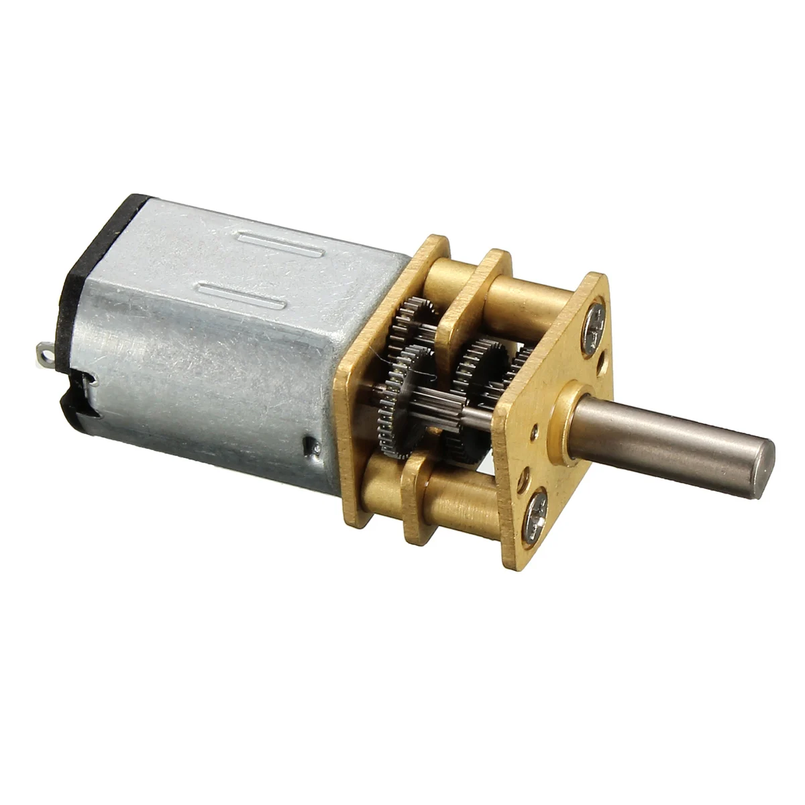
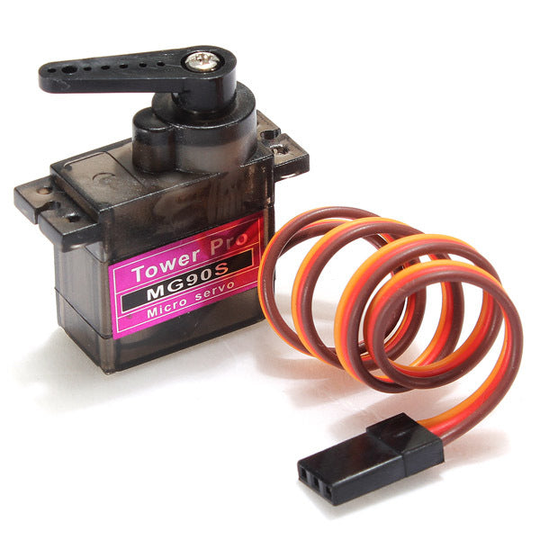

# KU STEAM Pinkies - WRO 2026 Future Engineers

We are KU STEAM Pinkies, a WRO Future Engineers team. We will take part in the Open Championship in Croatia. This README describes the mechanical design of our robot and the engineering decisions behind it. The sections on electronics, obstacle management, and testing will be added later.

Last year, we took part in the Open Championship in Slovenia. The biggest lesson was simple: keep the robot small, simple, and easy to control. That lesson shaped this year's design, where we tried to avoid unnecessary complexity. In our case, David beats Goliath by being smaller and less complicated.

## Table of contents

- [1. Review and changes](#1-review-and-changes)
- [2. Mechanical design](#2-mechanical-design)
  - [2.1 Chassis](#21-chassis)
  - [2.2 Drive motor](#22-drive-motor)
  - [2.3 Steering servo](#23-steering-servo)
  - [2.4 Differential and wheels](#24-differential-and-wheels)
- [3. Engineering / Design](#3-engineering--design)
  - [3.1 Mechanical engineering](#31-mechanical-engineering)
  - [3.2 Drive transmission](#32-drive-transmission)
  - [3.3 Differential comparison](#33-differential-comparison)
  - [3.4 Drivebase and mounting](#34-drivebase-and-mounting)
  - [3.5 Steering and wheels](#35-steering-and-wheels)
- [4. Power and sense management](#4-power-and-sense-management)
- [5. Obstacle management and control](#5-obstacle-management-and-control)
- [6. Testing and iteration](#6-testing-and-iteration)

## 1. Review and changes

Before we built this robot, we had a larger car with a more complicated rack and gearbox style layout. It was useful for testing, but it took more effort to turn and tune. With so many extra parts, the car did not behave the same way every time.

That experience shaped the new design. We made the frame smaller and kept the drivetrain easy to trace. Each part has a clear job, and the steering servo does not have to carry load from parts that do not need to be there.

The old robot was interesting to build, but its size and complicated layout made it harder to fit everything together. This time we chose a smaller frame and a simpler drive path.

<table>
  <tr>
    <td align="center"><strong>Previous robot base and steering</strong></td>
    <td align="center"><strong>Previous robot drivetrain</strong></td>
  </tr>
  <tr>
    <td align="center"></td>
    <td align="center"></td>
  </tr>
  <tr>
    <td align="center">The old base and steering assembly was much larger than the current one.</td>
    <td align="center">The old drivetrain showed us where the mechanical complexity came from.</td>
  </tr>
</table>

## 2. Mechanical design

We built the robot around a compact rear-wheel-drive chassis with front-wheel steering. Keeping it small made it easier to turn and park, and it also helped us keep the mechanical layout simple.

### 2.1 Chassis

The frame is made from wood. The complete drivebase and all of its mounting parts are LEGO. The robot is approximately 21 cm long, 10 cm wide, and 8 cm high.

| Part | Final choice |
|---|---|
| Drive layout | Rear-wheel drive |
| Drivebase | LEGO drivebase, including its mounts |
| Steering layout | Front-wheel steering |
| Robot size | Approximately 21 x 10 x 8 cm |
| Main structure | Custom wood frame with LEGO drivebase |

### 2.2 Drive motor

For the drive, we use a small 6 V N20 geared motor with a speed of 600 rpm. It fits the compact chassis and gives the robot enough speed without making it difficult to control.

The motor shaft fits into a converter. The converter outputs an X-shaped LEGO axle. This axle drives a LEGO gear, and that gear turns the LEGO differential.

<table>
  <tr>
    <th colspan="2">N20 6 V, 600 rpm geared motor</th>
  </tr>
  <tr>
    <td colspan="2" align="center">
      <br>
      <em>Reference photo. Source: <a href="https://zbotic.in/product/n20-6v-600-rpm-micro-metal-gear-motor/">Zbotic product page</a>.</em>
    </td>
  </tr>
  <tr>
    <th colspan="2">Specifications</th>
  </tr>
  <tr><td>Voltage</td><td>6 V</td></tr>
  <tr><td>Type</td><td>N20 geared DC motor</td></tr>
  <tr><td>Speed</td><td>600 rpm</td></tr>
  <tr><td>Power transfer</td><td>N20 shaft -> converter -> LEGO cross axle -> LEGO gear -> LEGO differential</td></tr>
</table>

### 2.3 Steering servo

For steering, we use an MG90S servo connected to a small gear mechanism. The direct layout keeps the mechanism compact and gives us a useful steering angle.

We center the servo before fixing the linkage. That helps both front wheels move symmetrically and keeps the robot more stable on straight sections.

<table>
  <tr>
    <th colspan="2">MG90S metal-gear micro servo</th>
  </tr>
  <tr>
    <td colspan="2" align="center">
      <br>
      <em>Reference photo. Source: <a href="https://hitechxyz.in/products/tower-pro-9g-micro-sg90s-180-metal-gear-servo-motor-original-tower-pro">Hi Tech XYZ product page</a>.</em>
    </td>
  </tr>
  <tr>
    <th colspan="2">Specifications</th>
  </tr>
  <tr><td>Servo</td><td>MG90S metal-gear micro servo</td></tr>
  <tr><td>Operating voltage</td><td>4.8 - 6 V</td></tr>
  <tr><td>Control</td><td>PWM</td></tr>
  <tr><td>Use</td><td>Front-wheel steering</td></tr>
</table>

### 2.4 Differential and wheels

The entire drivebase is LEGO, including the rear axle, differential, gears, and all the mounts that hold the drive system in place. The LEGO gear driven by the cross axle turns the differential, allowing the inside and outside wheels to rotate at different speeds when the robot turns.

All four wheels are custom silicone wheels. They give the robot better grip and make both driving and steering more reliable.

| Part | Final choice |
|---|---|
| Drivebase | LEGO drivebase |
| Drive mounts | LEGO mounting parts |
| Rear axle | LEGO mechanical differential |
| Rear wheels | Custom silicone wheels |
| Front wheels | Custom silicone wheels |
| Steering range | About 60 degrees of useful motion |

## 3. Engineering / Design

### 3.1 Mechanical engineering

The whole drivebase, including its mounts, is LEGO. The rear axle, differential, gears, and the pieces holding them in place are all part of the same LEGO system.

Power goes to the rear wheels, and the front wheels steer. Separating those jobs made it easier to see what we needed to change while testing.

### 3.2 Drive transmission

The final mechanical transfer is:

```text
N20 shaft -> converter -> X-shaped LEGO axle -> LEGO gear -> LEGO differential
```

The N20 shaft goes into a converter. The converter gives us an X-shaped LEGO axle. The axle turns a LEGO gear, and that gear turns the LEGO differential. This is how the motor reaches the driven wheels.

### 3.3 Differential comparison

We compared the earlier metal differential with the LEGO differential. We kept the LEGO version because it fit the simpler layout we chose for the final drivebase.

<table>
  <tr>
    <td align="center"><strong>Earlier metal differential</strong></td>
    <td align="center"><strong>Final LEGO differential</strong></td>
  </tr>
  <tr>
    <td align="center"></td>
    <td align="center"></td>
  </tr>
</table>

### 3.4 Drivebase and mounting

LEGO is not limited to the differential. It makes up the rear axle, the gears, and every mount holding the drivetrain. The whole drive section is built as one system.

The motor sits with its shaft lined up with the converter. From there, the X-shaped LEGO axle transfers the rotation through the gear and into the differential.

### 3.5 Steering and wheels

An MG90S servo moves the front-wheel steering. Because the front axle is separate from the driven rear axle, the servo only moves the steering mechanism.

All four wheels are custom silicone wheels. Using the same material on all four keeps contact with the track more predictable. The silicone also gives the front axle the grip it needs when the servo changes direction.

<table>
  <tr>
    <td align="center"></td>
  </tr>
  <tr>
    <td align="center">Final steering geometry, CAD view.</td>
  </tr>
</table>

| Part | Final choice |
|---|---|
| Frame | Wood, approximately 21 x 10 x 8 cm |
| Drivebase | LEGO rear axle, differential, gears, and all drive mounts |
| Drive motor | 6 V N20 geared motor, 600 rpm |
| Motor transfer | Converter, X-shaped LEGO axle, and LEGO gear |
| Steering | MG90S servo with front-wheel steering |
| Wheels | Custom silicone wheels on all four corners |

## 4. Power and sense management

This section is reserved for the next documentation update. It will cover the battery, motor driver, controllers, sensors, wiring, and power distribution.

## 5. Obstacle management and control

This section is reserved for the next documentation update. It will cover obstacle detection, sensor decisions, and the control logic used on the field.

## 6. Testing and iteration

This section is reserved for the next documentation update. It will cover mechanical tests, steering adjustments, drive consistency, and repeatability between runs.


The detailed source notes used for these sections are kept in [`docs/design/`](docs/design/).
