# KU STEAM Pinkies: WRO 2026 Future Engineers

We are **KU STEAM Pinkies** from Klaipėda University STEAM Centre. For WRO 2026 Future Engineers, we built a compact rear-wheel-drive, front-wheel-steer robot with an ESP32, a BNO085 heading sensor, three VL53L1X distance sensors and Pixy2 vision.

We gave each subsystem one job. If hardware added wiring, latency or failure points without giving us useful information, we left it out.

## Team

- **Domas Lukas (left)**
- **Jonas Danisevičius(right)**
- **Marius Plečkaitis(center)**

<p align="center">
  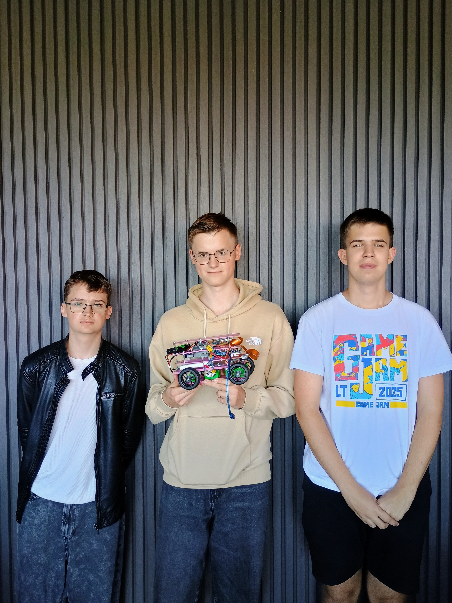
</p>

## Competition videos

- **Open Challenge:** https://youtu.be/wYDWJLPF3cQ
- **Obstacle Challenge:** https://youtu.be/kq5EeDzJqs0

## Contents

- [Final robot](#final-robot)
- [Mechanical design](#1-mechanical-design)
- [Electronics, power and sensors](#2-electronics-power-and-sensors)
- [Software architecture](#3-software-architecture)
- [Engineering decisions and system development](#4-engineering-decisions-and-system-development)
- [Testing and tuning](#5-testing-and-tuning)
- [Robot evolution](#6-robot-evolution)
- [Bill of materials and sourcing](#7-bill-of-materials-and-sourcing)
- [Rebuilding the robot](#8-rebuilding-the-robot)
- [Repository layout](#9-repository-layout)
- [Versioning and verification record](#10-versioning-and-verification-record)
---

# Final robot

The final competition robot has a **black custom PCB and white rear wheels**.

<table>
<tr>
<td align="center">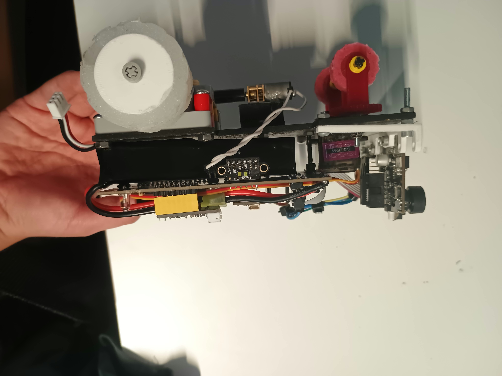<br><b>Final robot, right side</b></td>
<td align="center">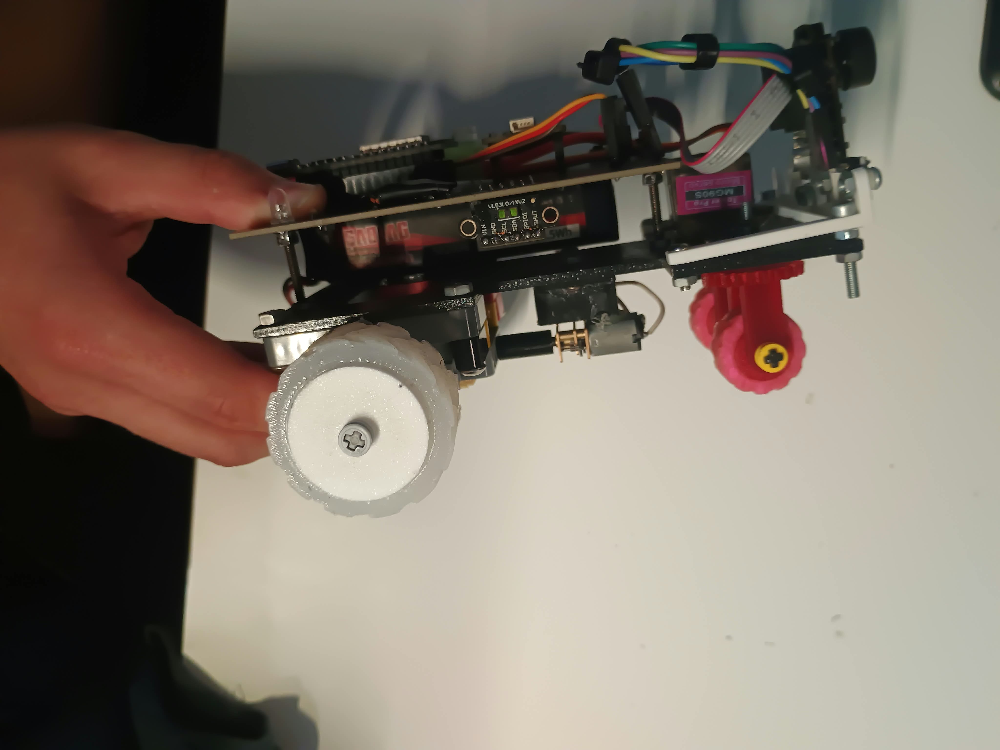<br><b>Final robot, left side</b></td>
</tr>
<tr>
<td align="center">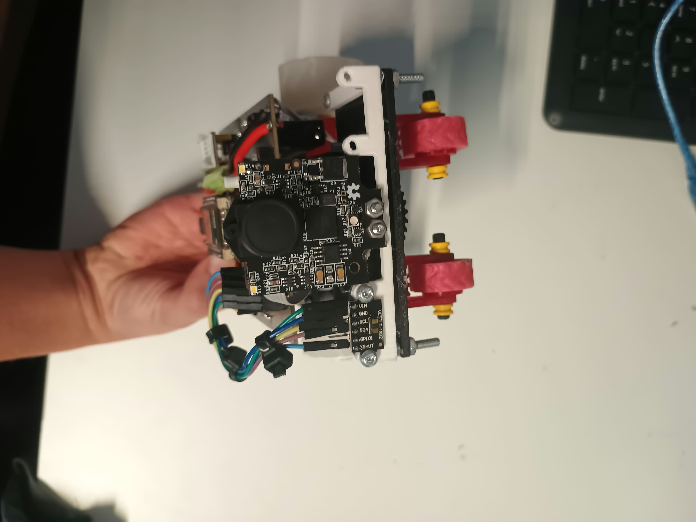<br><b>Final robot, front</b></td>
<td align="center">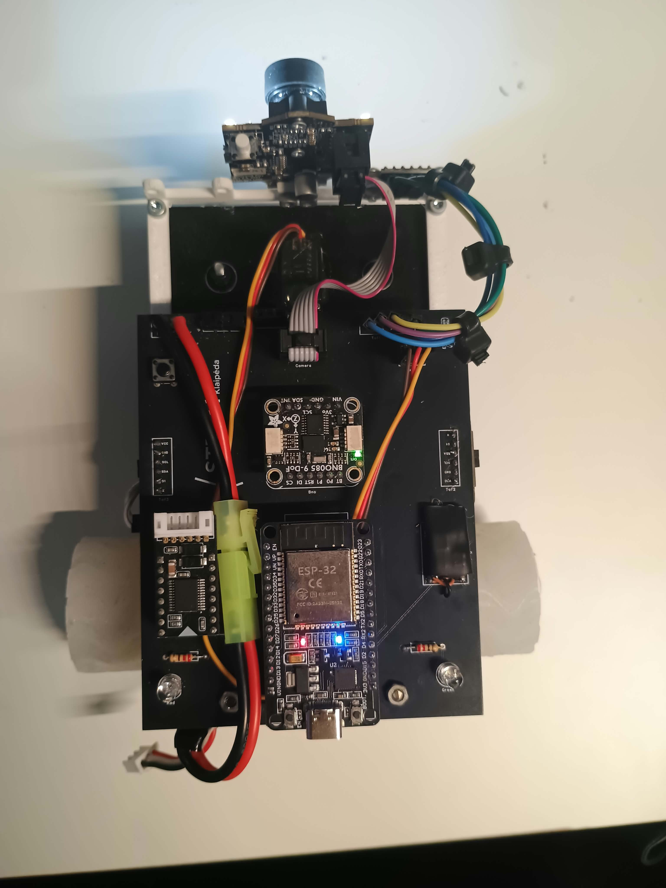<br><b>Final robot, top</b></td>
</tr>
<tr>
<td align="center" colspan="2">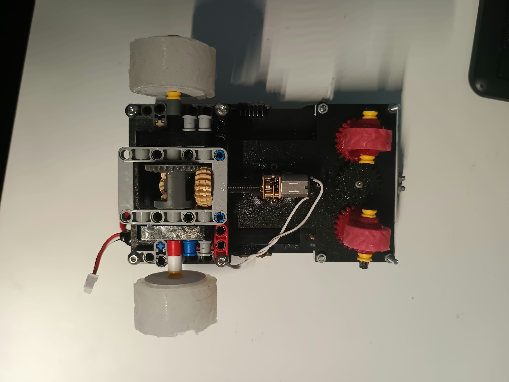<br><b>Final robot, bottom</b></td>
</tr>
</table>

| Subsystem | Final version |
|---|---|
| Controller | ESP32-WROOM-32, 30-pin DevKit V1 form factor |
| Heading | BNO085 |
| Range sensing | 3 × VL53L1X, Long mode |
| Vision | Pixy2 / Pixy2.1 |
| Drive | rear-wheel drive |
| Motor | N20, 6 V, nominal 600 rpm |
| Transmission | LEGO-compatible gearing + LEGO differential |
| Steering | front-wheel steering, positional MG90S |
| Battery | 2S LiPo, 7.4 V, 2500 mAh, 30C |
| 5 V regulator | Matek Micro BEC 6S, 6–30 V input, 5 V/9 V adjustable, used at 5 V |
| Electronics | custom PCB |
| Mass | 332.4 g |
| Approx. overall size | 165 × 145 × 70 mm |

---

# 1. Mechanical design

## 1.1 Layout

We chose **rear-wheel drive** and **front-wheel steering**. That leaves the rear axle to provide traction and the front mechanism to steer. The layout also simplified the control model and left room in the centre of the chassis for the battery, PCB and sensors.

We kept the car compact to leave more room around corners and obstacles and reduce the steering correction needed after a turn.

## 1.2 Drivetrain

```text
N20 geared motor
      ↓
shaft adapter
      ↓
LEGO-compatible gear stage
      ↓
LEGO differential
      ↓
rear wheels
```

The nominal motor speed is 600 rpm. With the final effective reduction of about 1.50:1:

```text
wheel_rpm = 600 / 1.50 = 400 rpm
wheel circumference = π × 0.054 = 0.1696 m
ideal geometric speed = 400 × 0.1696 / 60 ≈ 1.13 m/s
```

The **0.08 N·m motor-torque value comes from the official motor specification**. The **80% drivetrain efficiency is an engineering assumption** used for the design calculation rather than a measured efficiency value:

```text
wheel torque ≈ 0.08 × 1.50 × 0.80 = 0.096 N·m
tractive force ≈ 0.096 / 0.027 ≈ 3.6 N
```

The drivetrain model was used to select the final gearing before integration. We balanced wheel speed against the torque reserve needed for acceleration, steering drag and repeated corner exits. More reduction increases wheel torque but lowers lap speed, while less reduction increases speed at the cost of control margin. The final 1.50:1 ratio gives a compact drivetrain with enough calculated tractive force for the 332.4 g vehicle while keeping the target wheel speed within the controller's useful operating range.

The N20 motor was selected because its compact geared form factor fits the rear-drive layout, aligns cleanly with the LEGO-compatible transmission and provides the required combination of speed and torque without adding another transmission stage.

## 1.3 Differential iteration

<table>
<tr><td align="center"><b>Earlier metal differential</b></td><td align="center"><b>Final LEGO differential</b></td></tr>
<tr><td>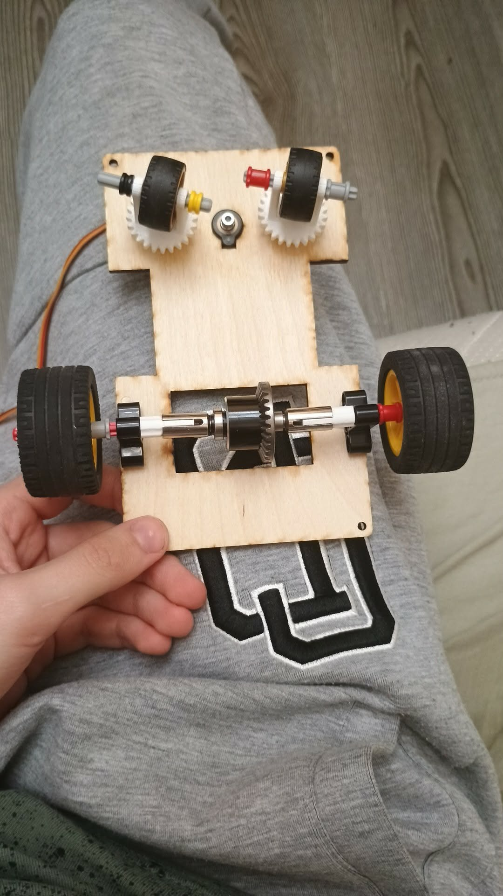</td><td>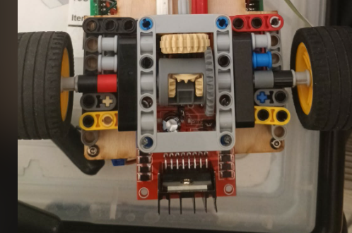</td></tr>
</table>

We kept the LEGO differential because it fits the rest of the LEGO-compatible axle and gearing directly, uses fewer custom couplings and is easier to replace during competition. It also allows the two rear wheels to rotate at different speeds in a corner.

## 1.4 Steering iteration

<table>
<tr><td align="center"><b>Earlier steering</b></td><td align="center"><b>Final steering</b></td></tr>
<tr><td>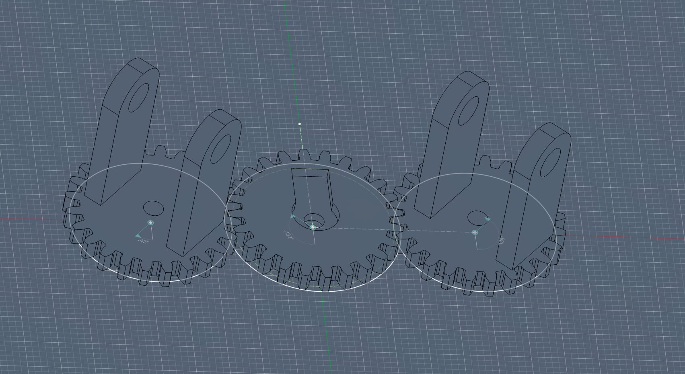</td><td></td></tr>
</table>

The final steering uses a positional MG90S servo. We chose this servo because the steering mechanism needs repeatable absolute positioning in a compact package, and its form factor integrates directly with the front linkage. We centre the linkage mechanically before fixing the servo horn. Firmware limits the servo command from **60° to 120°**, with **88°** as straight ahead. The final linkage is approximately **1:1 in angular movement around the centre position**, so the controller endpoints correspond approximately to **−28° and +32° of wheel steering relative to the 88° straight position**. These endpoint angles are derived from the linkage relationship and firmware commands; they are not separate protractor measurements. The limits keep the linkage inside the mechanically useful steering range and improve repeatability between runs.

The steering redesign reduced the observed space needed for a 90° turn from about **46 cm to 39 cm**, supporting the final compact linkage and steering-range choice.

## 1.5 CAD and base fabrication

The final custom parts are in `models/`:

| File | Part |
|---|---|
| `Body1.stl` | body / structural part |
| `Front.stl` | front assembly part |
| `lego-mold-su-x.stl` | LEGO-interface mould/part |
| `ratas-su-x.stl` | custom wheel part |
| `motor-shaft-spacer.stl` | motor shaft spacer |
| `steering-column-housing-short.stl` | steering column housing |
| `steering-gear-cover-disc.stl` | steering gear cover |
| `steering-gear-hub.stl` | steering gear hub |
| `steering-gear-plate.stl` | steering gear plate |
| `steering-pin-adapter.stl` | steering pin adapter |
| `case.ai` | 2D plywood/base cutting vector |

`models/case.ai` is the base fabrication file. Its main rectangular path is approximately **90 × 150 mm** when imported at the original scale. That number is only a scale check; holes, slots and curves must be taken from the vector itself.

Mechanical build order:

1. cut `models/case.ai` at 1:1 scale;
2. print the STL parts without rescaling;
3. mount the N20 motor and motor-shaft interface;
4. assemble the LEGO-compatible gear stage and rear differential;
5. install the rear wheels and confirm both sides rotate freely;
6. assemble the front steering parts and MG90S;
7. centre the steering mechanically;
8. check the full range from 60° to 120° for binding;
9. mount the electronics stack and compare the result with the final photos above.

Standard LEGO Technic shafts and gears, along with ordinary fasteners, are not performance-tuned. Replace them only with parts that keep the shaft, hole and mounting geometry shown in the CAD and final assembly.

---

# 2. Electronics, power and sensors

## 2.1 Power architecture

The final battery is **2S LiPo, 7.4 V, 2500 mAh, 30C**.

```text
2S LiPo (7.4 V)
  |
  +--> custom PCB --> motor driver --> N20 motor
  |
  +--> Matek Micro BEC 6S (set to 5 V) --> 5VLINE --> ESP32 / BNO085 / VL53L1X / Pixy2 / MG90S
```

Battery energy:

```text
E = 7.4 V × 2.5 Ah = 18.5 Wh
```

### Current budget used during design

| Load | Normal | Short peak | Main concern |
|---|---:|---:|---|
| ESP32 | ~160 mA | ~240 mA | logic stability |
| BNO085 | ~15 mA | ~20 mA | heading stability |
| 3 × VL53L1X | ~75 mA total | ~120 mA total | ranging / I2C stability |
| Pixy2 | ~140 mA | ~200 mA | camera processing |
| MG90S | ~200–300 mA | ~750 mA | steering peak/stall |
| N20 motor | ~350 mA | ~1.3 A | acceleration/stall |
| whole robot | ~0.9–1.2 A | ~1.8–2.2 A coincident design peak; ~2.63 A if every listed individual peak is summed simultaneously | regulator and connector voltage drop |

The PCB netlist shows the 7.4 V battery rail feeding the **Matek Micro BEC 6S**, configured for **5 V**, whose output is the board's `5VLINE`. The regulator is specified for a **6–30 V input**, **5 V or 9 V adjustable output (5 V default)**, **1.5 A continuous load**, and **2.5 A maximum for 5 s/minute**. It also specifies over-current protection, thermal shutdown and short-circuit tolerance. Product reference: https://www.rcdalys.lt/detales/0/27234/MATEK-MICRO-BEC-6S-6-30V-5V9V-ADJUSTABLE-3PCS

The 5 V branch supplies the ESP32, BNO085, three VL53L1X modules, Pixy2 and MG90S. Using the component peak values in the table above, the listed 5 V loads sum to approximately **1.33 A**, below the BEC's **1.5 A continuous** rating. The N20 motor is supplied through the separate battery/motor-driver path, so its current is not part of the BEC load. The individual peak figures are component-level design values; the whole-robot 1.8–2.2 A figure is the expected coincident operating peak because all listed component maxima do not normally occur at exactly the same instant.

## 2.2 Custom PCB

<table>
<tr><td align="center"><b>PCB layout</b></td><td align="center"><b>PCB routing</b></td></tr>
<tr><td>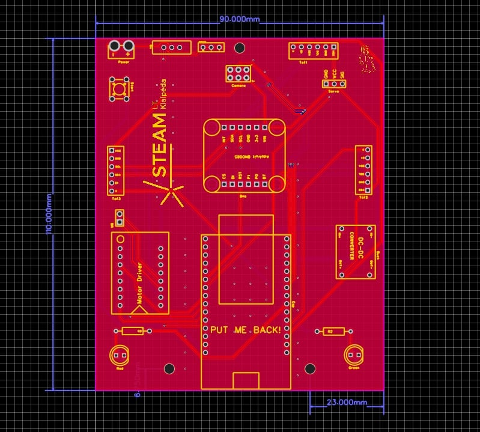</td><td>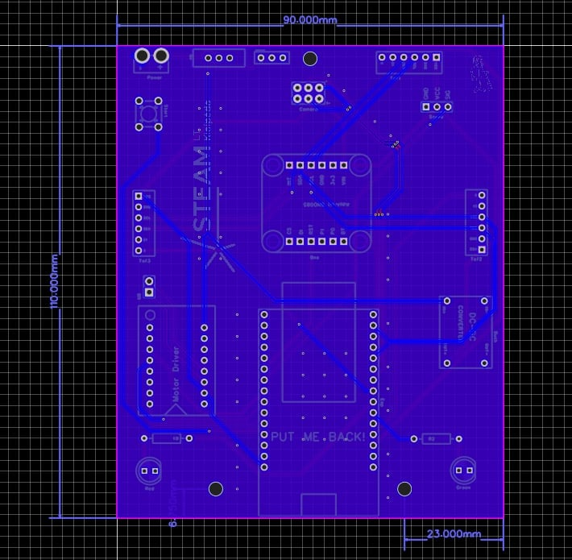</td></tr>
</table>

### Wiring and sensor-bus diagrams

<p align="center">
  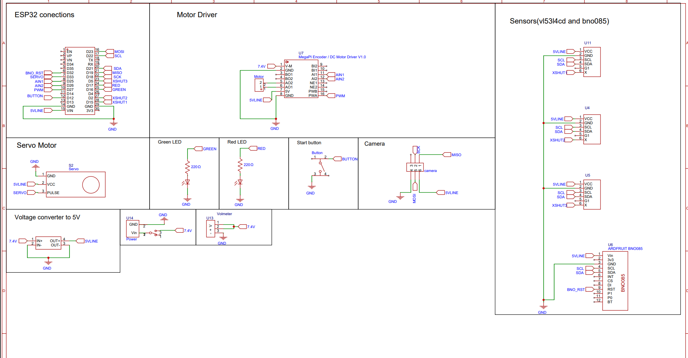
</p>

<p align="center"><strong>Electrical overview.</strong> The diagram shows the battery, regulated logic supply, ESP32, motor driver, steering servo and sensor connections used on the final robot.</p>

<p align="center">
  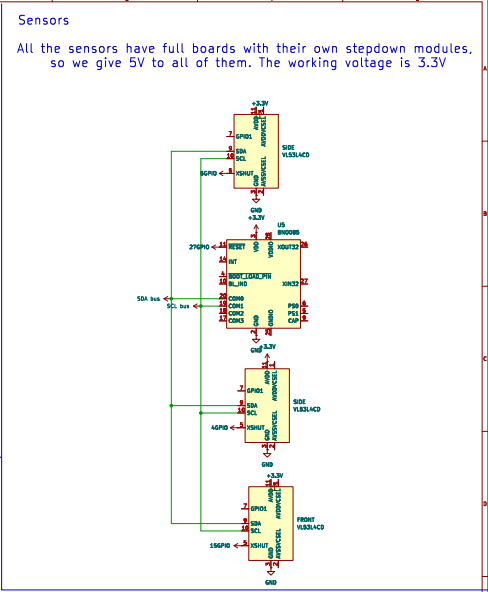
</p>

<p align="center"><strong>Sensor-bus detail.</strong> The three VL53L1X modules share I2C and are given unique runtime addresses through separate XSHUT lines; the BNO085 is the independent heading reference.</p>

The electrical folder contains:

- `schemes/Wro_customPCBs.pdf`
- `schemes/images/schematic-overview.png`
- `schemes/images/sensor-bus-detail.png`
- complete top/bottom copper, solder-mask and silkscreen Gerbers
- board outline and mechanical/document layers
- plated, non-plated and via drill files
- flying-probe test data

The Gerber and drill files are for manufacturing the final PCB revision.

## 2.3 Pin and sensor identity

| Function | ESP32 pin / bus |
|---|---|
| Start button | GPIO14 |
| Motor enable / PWM | GPIO32 |
| Motor input 1 | GPIO26 |
| Motor input 2 | GPIO25 |
| Steering servo | GPIO33 |
| Front VL53L1X XSHUT | GPIO15 |
| Left VL53L1X XSHUT | GPIO5 |
| Right VL53L1X XSHUT | GPIO18 |
| BNO085 | I2C |
| 3 × VL53L1X | shared I2C, separate XSHUT |
| Pixy2 | SPI on custom PCB (MOSI / MISO / SCK) |

All three ToF modules share the same factory I2C address. Firmware enables them one at a time and assigns each a different runtime address:

| Sensor | XSHUT | Runtime address |
|---|---:|---:|
| Front | GPIO15 | `0x30` |
| Left | GPIO5 | `0x31` |
| Right | GPIO18 | `0x32` |

## 2.4 Sensor placement and track geometry

The **front VL53L1X** faces forward on the robot **centreline**, beside the **Pixy2** camera. It measures forward clearance and helps detect a corner; Pixy2 independently reports the position of coloured obstacles. The **left and right VL53L1X** modules are installed directly in the dedicated ToF positions provided by the custom PCB, at its lateral sides, and measure the corresponding side clearances for wall correction. Their placement is therefore fixed by the checked-in PCB layout rather than by an arbitrary hand-measured mounting offset. The chassis-mounted **BNO085** provides heading, so range and orientation feedback come from separate sensors.

<table>
<tr>
<td align="center">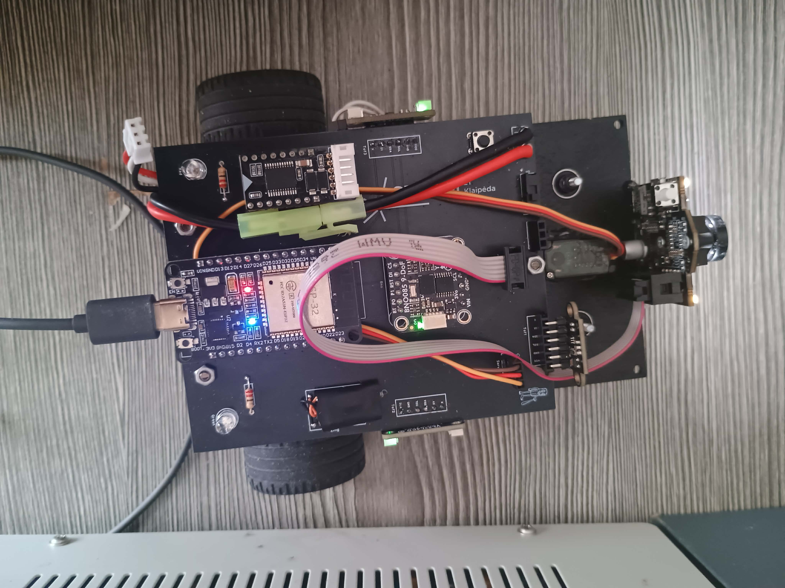<br><strong>Installed sensor positions.</strong> Left and right VL53L1X modules sit at the PCB side edges; the front VL53L1X is beside Pixy2.</td>
<td align="center"><br><strong>PCB footprint.</strong> The drawing marks the board as 90 × 100 mm.</td>
</tr>
</table>

The robot's documented overall dimensions are approximately **165 × 145 × 70 mm**.

### Projection onto the WRO corridor

The [WRO 2026 Future Engineers rules](https://wro.hr/wp-content/uploads/2026/01/WRO-2026-Future-Engineers-Self-Driving-Cars-General-Rules.pdf) specify nominal corridor widths of **600 mm or 1000 mm** for Open Challenge, and **1000 mm** for Obstacle Challenge. The Open Challenge width may vary by ±100 mm at the International Final; Obstacle Challenge specifies ±10 mm.

For the corridor model, the **90 mm PCB dimension runs across the robot**, with the left and right ToF modules positioned at the two lateral PCB edges. The centred-reference calculation below shows how that sensor spacing relates to the nominal WRO corridor widths and to the documented 145 mm vehicle width.

| WRO section | Nominal corridor width | Side sensor centre to nearest wall, centred | Robot body side to wall, centred |
|---|---:|---:|---:|
| Open Challenge, narrow corridor | 600 mm | ≈255 mm | ≈227.5 mm |
| Open Challenge, wide corridor | 1000 mm | ≈455 mm | ≈427.5 mm |
| Obstacle Challenge | 1000 mm | ≈455 mm | ≈427.5 mm |

Calculation: `sensor-to-wall = (corridor width − 90 mm) / 2`; body clearance uses the documented 145 mm vehicle width: `(corridor width − 145 mm) / 2`. Firmware uses `ROBOT_WIDTH = 150 mm` as its rounded control model.

```text
Plan view — schematic, not to scale

600 mm corridor:
LEFT WALL │← ≈255 mm →│ ● Left ToF ── ≈90 mm ── Right ToF ● │← ≈255 mm →│ RIGHT WALL

1000 mm corridor:
LEFT WALL │← ≈455 mm →│ ● Left ToF ── ≈90 mm ── Right ToF ● │← ≈455 mm →│ RIGHT WALL

Robot layout (body width ≈145 mm):
                         FRONT / direction of travel ↑
+----------------------------------------------+
| Front VL53L1X beside Pixy2 camera            |
| Left ToF   [PCB 90 × 100 mm]   Right ToF     |
+----------------------------------------------+
```

The firmware's `TARGET_DISTANCE=300 mm` is a side-wall setpoint while the current section width is unknown; in the Obstacle Challenge build, section width is not learned, so normal wall following uses that 300 mm target. At the nominal centred geometry, this is 45 mm farther from the selected wall than the 600 mm corridor reading (≈255 mm), and 155 mm closer to the selected wall than the 1000 mm corridor reading (≈455 mm). This comparison shows why the controller's 300 mm wall target provides a practical starting point across the two Open Challenge corridor widths while leaving the final correction to the live side-distance measurements.

## 2.5 Sensor architecture changes

### MPU6050 → BNO085

The earlier MPU6050 setup showed noticeable yaw drift during repeated turns. Because heading error directly becomes steering error, we replaced it with BNO085 and used the IMU as the dedicated chassis-heading reference.

### Five range sensors → three VL53L1X + BNO085

With the BNO085 handling heading, we only needed three range measurements: front, left and right. We removed the other range modules and their wiring.

### VL53L4CD → VL53L1X Long mode

The side controller needs wall readings before the car gets close to a wall. VL53L1X Long mode provided a larger useful range, so we used it for all three distance sensors.

### Raspberry Pi camera chain → Pixy2 directly to ESP32 over SPI

The final PCB connects Pixy2 directly to the ESP32 using the SPI data and clock nets `MOSI`, `MISO` and `SCK`. This removed the Raspberry Pi processing stage and its inter-processor communication link, reducing wiring and communication stages.

## 2.6 Calibration

**ToF identity and direction**

1. Put a flat target close to the left module only and check that the left channel changes.
2. Repeat for the right module.
3. Check the front sensor against a target placed on the centreline.
4. Test several known distances and record mean reading, spread and invalid samples.
5. Make sure no wheel or chassis part clips a sensor beam.

**BNO085**

1. Point the car along a known straight reference.
2. Record yaw.
3. Rotate the chassis about 90° and confirm the expected sign/direction.
4. Cross the 0°/360° boundary to check heading wrapping.

**Pixy2**

1. Open **PixyMon** and train the colour signatures on the actual obstacle cubes used for testing.
2. Train/check each cube individually rather than relying on one generic colour sample.
3. Repeat the signature check under different lighting conditions so the stored signatures remain usable when ambient illumination changes.
4. Place a trained obstacle near image centre and confirm that Pixy2 reports the expected signature.
5. Move it left and right and verify the reported X coordinate changes in the expected direction.
6. Check that the front structure does not block the useful image area.

The camera calibration is therefore based on PixyMon's trained colour signatures rather than fixed RGB/HSV values in the ESP32 firmware.

---

# 3. Software architecture

The final firmware is in `src/` and is built with PlatformIO.

Two build environments use the same source code:

```bash
platformio run -d src -e open_challenge
platformio run -d src -e obstacle_challenge
```

- `open_challenge` uses `WRO_CHALLENGE_MODE=0`
- `obstacle_challenge` uses `WRO_CHALLENGE_MODE=1`

`src/include/CompetitionMode.h` validates the build-time value, so challenge mode is not changed by editing `main.cpp`.

Build verification is **manual**. The repository intentionally does not include GitHub Actions CI or a `scripts/` verification directory. The same two commands above are the documented reproducible build entry points.

## 3.1 Modules

| Module | Responsibility |
|---|---|
| `src/src/main.cpp` | driving behaviour and state transitions |
| `Engine` | DC motor direction and PWM |
| `Compass` | BNO085 startup and yaw |
| `Distance_Sensor` | VL53L1X startup, address assignment and ranging |
| Pixy2 interface | colour connected-component acquisition |
| `Lights` | visible robot state |
| `CompetitionMode.h` | Open/Obstacle build selection |

## 3.2 State machine

The controller follows a state machine:

```text
WAIT_FOR_START
      |
      | start button
      v
NORMAL_DRIVING
   |       |
   |       +-- corner detected --> TURNING --------+
   |                                               |
   +-- obstacle detected --> OBSTACLE_AVOIDANCE    |
                              |                     |
                              | obstacle disappears |
                              v                     |
                         OBSTACLE_RECOVERY ----------+
                              |
                              | recovery timer ends
                              v
                        NORMAL_DRIVING

12 corners / 3 laps + stable finish condition --> FINISHED
sensor-start failure ---------------------------> ERROR
```

The same control flow is shown below as a diagram for quicker review:

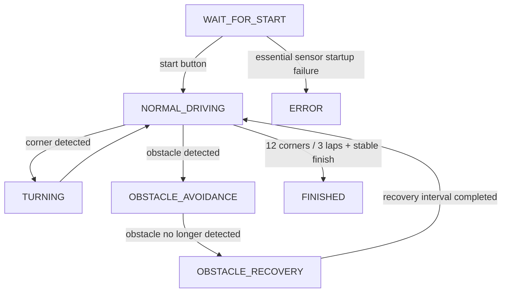
```mermaid
flowchart TD
    A[WAIT_FOR_START] -->|start button| B[NORMAL_DRIVING]
    B -->|corner detected| C[TURNING]
    C --> B
    B -->|obstacle detected| D[OBSTACLE_AVOIDANCE]
    D -->|obstacle no longer detected| E[OBSTACLE_RECOVERY]
    E -->|recovery interval completed| B
    B -->|12 corners / 3 laps + stable finish| F[FINISHED]
    A -->|essential sensor startup failure| G[ERROR]
```

### What each state does

- **WAIT_FOR_START** keeps the motor stopped until the team starts a run.
- **NORMAL_DRIVING** uses heading and wall control.
- **TURNING** handles a corner and updates the target heading by about 90° after the turn condition is met.
- **OBSTACLE_AVOIDANCE** gives Pixy2 steering priority while an obstacle block is present.
- **OBSTACLE_RECOVERY** keeps wall following from taking over while the car is still angled after passing an obstacle.
- **FINISHED** keeps the robot stopped after the coded three-lap finish condition. It does not execute parallel parking.
- **ERROR** stops the run if an essential sensor fails during startup.

## 3.3 Heading and wall control

Heading error is wrapped to the shortest direction:

```text
heading_error = target_heading - yaw
if heading_error > 180:  heading_error -= 360
if heading_error < -180: heading_error += 360
```

Heading error sets the base steering correction. A derivative damping term is included to reduce abrupt steering changes and improve stability as the robot converges back toward its target heading.

Wall correction uses the outside wall:

```text
wall_error = measured_outer_wall_distance - target_wall_distance
```

Clockwise runs use the left outer wall, and counter-clockwise runs use the right. The controller accepts a range reading only when its status and the combined left and right distances are plausible.

The steering command is conceptually:

```text
straight centre
+ heading correction
+ wall-distance correction
+ derivative damping
+ Pixy2 correction when avoiding an obstacle
```

Servo output is clamped to the mechanical range.

## 3.4 Corner strategy

When the front ToF detects a corner, the controller enters `TURNING`. If the driving direction is not set yet, it locks one in, steers to the turn limit and waits for the sensor to show that the car has cleared the corner. It then updates the target heading by about 90° and returns to `NORMAL_DRIVING`.

The front ToF tells the controller when to turn; BNO085 provides the heading the car should recover to.

## 3.5 Obstacle strategy

In `obstacle_challenge`, Pixy2 CCC blocks go straight to the ESP32. The controller filters detections by height so tiny or oversized blocks do not trigger steering.

Among the remaining blocks, the controller selects the block with the largest image-Y coordinate as a **camera-image proximity heuristic** (not a direct physical-distance measurement). The team trained **Pixy2 signature 1 for the green pillar** and **signature 2 for the red pillar** in PixyMon. Under the WRO rules, green must be passed on the left and red on the right. The code uses the signature-dependent horizontal image target to generate a steering correction; the sign of the resulting physical turn depends on the fitted steering mechanism and camera orientation, which must be verified on the track.

The present `main.cpp` tests `m_signature == 1`, otherwise it uses the second offset. Thus **all non-1 signatures**, not exclusively signature 2, currently take the red-signature branch. During PixyMon preparation, only the intended two colour signatures should be enabled; explicitly rejecting unexpected signatures is a useful additional robustness improvement.

Current obstacle tuning constants:

| Parameter | Value |
|---|---:|
| Minimum block height | 8 |
| Maximum block height | 70 |
| Signature 1 — green offset | -105 |
| Signature 2 — red / current fallback offset | 55 |
| Pixy steering gain | 0.32 |
| Recovery time | 450 ms |

When the obstacle disappears, the controller waits 450 ms in `OBSTACLE_RECOVERY`, then resumes wall control.

**Current competition limitation — parking:** The team's present robot does **not** implement autonomous parallel parking. The `FINISHED` state in `src/src/main.cpp` is a three-lap stop condition, **not** a parking manoeuvre. Therefore, demonstrations and performance summaries here describe driving and obstacle avoidance, not a successfully completed WRO Obstacle Challenge including parking. Parking remains an unimplemented task under the 2026 rules.

## 3.6 Controller constants

| Constant | Value |
|---|---:|
| `ROBOT_WIDTH` | 150 mm controller model |
| `TARGET_DISTANCE` | 300 mm |
| `WIDTH_THRESHOLD` | 150 mm |
| `MIN_ANGLE` | 60° |
| `MAX_ANGLE` | 120° |
| `STRAIGHT_ANGLE` | 88° |
| `Kp` | 0.09 |
| `Kg` | 0.95 |
| `Kd` | 0.05 |

## 3.7 Controller tuning and boundaries

The team iterated controller coefficients and corner behaviour during development. The final constants below are taken directly from `src/src/main.cpp`; no intermediate coefficient history is available for a numeric before/after comparison.

| Control element | Current code | Engineering purpose / check |
|---|---|---|
| Heading | `angle = Kg * heading`, `Kg = 0.95` | Bring the robot back to the BNO085 target heading; verify both driving directions |
| Wall position | `Kp = 0.09` applied to outer-wall distance error | Correct lateral displacement only when distance/geometry gates pass |
| Damping | `Kd = 0.05` applied to an error-difference term over elapsed time | Moderate abrupt steering changes; review overshoot on corner exit |
| Corner detection | Valid front ToF reading, a front-clearance threshold and combined side width ≥ 900 mm | Distinguish corner entry from normal wall following |
| Corner steering | Servo limited to 60° or 120° during the turn | Keep the command inside the chosen mechanical travel |
| Corner counting | One increment after the front-distance turn-exit condition | Track the required 12 corners over three laps |
| Normal stop | At least 12 counted corners, wall-distance error under 50 mm and heading error within 5° for 2 seconds | Avoid declaring a finish on a single instantaneous reading |

The firmware handles heading wrap across 0°/360°, stops on essential ToF/BNO085 **initialisation** failures, ignores implausible readings for specified wall-control paths and uses a 450 ms obstacle-recovery state. These are code-level mechanisms, not claims that every physical failure has been eliminated.

**Cases to test explicitly:** uncertain colour classification; an unrelated Pixy2 signature; loss of valid ToF readings during a corner; heading events unavailable after start; unexpected stopping or restarting; and return to the finish area after the twelfth corner. In particular, the current corner-exit `while` loop has no independent timeout, so a persistent invalid reading may prevent progression. A separate parking trajectory should not be inferred merely from the three-lap `FINISHED` state; its behaviour must be demonstrated and matched to the deployed firmware.

## 3.8 Robustness and safeguards

The final control architecture includes several safeguards for stable competition operation:

- Separate XSHUT lines allow the three ToF sensors to receive unique runtime I2C addresses during startup.
- Essential distance and heading sensors are validated before motion begins.
- Front ToF validity is checked at corner entry, and outer-wall readings are subject to distance/geometry gates during wall correction; some other paths, including the combined side-width condition, do not separately reject all invalid readings.
- Heading error is normalised to ±180° across the 0°/360° boundary.
- Pixy2 detections are filtered by block size before obstacle steering is applied.
- Servo commands are clamped to the tested mechanical steering range.
- A dedicated recovery state smooths the transition from obstacle avoidance back to wall following.
- The documented current budget identifies the regulator's design margin; a dated under-load voltage/current log would be stronger physical verification.

---

# 4. Engineering decisions and system development

We designed around chassis size, corner clearance, steering geometry, drivetrain alignment, power stability, I2C addressing, camera view and loop latency. The robot also had to be repairable and quick to debug at a competition.

| Earlier approach | Final approach | Why we changed it |
|---|---|---|
| larger packaging | compact chassis | more clearance and simpler layout |
| metal/custom differential interfaces | LEGO differential | easier integration and repair |
| MPU6050 | BNO085 | more useful heading reference after observed drift |
| five range sensors | three VL53L1X + BNO085 | clearer sensor roles and less wiring |
| VL53L4CD side sensing | VL53L1X Long mode | larger useful wall-ranging region |
| Raspberry Pi camera chain | Pixy2 directly to ESP32 over SPI | fewer processors and communication stages |
| prototype wiring | custom PCB | repeatable and compact electrical build |
| earlier Li-ion arrangement | 2S LiPo | compact package with good transient-current reserve |
| earlier steering linkage | revised compact linkage | better centring and less binding |
| implicit behaviour flags | explicit state machine | easier to understand, test and recover between behaviours |

## Risk table

| Failure | Effect | Mitigation |
|---|---|---|
| ToF address collision | no reliable distance data | independent XSHUT + `0x30/0x31/0x32` addresses |
| bad front range | wrong corner trigger | status check and startup validation |
| bad side range | wrong wall correction | range/status/geometry filtering |
| IMU failure | no heading reference | startup check |
| heading wrap | very large false error | ±180° normalisation |
| steering over-travel | binding / heating | mechanical centring + 60°–120° clamp |
| false vision block | wrong passing path | signature/height/position filtering |
| obstacle hand-back too early | oscillation after pass | dedicated recovery state |
| power sag | reset or sensor dropout | current margin + powered load test |
| loose wiring | intermittent fault | custom PCB and fixed connectors |
| firmware/document mismatch | hard-to-reproduce robot | Git history, two fixed PlatformIO environments, manual verification workflow and the README versioning record |

---

# 5. Testing and tuning

## 5.1 Testing approach

The final robot was tuned through repeated mechanical, sensor, control and full-route testing. Consolidated results are stored in [`docs/testing/validation-summary.csv`](docs/testing/validation-summary.csv), while [`docs/testing/raw/run-template.csv`](docs/testing/raw/run-template.csv) provides a consistent format for future run-level validation.

We tuned the robot in this order:

1. free mechanical movement and steering centre;
2. BNO085 direction and heading response;
3. heading gain;
4. derivative damping;
5. wall-distance gain;
6. clockwise and counter-clockwise corners;
7. Pixy2 obstacle pass;
8. obstacle recovery;
9. repeated full-route attempts.

Saved results are in `docs/testing/validation-summary.csv`.

## 5.2 Manual verification and evidence workflow

This repository uses a manual verification workflow rather than GitHub Actions CI:

1. record the Git commit SHA for the revision being tested;
2. run `platformio run -d src -e open_challenge`;
3. run `platformio run -d src -e obstacle_challenge`;
4. perform the sensor calibration checks in section 2.6;
5. perform the final acceptance checks in section 8;
6. for each new physical run, copy `docs/testing/raw/run-template.csv` and record challenge mode, firmware SHA, battery state, changed variable, result and measured outcome;
7. update `docs/testing/validation-summary.csv` with the retained validation results.

The repository versioning and verification record is included in section 10 of this README. The complete repeatable test procedure, measurement definitions and evidence rules are in sections 5.3–5.6 **of this README**.

### Current qualitative performance estimate

The team reports **approximately 8/10 successful Open Challenge driving attempts (~80%)** and **approximately 6/10 successful Obstacle Challenge driving/avoidance attempts (~60%)** with the current robot. These are informal approximate field estimates, **not** ten individually recorded trials with a controlled layout. Their detailed pass/fail definitions, distributions across layouts and firmware SHAs have not been retained. In particular, **the obstacle estimate excludes autonomous parking**, which is not implemented. Consequently, it must not be described as a 60% success rate for completing the entire 2026 Obstacle Challenge.

The engineering development included tuning steering coefficients and corner behaviour. The current coefficient values are listed in section 3.6, and testable tuning questions are described in sections 3.7 and 5.4 of this README.

### Historical test summary and evidence provenance

The figures below reproduce the project's existing historical summary. These are **archived prior estimates, not the current 8/10 and 6/10 estimates** and not independently validated measurements. They are **not** an independently reconstructable run-by-run dataset: the original per-run logs, firmware SHA and exact field layouts for these earlier summaries were not retained. The evidence classes in `docs/testing/validation-summary.csv` distinguish team-reported comparisons, summary observations and retained five-value drift comparisons. The five-value calculations can be checked arithmetically, but the original measurement conditions cannot be independently re-created from the surviving records alone. New quantitative claims should be based on newly logged runs with firmware and layout identifiers.

| Test | Earlier | Updated/final | Notes |
|---|---:|---:|---|
| Straight drift after 2 m | 9 cm | 4 cm | prototype → final comparison, 10 runs |
| Successful 3-lap runs (archived estimate, not current) | 6/10 | 9/10 | Original per-run logs unavailable; not to be used as present success rate |
| Corner overshoot | 14 cm | 6 cm | prototype → final comparison |
| Obstacle recovery | 1.2 s | 0.6 s | prototype → final comparison |
| Matched 3 m drift mean | 10.6 cm | 4.0 cm | five retained values per version |
| Open straight | — | 5/5 | final layout |
| Obstacle slalom | — | 4/5 | final layout |
| Full practice route | — | 4/5 | final layout |
| 90° turning space | ~46 cm | ~39 cm | prototype → final comparison |

For the matched 3 m drift comparison, the retained values are:

```text
earlier: 11, 10, 12, 9, 11 cm  -> mean 10.6 cm
updated:  4,  5,  3, 4,  4 cm  -> mean  4.0 cm
```

That is a 6.6 cm reduction in the retained means, about 62%.

For future physical runs, `docs/testing/raw/run-template.csv` keeps challenge mode, firmware SHA, battery state, changed variable and measured outcome in one consistent format. The two linked YouTube videos at the top provide a visual demonstration of the final robot according to the team; they do not by themselves establish a statistically sampled success rate, nor do they establish successful parallel parking.


## 5.3 Repeatable test setup and traceability

The following procedure is for documenting **future physical testing**. It does not assert that tests were performed after the historical summary above. Estimated results must not be converted into invented per-run measurements.

Before changing firmware or tuning, save the full Git commit SHA and select the correct PlatformIO environment:
- `platformio run -d src -e open_challenge`
- `platformio run -d src -e obstacle_challenge`

Use a copy of `docs/testing/raw/run-template.csv` for each physical test series. Record the date/time, firmware SHA, mode, direction and track layout, battery voltage/state if measured, parameter intentionally changed, outcome, elapsed time, observed errors and any reset or repair. Enter `not measured` when an instrument or reliable visual measurement is unavailable rather than inventing a precision value.

The test layout should record the corridor widths (for Open Challenge), start zone, direction and the positions and signatures of relevant coloured pillars (for Obstacle Challenge). A top-view photo or sketch labelled with the run ID is useful.

## 5.4 Repeatable physical test procedures

### A. Steering and corner tuning

1. Record the deployed values of `Kp`, `Kg`, `Kd`, turn thresholds and 60°/120° steering limits.
2. Check the servo centre and both mechanical end positions with the drive motor disabled.
3. Drive a known straight segment. If measuring drift, identify the reference line, the distance travelled (2 m or 3 m), and the lateral offset at the endpoint in cm.
4. Test clockwise and counter-clockwise 90° corners with identical layout and start speed.
5. For each attempt, note whether the front ToF initiated a turn, whether it exited the turn condition, any wall contact, and any visibly excessive correction.
6. Change only one gain or threshold at a time, keeping a record of the old and new values and of the same test layout. Do not describe an improvement quantitatively unless matched measurements were retained.

### B. Pixy2 signatures and obstacle passing

The team uses signature **1 = green** and signature **2 = red**. WRO 2026 requires green to be passed on the left and red on the right.

1. In PixyMon verify each of the two trained colour signatures under the lighting used for the test.
2. Place the green and red pillar in turn at known track positions. Record each detected signature and whether the physical pass is on the required side.
3. Repeat from the two track directions where the layout permits.
4. Vary one parameter per series: target image offsets (`-105` for signature 1 and `55` for the other-signature fallback), block-height filter, steering gain (`0.32`) or recovery period (`450 ms`).
5. Note mistaken signatures, missed detections, contacts, side errors and recovery behaviour. A video link and timestamp should be attached for decisive cases.
6. When a detection is not signature 1 or 2, record the event; the current source code uses its fallback offset rather than rejecting it.

### C. Three-lap run, stopping and parking status

1. Record the firmware SHA, track layout and start configuration.
2. Attempt three full laps without touching or adjusting the vehicle after the authorised start.
3. Record laps and counted corners, final stopping behaviour, wall/pillar contacts and whether intervention was required.
4. **Current status:** autonomous parallel parking is **not implemented**. For an Obstacle Challenge driving run, score the three-lap/obstacle portion separately and record parking as `not implemented`, never `success`. If parking is added in a future firmware revision, separately record whether the parking-space boundaries remain untouched and whether the robot finishes inside and parallel. The present `FINISHED` state only implements a stop condition.
5. A success fraction is `successful independently documented runs / all independently documented attempts`. Keep failed attempts in the denominator; do not combine incompatible layouts as if they were identical.

## 5.5 Metric definitions

| Metric | Definition | Source |
|---|---|---|
| Straight-line drift (cm) | Lateral endpoint offset after a stated 2 m or 3 m straight | Tape/ruler and reference line |
| Turn overshoot (cm) | Maximum lateral deviation from the stated intended path after a 90° corner | Marked track / measured video |
| Obstacle pass success | Correct pass side with no disqualifying contact | Video + run sheet |
| Three-lap completion | Three complete laps and separately recorded finish behaviour | Video + run sheet |
| Obstacle recovery (s) | Time from obstacle no longer being detected to normal steering control, using a defined source | Instrumented trace / frame-by-frame video |
| Reset/timeout count | Number of controller resets or uncompleted turn conditions per run | Serial/event notes |
| Supply voltage (V) | Measured 5 V line or battery voltage and specified load state | Multimeter / logger |

Report `n`, exact metric, units, setup and spread/range with any average. When a metric cannot be measured, log the observation qualitatively and leave the numeric field blank or mark it unavailable.

## 5.6 Evidence quality and reporting

1. Source-controlled firmware SHA, raw run record, corresponding video with time markers and a documented layout.
2. Dated test notes with measured values and enough setup information to repeat.
3. Historical team summary and observations, which can illustrate development but are not equivalent to a traceable run series.

Preserve the existing `validation-summary.csv` as a historical summary. Add new physical results with their own source evidence and do not overwrite older values to make the trend look smoother.

The retained historical CSV remains linked as a numerical supporting file, while the result interpretation and the measurement protocol are fully explained in this README. A future physical test may improve the confidence in the reported estimates; documentation alone cannot supply missing measurements.

---

# 6. Robot evolution

We kept older photos to show how the design changed.

## Stage 1: earlier full vehicle

<table>
<tr><td>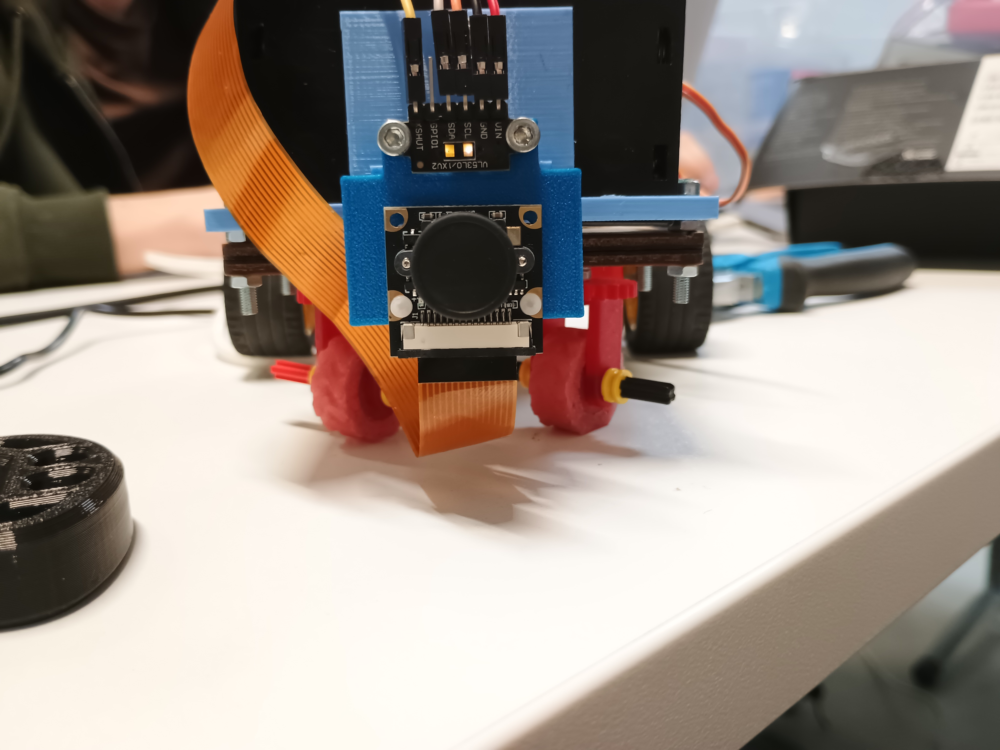</td><td>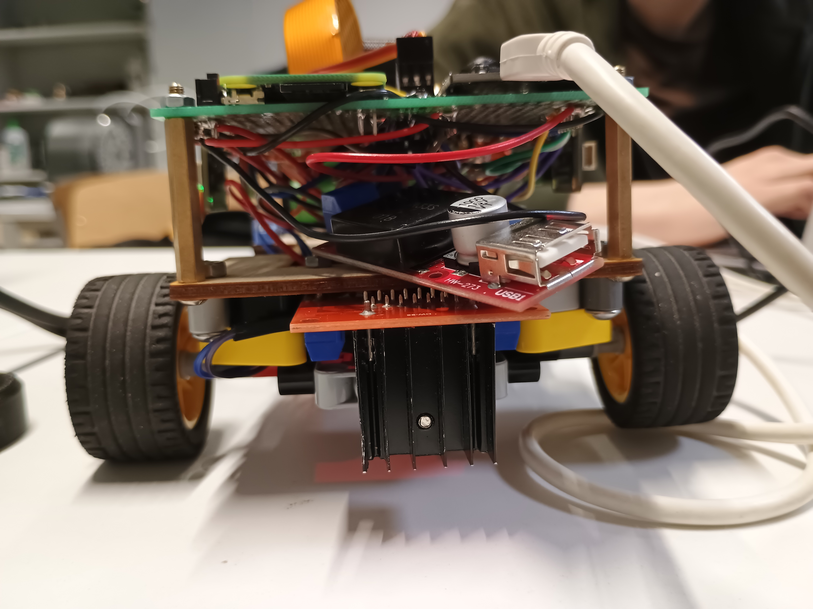</td></tr>
<tr><td>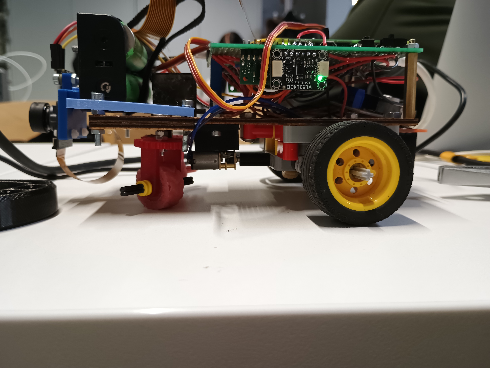</td><td>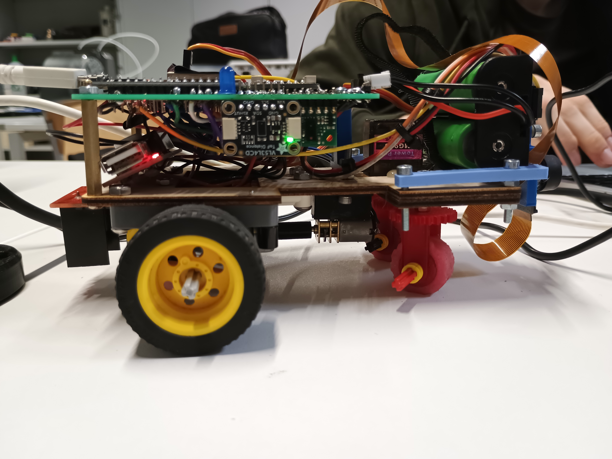</td></tr>
<tr><td>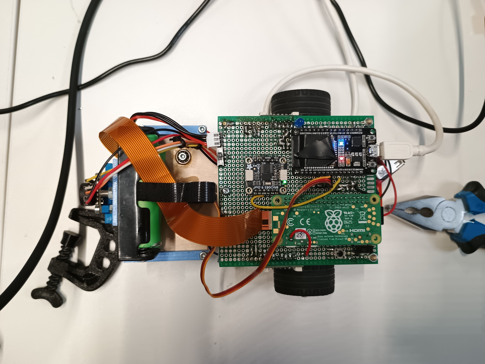</td><td>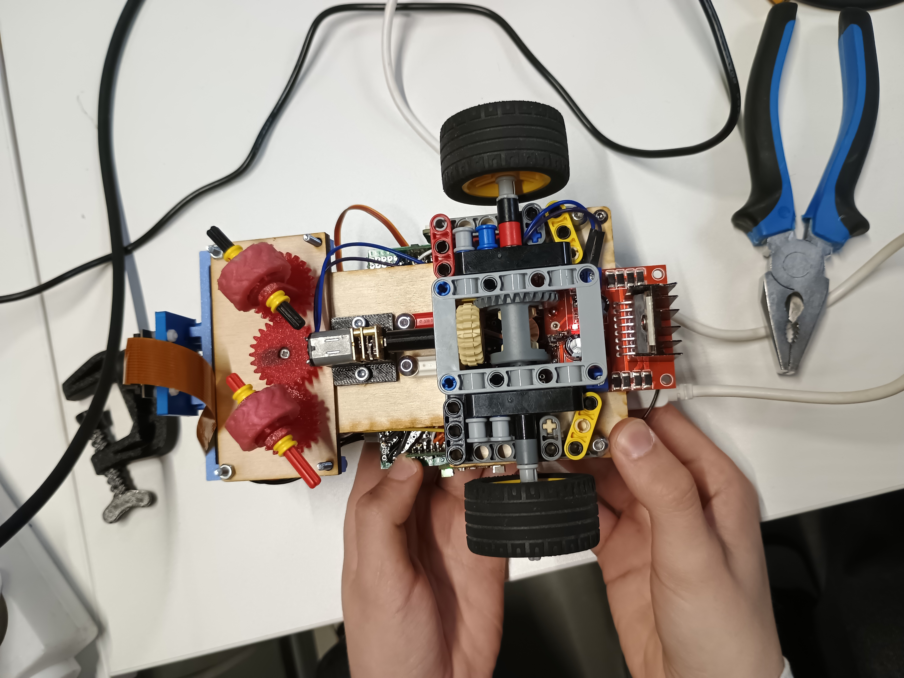</td></tr>
</table>

This is the earlier packaging baseline. The later car is smaller and uses less hardware.

## Stage 2: differential and drivetrain

<table>
<tr><td></td><td></td></tr>
</table>

## Stage 3: steering

<table>
<tr><td></td><td></td></tr>
</table>

## Stage 4: electronics integration

<table>
<tr><td></td><td>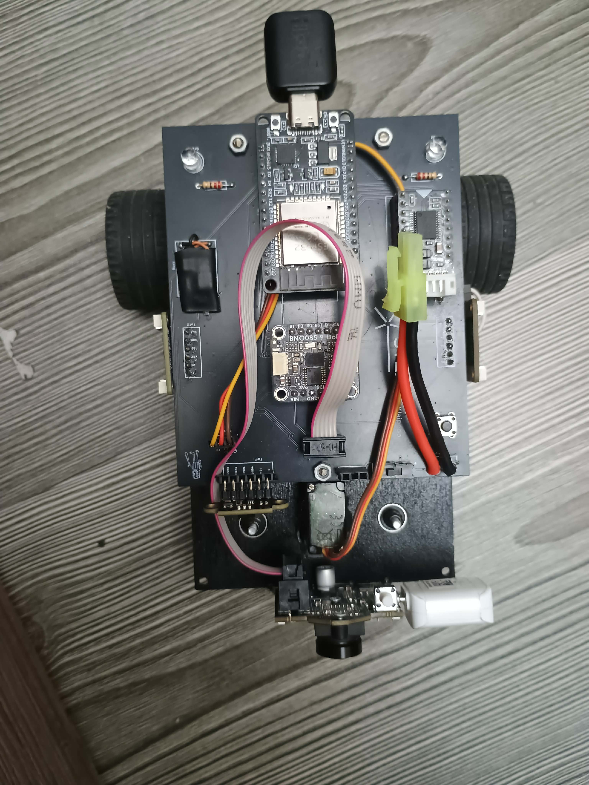</td></tr>
<tr><td>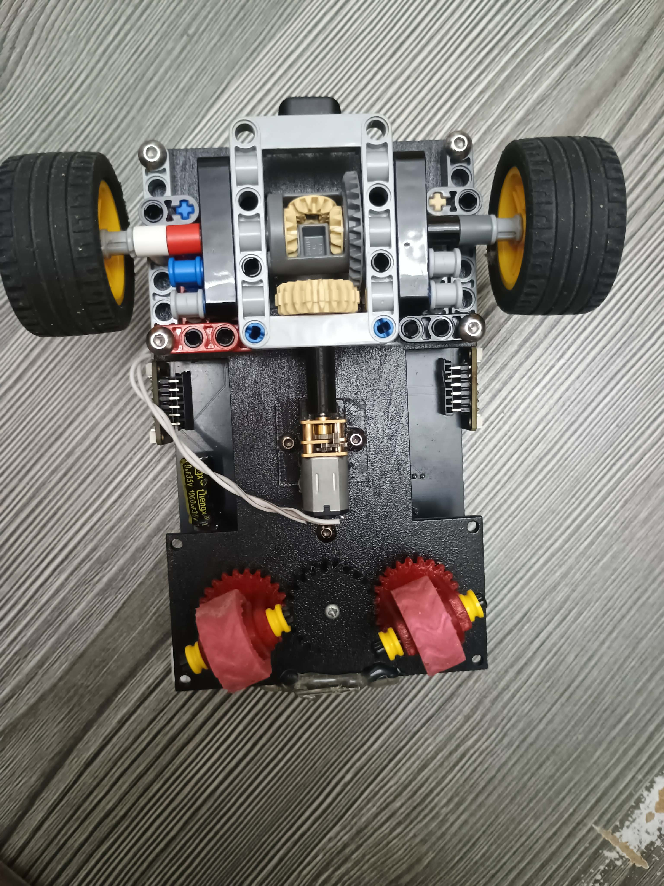</td><td>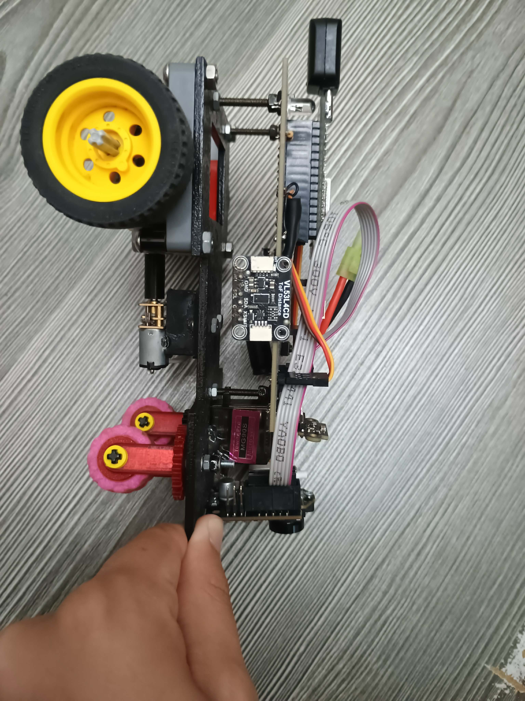</td></tr>
<tr><td colspan="2" align="center">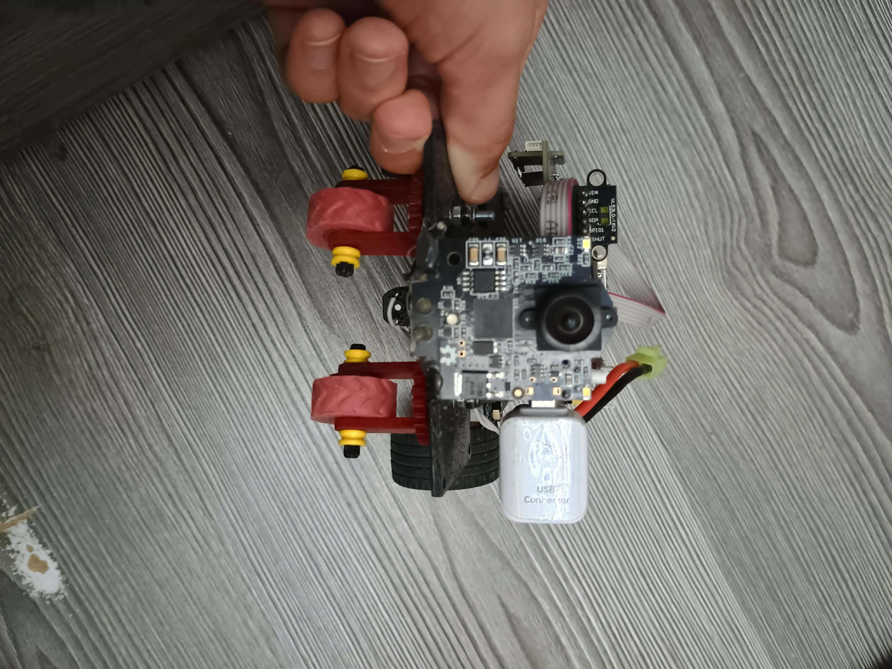</td></tr>
</table>

## Stage 5: final competition robot

The five photos near the top show the final robot with the black PCB and white rear wheels.

---

# 7. Bill of materials and sourcing

The supplier links are examples. Match each part to the model, footprint and electrical or mechanical interface listed here.

| Qty | Component | Final specification | Example source | Important detail |
|---:|---|---|---|---|
| 1 | ESP32 board | ESP32-WROOM-32 DevKit V1, **30 pin** | [3DSVET EU](https://www.3dsvet.eu/izdelek/esp32-wroom32-30pinov-microusb/) | 38-pin boards do not fit the same PCB footprint |
| 1 | IMU | Adafruit BNO085, product 4754 | [Adafruit](https://www.adafruit.com/product/4754) | fixed chassis orientation |
| 3 | ToF sensor | VL53L1X on 6-pin carrier | [Pololu](https://www.pololu.com/product/3415) | the sensor itself must be VL53L1X, even if the carrier looks similar |
| 1 | Camera | Pixy2 / Pixy2.1 CMUcam5 | [RobotShop EU](https://eu.robotshop.com/products/charmed-labs-pixy-21-robot-vision-image-sensor-rbc) | direct ESP32 SPI connection through the custom PCB |
| 1 | Steering servo | TowerPro MG90S positional | [Anodas LT](https://www.anodas.lt/en/towerpro-mg90s-micro-analog-servo-with-metal-gear) | do not use 360° continuous rotation |
| 1 | Motor driver | Makeblock MegaPi Encoder/DC Motor Driver V1 | [BerryBase](https://www.berry-base.com/makeblock-megapi-encoder-dc-motor-driver-v1-2-kanaele-6-12-v-3-a-nennstrom-5-5-a-peak) | brushed DC output used |
| 1 | Drive motor | N20, 6 V, nominal 600 rpm, 3 mm D-shaft class | [HESTORE](https://www.hestore.eu/prod_10042830.html) | check shaft length before ordering |
| 1 | Battery | 2S LiPo, 7.4 V, 2500 mAh, 30C | RC supplier | must fit final packaging |
| 1 | 5 V regulator | Matek Micro BEC 6S, 6–30 V input, 5 V/9 V adjustable | [RCdalys](https://www.rcdalys.lt/detales/0/27234/MATEK-MICRO-BEC-6S-6-30V-5V9V-ADJUSTABLE-3PCS) | set to 5 V; 1.5 A continuous, 2.5 A max for 5 s/min |
| 1 | PCB | KU STEAM Pinkies final board | `schemes/` Gerbers | manufacture from the checked-in package |
| 1 | Rear differential | LEGO-compatible differential | LEGO/Technic source | geometry must match final drivetrain |
| 2 | Rear wheels | final white custom wheel geometry | `models/` | use final wheel CAD/material |
| 2 | Front wheel/steering assemblies | final printed/LEGO-compatible geometry | `models/` | do not scale STL files |
| 1 | Plywood base | final cut vector | `models/case.ai` | import at 1:1 scale |

### Replacement rules

- ESP32 replacements must keep the same 30-pin footprint and required GPIOs.
- ToF replacements must use VL53L1X and expose XSHUT.
- Servo must be positional, not continuous rotation.
- The 5 V regulator must meet the final Matek Micro BEC 6S electrical role: 2S-compatible input and enough continuous current for the documented 5 V load.
- N20 replacements must match voltage, speed class and shaft geometry.
- Mechanical substitutions must preserve axle, hole and wheel geometry.
- Treat any change to the pinout, sensor type, wheel size, steering geometry or camera interface as a new robot revision, and retest the robot.

---

# 8. Rebuilding the robot

Use the CAD files and steps below to rebuild the robot. Use the photos as visual references, not for measuring dimensions.

## Mechanics

1. Cut the base from `models/case.ai`.
2. Print the final STLs from `models/` without scaling.
3. Assemble the rear motor, gear stage, differential and wheels.
4. Assemble the front steering parts and MG90S.
5. Centre the linkage and verify the command range from 60° to 120°.

## Electronics

1. Manufacture the PCB from the `schemes/` Gerber/drill package.
2. Install the 30-pin ESP32 board.
3. Connect BNO085 and the three VL53L1X modules to I2C.
4. Connect XSHUT to GPIO15 / GPIO5 / GPIO18 for front / left / right.
5. Connect MG90S to GPIO33.
6. Connect the motor driver to GPIO26, GPIO25 and GPIO32.
7. Connect Pixy2 to the final board's SPI camera connector; the PCB routes `MOSI`, `MISO`, `SCK`, 5 V and GND to the camera header.
8. Check ground and supply polarity before applying motor power.

## Firmware

```bash
platformio run -d src -e open_challenge
platformio run -d src -e obstacle_challenge
```

Upload the build for the required challenge, then run the calibration checks in section 2.6.

## Final acceptance checks

- base and printed parts match the final CAD revision;
- drivetrain turns freely;
- steering is centred and does not bind;
- front/left/right ToF identities match `0x30/0x31/0x32`;
- BNO085 heading direction is correct;
- Pixy2 image direction matches steering logic;
- ESP32 does not reset during hard steering and acceleration;
- both PlatformIO environments compile;
- Open Challenge straight/corner control runs without manual input;
- Obstacle Challenge recognises the trained signatures, passes and recovers to normal driving;
- parallel parking is **not yet implemented**; do not record the entire 2026 Obstacle Challenge as complete.

---

# 9. Repository layout

```text
README.md                     project engineering journal
src/                          ESP32 PlatformIO firmware
models/                       final STL/CAD + case.ai base vector
schemes/                      schematic images, PCB PDF, Gerbers and drill files
videos/                       competition run recordings
v-photos/                     final robot photographs
t-photos/                     team photograph
docs/design/images/           drivetrain and steering development photos
docs/design/history/          earlier whole-robot photographs
docs/report/images/           build/electronics development photographs
docs/testing/                 retained validation CSV and raw-run template
```

This README is the **single engineering-journal and assessment narrative**: technical rationale, methods, results, limitations, reconstruction, testing procedures and version notes are readable here without opening another Markdown document. Source code, CAD, PCB files, CSVs, photos and videos stay in their original formats as linked supporting evidence. Build verification is manual; there is intentionally no GitHub Actions CI or `scripts/` verification directory in the current repository.

---

# 10. Versioning and verification record

This section records the competition-ready documentation state of the robot and the workflow used to keep hardware, firmware and validation evidence aligned. Git commit history provides the detailed change-by-change record, while this section identifies the current documented revision and the checks expected after material changes.

## Current competition revision

The documented competition configuration uses:

- ESP32-WROOM-32, 30-pin DevKit V1 form factor;
- BNO085 heading sensor;
- 3 × VL53L1X distance sensors in Long mode;
- Pixy2 / Pixy2.1 vision connected directly to ESP32 over SPI;
- N20 6 V motor, nominal 600 rpm;
- LEGO-compatible gearing and rear differential;
- MG90S positional steering servo;
- 2S LiPo, 7.4 V, 2500 mAh, 30C;
- custom PCB;
- approximate overall size of 165 × 145 × 70 mm;
- documented mass of 332.4 g.

The firmware is maintained as one source tree with two explicit PlatformIO environments. The currently documented Obstacle build has pillar avoidance and finish stopping, but **no autonomous parallel-parking routine**:

```bash
platformio run -d src -e open_challenge
platformio run -d src -e obstacle_challenge
```

- `open_challenge` uses `WRO_CHALLENGE_MODE=0`;
- `obstacle_challenge` uses `WRO_CHALLENGE_MODE=1`.

## Reproducibility package

The repository keeps the material needed to rebuild, inspect and validate the documented robot in version control:

- `README.md` — design reasoning, architecture, calibration, tuning, rebuild instructions and this versioning record;
- `src/` — ESP32 PlatformIO firmware;
- `models/` — final STL/CAD files and `case.ai`;
- `schemes/` — PCB documentation, Gerbers, drill files and schematic images;
- `docs/testing/validation-summary.csv` — retained validation summary;
- `docs/testing/raw/run-template.csv` — repeatable run-record format;
- `README.md` section 5 — the full test protocol, metric definitions, evidence requirements and historical result context;
- `v-photos/` — final robot photographs;
- `t-photos/` — team photograph;
- `videos/` — competition run recordings.

## Verification workflow for a material revision

When a material robot revision is made:

1. record the Git commit SHA used for the revision;
2. build both PlatformIO environments;
3. repeat the calibration checks in section 2.6;
4. repeat the final acceptance checks in section 8;
5. record new physical runs using `docs/testing/raw/run-template.csv`;
6. update `docs/testing/validation-summary.csv` from retained measurements;
7. document what changed, why it changed and which subsystem was affected.

A change to pinout, sensor type, wheel size, steering geometry, camera interface or challenge-control behaviour is treated as a new robot revision and is rechecked before its results are used as final competition evidence.

## Revision trace

The Git history provides the detailed evolution of the project. Meaningful commits cover the major documented revisions, including chassis and drivetrain development, steering redesign, sensor architecture changes, custom PCB integration, Pixy2 SPI correction, testing workflow updates and final power/sensor/calibration documentation. Together with the robot-evolution section and retained test results, this provides traceability from earlier prototypes to the current competition configuration.

## Documentation clarification record

The documentation explicitly identifies Pixy2 green as signature 1 and red as signature 2; separates firmware constants from historical measurements; explains coefficient and corner-control decisions from the checked-in code; and includes the repeatable testing protocol directly in section 5 of this README. This clarification does not imply a change to the physical robot or new physical measurements.
