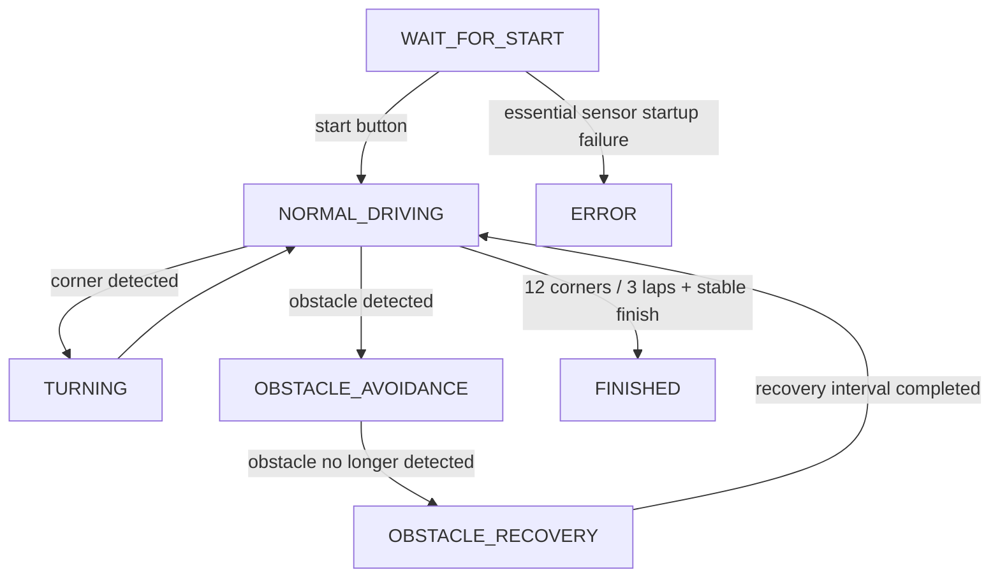

# KU STEAM Pinkies: WRO 2026 Future Engineers

We are **KU STEAM Pinkies** from Klaipėda University STEAM Centre. For WRO 2026 Future Engineers, we built a compact rear-wheel-drive, front-wheel-steer robot with an ESP32, a BNO085 heading sensor, three VL53L1X distance sensors and Pixy2 vision.

We gave each subsystem one job. If hardware added wiring, latency or failure points without giving us useful information, we left it out.

## Team

- **Domas Lukas (left)**
- **Jonas Danisevičius(right)**
- **Marius Plečkaitis(center)**

<p align="center">
  
</p>

## Competition videos

- **Open Challenge:** https://www.youtube.com/watch?v=PdYDFbR_HfI
- **Obstacle Challenge:** [MP4 recording](videos/obstacle-challenge.mp4)

## Contents

- [Final robot](#final-robot)
- [Mechanical design](#1-mechanical-design)
- [Electronics, power and sensors](#2-electronics-power-and-sensors)
- [Software architecture](#3-software-architecture)
- [Engineering decisions and system development](#4-engineering-decisions-and-system-development)
- [Testing and tuning](#5-testing-and-tuning)
- [Robot evolution](#6-robot-evolution)
- [Bill of materials and sourcing](#7-bill-of-materials-and-sourcing)
- [Rebuilding the robot](#8-rebuilding-the-robot)
- [Repository layout](#9-repository-layout)
- [Release and versioning notes](RELEASE_NOTES.md)
---

# Final robot

The final competition robot has a **black custom PCB and white rear wheels**.

<table>
<tr>
<td align="center"><br><b>Final robot, right side</b></td>
<td align="center"><br><b>Final robot, left side</b></td>
</tr>
<tr>
<td align="center"><br><b>Final robot, front</b></td>
<td align="center"><br><b>Final robot, top</b></td>
</tr>
<tr>
<td align="center" colspan="2"><br><b>Final robot, bottom</b></td>
</tr>
</table>

| Subsystem | Final version |
|---|---|
| Controller | ESP32-WROOM-32, 30-pin DevKit V1 form factor |
| Heading | BNO085 |
| Range sensing | 3 × VL53L1X, Long mode |
| Vision | Pixy2 / Pixy2.1 |
| Drive | rear-wheel drive |
| Motor | N20, 6 V, nominal 600 rpm |
| Transmission | LEGO-compatible gearing + LEGO differential |
| Steering | front-wheel steering, positional MG90S |
| Battery | 2S LiPo, 7.4 V, 2500 mAh, 30C |
| Electronics | custom PCB |
| Mass | 332.4 g |
| Approx. overall size | 165 × 145 × 70 mm |

---

# 1. Mechanical design

## 1.1 Layout

We chose **rear-wheel drive** and **front-wheel steering**. That leaves the rear axle to provide traction and the front mechanism to steer. The layout also simplified the control model and left room in the centre of the chassis for the battery, PCB and sensors.

We kept the car compact to leave more room around corners and obstacles and reduce the steering correction needed after a turn.

## 1.2 Drivetrain

```text
N20 geared motor
      ↓
shaft adapter
      ↓
LEGO-compatible gear stage
      ↓
LEGO differential
      ↓
rear wheels
```

The nominal motor speed is 600 rpm. With the final effective reduction of about 1.50:1:

```text
wheel_rpm = 600 / 1.50 = 400 rpm
wheel circumference = π × 0.054 = 0.1696 m
ideal geometric speed = 400 × 0.1696 / 60 ≈ 1.13 m/s
```

For the design model we used 0.08 N·m useful motor torque and 80% drivetrain efficiency:

```text
wheel torque ≈ 0.08 × 1.50 × 0.80 = 0.096 N·m
tractive force ≈ 0.096 / 0.027 ≈ 3.6 N
```

These figures are design calculations. Under load, the car runs slower because of motor load, friction, tyre deformation, PWM and battery voltage.

We balanced speed against the time the controller needs to sample the ToF sensors, correct the heading, detect corners and recover after an obstacle. More reduction increases wheel torque but lowers lap speed. The final 1.50:1 ratio is our compromise.

## 1.3 Differential iteration

<table>
<tr><td align="center"><b>Earlier metal differential</b></td><td align="center"><b>Final LEGO differential</b></td></tr>
<tr><td></td><td></td></tr>
</table>

We kept the LEGO differential because it fits the rest of the LEGO-compatible axle and gearing directly, uses fewer custom couplings and is easier to replace during competition. It also allows the two rear wheels to rotate at different speeds in a corner.

## 1.4 Steering iteration

<table>
<tr><td align="center"><b>Earlier steering</b></td><td align="center"><b>Final steering</b></td></tr>
<tr><td></td><td></td></tr>
</table>

The final steering uses a positional MG90S servo. We centre the linkage mechanically before fixing the servo horn. Firmware limits the servo command from **60° to 120°**, with **88°** as straight ahead. The limits keep the linkage out of the range where it binds and heats the servo.

During development, we saw the space needed for a 90° turn fall from about 46 cm to 39 cm after changing the steering. We did not keep the original matched test log, so treat those figures as an engineering observation, not a precise measurement.

## 1.5 CAD and base fabrication

The final custom parts are in `models/`:

| File | Part |
|---|---|
| `Body1.stl` | body / structural part |
| `Front.stl` | front assembly part |
| `lego-mold-su-x.stl` | LEGO-interface mould/part |
| `ratas-su-x.stl` | custom wheel part |
| `motor-shaft-spacer.stl` | motor shaft spacer |
| `steering-column-housing-short.stl` | steering column housing |
| `steering-gear-cover-disc.stl` | steering gear cover |
| `steering-gear-hub.stl` | steering gear hub |
| `steering-gear-plate.stl` | steering gear plate |
| `steering-pin-adapter.stl` | steering pin adapter |
| `case.ai` | 2D plywood/base cutting vector |

`models/case.ai` is the base fabrication file. Its main rectangular path is approximately **90 × 150 mm** when imported at the original scale. That number is only a scale check; holes, slots and curves must be taken from the vector itself.

Mechanical build order:

1. cut `models/case.ai` at 1:1 scale;
2. print the STL parts without rescaling;
3. mount the N20 motor and motor-shaft interface;
4. assemble the LEGO-compatible gear stage and rear differential;
5. install the rear wheels and confirm both sides rotate freely;
6. assemble the front steering parts and MG90S;
7. centre the steering mechanically;
8. check the full range from 60° to 120° for binding;
9. mount the electronics stack and compare the result with the final photos above.

Standard LEGO Technic shafts and gears, along with ordinary fasteners, are not performance-tuned. Replace them only with parts that keep the shaft, hole and mounting geometry shown in the CAD and final assembly.

---

# 2. Electronics, power and sensors

## 2.1 Power architecture

The final battery is **2S LiPo, 7.4 V, 2500 mAh, 30C**.

```text
2S LiPo
  |
  +--> custom PCB --> motor driver --> N20 motor
  |
  +--> regulated logic rail --> ESP32
  |
  +--> PCB distribution --> BNO085 / VL53L1X / Pixy2 / MG90S
```

Battery energy:

```text
E = 7.4 V × 2.5 Ah = 18.5 Wh
```

### Current budget used during design

| Load | Normal | Short peak | Main concern |
|---|---:|---:|---|
| ESP32 | ~160 mA | ~240 mA | logic stability |
| BNO085 | ~15 mA | ~20 mA | heading stability |
| 3 × VL53L1X | ~75 mA total | ~120 mA total | ranging / I2C stability |
| Pixy2 | ~140 mA | ~200 mA | camera processing |
| MG90S | ~200–300 mA | ~750 mA | steering peak/stall |
| N20 motor | ~350 mA | ~1.3 A | acceleration/stall |
| whole robot | ~0.9–1.2 A | ~1.8–2.2 A | regulator and connector voltage drop |

The battery has ample discharge reserve. During motor and servo peaks, the tighter limits are the regulator, PCB traces, connectors and wiring. During testing, we reject a build if acceleration or steering repeatedly resets the ESP32 or interrupts sensor communication.

## 2.2 Custom PCB

<table>
<tr><td align="center"><b>PCB layout</b></td><td align="center"><b>PCB routing</b></td></tr>
<tr><td></td><td></td></tr>
</table>

### Wiring and sensor-bus diagrams

<p align="center">
  
</p>

<p align="center"><strong>Electrical overview.</strong> The diagram shows the battery, regulated logic supply, ESP32, motor driver, steering servo and sensor connections used on the final robot.</p>

<p align="center">
  
</p>

<p align="center"><strong>Sensor-bus detail.</strong> The three VL53L1X modules share I2C and are given unique runtime addresses through separate XSHUT lines; the BNO085 is the independent heading reference.</p>

The electrical folder contains:

- `schemes/Wro_customPCBs.pdf`
- `schemes/images/schematic-overview.png`
- `schemes/images/sensor-bus-detail.png`
- complete top/bottom copper, solder-mask and silkscreen Gerbers
- board outline and mechanical/document layers
- plated, non-plated and via drill files
- flying-probe test data

The Gerber and drill files are for manufacturing the final PCB revision.

## 2.3 Pin and sensor identity

| Function | ESP32 pin / bus |
|---|---|
| Start button | GPIO14 |
| Motor enable / PWM | GPIO32 |
| Motor input 1 | GPIO26 |
| Motor input 2 | GPIO25 |
| Steering servo | GPIO33 |
| Front VL53L1X XSHUT | GPIO15 |
| Left VL53L1X XSHUT | GPIO5 |
| Right VL53L1X XSHUT | GPIO18 |
| BNO085 | I2C |
| 3 × VL53L1X | shared I2C, separate XSHUT |
| Pixy2 | direct Pixy2-to-ESP32 interface |

All three ToF modules share the same factory I2C address. Firmware enables them one at a time and assigns each a different runtime address:

| Sensor | XSHUT | Runtime address |
|---|---:|---:|
| Front | GPIO15 | `0x30` |
| Left | GPIO5 | `0x31` |
| Right | GPIO18 | `0x32` |

## 2.4 Sensor placement and track geometry

The **front VL53L1X** faces forward and is mounted beside the **Pixy2** camera. It measures forward clearance and helps detect a corner; Pixy2 independently reports the position of coloured obstacles. The **left and right VL53L1X** modules sit at the lateral edges of the custom PCB and measure the corresponding side clearances for wall correction. The chassis-mounted **BNO085** provides heading, so range and orientation feedback come from separate sensors.

<table>
<tr>
<td align="center"><br><strong>Installed sensor positions.</strong> Left and right VL53L1X modules sit at the PCB side edges; the front VL53L1X is beside Pixy2.</td>
<td align="center"><br><strong>PCB footprint.</strong> The drawing marks the board as 90 × 100 mm.</td>
</tr>
</table>

The robot's documented overall dimensions are approximately **165 × 145 × 70 mm**.

### Projection onto the WRO corridor

The [WRO 2026 Future Engineers rules](https://wro.hr/wp-content/uploads/2026/01/WRO-2026-Future-Engineers-Self-Driving-Cars-General-Rules.pdf) specify nominal corridor widths of **600 mm or 1000 mm** for Open Challenge, and **1000 mm** for Obstacle Challenge. The Open Challenge width may vary by ±100 mm at the International Final; Obstacle Challenge specifies ±10 mm.

For this estimate, the **90 mm PCB dimension is assumed to run across the robot**, with the two side sensor centres at opposite PCB edges. The car is assumed to be centred and parallel to the corridor walls. These are geometry estimates from the PCB drawing and assembly photos, not direct measurements of the installed sensor centres or calibrated readings.

| WRO section | Nominal corridor width | Side sensor centre to nearest wall, centred | Robot body side to wall, centred |
|---|---:|---:|---:|
| Open Challenge, narrow corridor | 600 mm | ≈255 mm | ≈227.5 mm |
| Open Challenge, wide corridor | 1000 mm | ≈455 mm | ≈427.5 mm |
| Obstacle Challenge | 1000 mm | ≈455 mm | ≈427.5 mm |

Calculation: `sensor-to-wall = (corridor width − 90 mm) / 2`; body clearance uses the documented 145 mm vehicle width: `(corridor width − 145 mm) / 2`. Firmware uses `ROBOT_WIDTH = 150 mm` as its rounded control model.

```text
Plan view — schematic, not to scale

600 mm corridor:
LEFT WALL │← ≈255 mm →│ ● Left ToF ── ≈90 mm ── Right ToF ● │← ≈255 mm →│ RIGHT WALL

1000 mm corridor:
LEFT WALL │← ≈455 mm →│ ● Left ToF ── ≈90 mm ── Right ToF ● │← ≈455 mm →│ RIGHT WALL

Robot layout (body width ≈145 mm):
                         FRONT / direction of travel ↑
+----------------------------------------------+
| Front VL53L1X beside Pixy2 camera            |
| Left ToF   [PCB 90 × 100 mm]   Right ToF     |
+----------------------------------------------+
```

The firmware's `TARGET_DISTANCE=300 mm` is a side-wall setpoint while the current section width is unknown; in the Obstacle Challenge build, section width is not learned, so normal wall following uses that 300 mm target. At the nominal centred geometry, this is 45 mm farther from the selected wall than the 600 mm corridor reading (≈255 mm), and 155 mm closer to the selected wall than the 1000 mm corridor reading (≈455 mm). This comparison describes the setpoint relative to a centred car, not a measured driving offset. Confirm the PCB orientation, sensor centres and beam angles on the assembled robot, then record calibrated left/right readings on the actual field.

## 2.5 Sensor architecture changes

### MPU6050 → BNO085

The earlier MPU6050 setup showed noticeable yaw drift during repeated turns. Because heading error directly becomes steering error, we replaced it with BNO085 and used the IMU as the dedicated chassis-heading reference.

### Five range sensors → three VL53L1X + BNO085

With the BNO085 handling heading, we only needed three range measurements: front, left and right. We removed the other range modules and their wiring.

### VL53L4CD → VL53L1X Long mode

The side controller needs wall readings before the car gets close to a wall. VL53L1X Long mode provided a larger useful range, so we used it for all three distance sensors.

### Raspberry Pi + UART → Pixy2 directly on ESP32

Pixy2 sends colour connected-component data directly to the ESP32, so we removed the Raspberry Pi and UART link. That cut wiring and delay and removed one source of stale packets or communication failures.

## 2.6 Calibration

**ToF identity and direction**

1. Put a flat target close to the left module only and check that the left channel changes.
2. Repeat for the right module.
3. Check the front sensor against a target placed on the centreline.
4. Test several known distances and record mean reading, spread and invalid samples.
5. Make sure no wheel or chassis part clips a sensor beam.

**BNO085**

1. Point the car along a known straight reference.
2. Record yaw.
3. Rotate the chassis about 90° and confirm the expected sign/direction.
4. Cross the 0°/360° boundary to check heading wrapping.

**Pixy2**

1. Load the obstacle colour signatures used by the controller.
2. Place a trained obstacle near image centre.
3. Move it left and right and verify the reported X coordinate changes in the expected direction.
4. Check that the front structure does not block the useful image area.

---

# 3. Software architecture

The final firmware is in `src/` and is built with PlatformIO.

Two build environments use the same source code:

```bash
platformio run -d src -e open_challenge
platformio run -d src -e obstacle_challenge
```

- `open_challenge` uses `WRO_CHALLENGE_MODE=0`
- `obstacle_challenge` uses `WRO_CHALLENGE_MODE=1`

`src/include/CompetitionMode.h` validates the build-time value, so challenge mode is not changed by editing `main.cpp`.

Build verification is **manual**. The repository intentionally does not include GitHub Actions CI or a `scripts/` verification directory. The same two commands above are the documented reproducible build entry points.

## 3.1 Modules

| Module | Responsibility |
|---|---|
| `src/src/main.cpp` | driving behaviour and state transitions |
| `Engine` | DC motor direction and PWM |
| `Compass` | BNO085 startup and yaw |
| `Distance_Sensor` | VL53L1X startup, address assignment and ranging |
| Pixy2 interface | colour connected-component acquisition |
| `Lights` | visible robot state |
| `CompetitionMode.h` | Open/Obstacle build selection |

## 3.2 State machine

The controller follows a state machine:

```text
WAIT_FOR_START
      |
      | start button
      v
NORMAL_DRIVING
   |       |
   |       +-- corner detected --> TURNING --------+
   |                                               |
   +-- obstacle detected --> OBSTACLE_AVOIDANCE    |
                              |                     |
                              | obstacle disappears |
                              v                     |
                         OBSTACLE_RECOVERY ----------+
                              |
                              | recovery timer ends
                              v
                        NORMAL_DRIVING

12 corners / 3 laps + stable finish condition --> FINISHED
sensor-start failure ---------------------------> ERROR
```

The same control flow is shown below as a diagram for quicker review:


```mermaid
flowchart TD
    A[WAIT_FOR_START] -->|start button| B[NORMAL_DRIVING]
    B -->|corner detected| C[TURNING]
    C --> B
    B -->|obstacle detected| D[OBSTACLE_AVOIDANCE]
    D -->|obstacle no longer detected| E[OBSTACLE_RECOVERY]
    E -->|recovery interval completed| B
    B -->|12 corners / 3 laps + stable finish| F[FINISHED]
    A -->|essential sensor startup failure| G[ERROR]
```

### What each state does

- **WAIT_FOR_START** keeps the motor stopped until the team starts a run.
- **NORMAL_DRIVING** uses heading and wall control.
- **TURNING** handles a corner and updates the target heading by about 90° after the turn condition is met.
- **OBSTACLE_AVOIDANCE** gives Pixy2 steering priority while an obstacle block is present.
- **OBSTACLE_RECOVERY** keeps wall following from taking over while the car is still angled after passing an obstacle.
- **FINISHED** keeps the robot stopped after three laps.
- **ERROR** stops the run if an essential sensor fails during startup.

## 3.3 Heading and wall control

Heading error is wrapped to the shortest direction:

```text
heading_error = target_heading - yaw
if heading_error > 180:  heading_error -= 360
if heading_error < -180: heading_error += 360
```

Heading error sets the base steering correction. The firmware has a `Kd` term, but its previous-error value is not updated on every control cycle. It therefore does not implement the usual discrete derivative of current and previous heading error, and its damping effect has not been validated.

Wall correction uses the outside wall:

```text
wall_error = measured_outer_wall_distance - target_wall_distance
```

Clockwise runs use the left outer wall, and counter-clockwise runs use the right. The controller accepts a range reading only when its status and the combined left and right distances are plausible.

The steering command is conceptually:

```text
straight centre
+ heading correction
+ wall-distance correction
+ derivative damping
+ Pixy2 correction when avoiding an obstacle
```

Servo output is clamped to the mechanical range.

## 3.4 Corner strategy

When the front ToF detects a corner, the controller enters `TURNING`. If the driving direction is not set yet, it locks one in, steers to the turn limit and waits for the sensor to show that the car has cleared the corner. It then updates the target heading by about 90° and returns to `NORMAL_DRIVING`.

The front ToF tells the controller when to turn; BNO085 provides the heading the car should recover to.

## 3.5 Obstacle strategy

In `obstacle_challenge`, Pixy2 CCC blocks go straight to the ESP32. The controller filters detections by height so tiny or oversized blocks do not trigger steering.

Among the remaining blocks, the controller chooses the closest using image Y. Each signature has its own horizontal target offset, which sets the side the car passes on.

Current obstacle tuning constants:

| Parameter | Value |
|---|---:|
| Minimum block height | 8 |
| Maximum block height | 70 |
| Signature 1 offset | -105 |
| Other signature offset | 55 |
| Pixy steering gain | 0.32 |
| Recovery time | 450 ms |

When the obstacle disappears, the controller waits 450 ms in `OBSTACLE_RECOVERY`, then resumes wall control.

## 3.6 Controller constants

| Constant | Value |
|---|---:|
| `ROBOT_WIDTH` | 150 mm controller model |
| `TARGET_DISTANCE` | 300 mm |
| `WIDTH_THRESHOLD` | 150 mm |
| `MIN_ANGLE` | 60° |
| `MAX_ANGLE` | 120° |
| `STRAIGHT_ANGLE` | 88° |
| `Kp` | 0.09 |
| `Kg` | 0.95 |
| `Kd` | 0.05 |

## 3.7 Failure handling

The firmware handles several failure cases; the remaining gaps are listed in section 5.

- The ToF sensors share a default address, so separate XSHUT lines let startup assign each sensor a different runtime address.
- The robot stays stopped if a ToF sensor or the BNO085 fails at startup.
- Invalid ToF readings are filtered during wall control and corner detection, but the TURNING loop has no timeout if the front sensor never reports that the corner is clear.
- Heading error is normalised to ±180° across the 0°/360° boundary.
- Pixy2 filters false or implausible blocks by image size.
- Servo commands are clamped to the linkage's mechanical range.
- After obstacle avoidance, a recovery state and timer delay the return to wall following.
- Load tests check whether power sag resets the ESP32 or interrupts sensor communication.

---

# 4. Engineering decisions and system development

We designed around chassis size, corner clearance, steering geometry, drivetrain alignment, power stability, I2C addressing, camera view and loop latency. The robot also had to be repairable and quick to debug at a competition.

| Earlier approach | Final approach | Why we changed it |
|---|---|---|
| larger packaging | compact chassis | more clearance and simpler layout |
| metal/custom differential interfaces | LEGO differential | easier integration and repair |
| MPU6050 | BNO085 | more useful heading reference after observed drift |
| five range sensors | three VL53L1X + BNO085 | clearer sensor roles and less wiring |
| VL53L4CD side sensing | VL53L1X Long mode | larger useful wall-ranging region |
| Raspberry Pi camera chain | Pixy2 directly to ESP32 | fewer processors and communication stages |
| prototype wiring | custom PCB | repeatable and compact electrical build |
| earlier Li-ion arrangement | 2S LiPo | compact package with good transient-current reserve |
| earlier steering linkage | revised compact linkage | better centring and less binding |
| implicit behaviour flags | explicit state machine | easier to understand, test and recover between behaviours |

## Risk table

| Failure | Effect | Mitigation |
|---|---|---|
| ToF address collision | no reliable distance data | independent XSHUT + `0x30/0x31/0x32` addresses |
| bad front range | wrong corner trigger | status check and startup validation |
| bad side range | wrong wall correction | range/status/geometry filtering |
| IMU failure | no heading reference | startup check |
| heading wrap | very large false error | ±180° normalisation |
| steering over-travel | binding / heating | mechanical centring + 60°–120° clamp |
| false vision block | wrong passing path | signature/height/position filtering |
| obstacle hand-back too early | oscillation after pass | dedicated recovery state |
| power sag | reset or sensor dropout | current margin + powered load test |
| loose wiring | intermittent fault | custom PCB and fixed connectors |
| firmware/document mismatch | hard-to-reproduce robot | Git history, two fixed PlatformIO environments, manual verification workflow and dated release notes |

---

# 5. Testing and tuning

## 5.1 Evidence policy

We separate **measured data**, **matched run values**, **team-reported comparisons**, **summary observations** and **design calculations** instead of presenting them as equally precise evidence. The consolidated dataset is stored in [`docs/testing/validation-summary.csv`](docs/testing/validation-summary.csv), and [`docs/testing/raw/run-template.csv`](docs/testing/raw/run-template.csv) defines the fields used for new run-level logging.

Where original run metadata was not retained, the README states that limitation explicitly. We do not reconstruct missing dates, firmware versions or sample counts after the fact. New validation runs should be recorded at run level so future comparisons remain reproducible.


We tuned the robot in this order:

1. free mechanical movement and steering centre;
2. BNO085 direction and heading response;
3. heading gain;
4. derivative damping;
5. wall-distance gain;
6. clockwise and counter-clockwise corners;
7. Pixy2 obstacle pass;
8. obstacle recovery;
9. repeated full-route attempts.

Saved results are in `docs/testing/validation-summary.csv`.

## 5.1 Manual verification and evidence workflow

This repository uses a manual verification workflow rather than GitHub Actions CI:

1. record the Git commit SHA for the revision being tested;
2. run `platformio run -d src -e open_challenge`;
3. run `platformio run -d src -e obstacle_challenge`;
4. perform the sensor calibration checks in section 2.6;
5. perform the final acceptance checks in section 8;
6. for each new physical run, copy `docs/testing/raw/run-template.csv` and record challenge mode, firmware SHA, battery state, changed variable, result and measured error/failure where available;
7. update `docs/testing/validation-summary.csv` only from retained evidence.

Leave a field blank when it was not measured. Do not reconstruct a missing measurement from memory. Dated repository versioning notes are kept in [`RELEASE_NOTES.md`](RELEASE_NOTES.md).

| Test | Earlier | Updated/final | Notes |
|---|---:|---:|---|
| Straight drift after 2 m | 9 cm | 4 cm | team-recorded comparison, 10 runs |
| Successful 3-lap runs | 6/10 | 9/10 | 10 attempts per version |
| Corner overshoot | 14 cm | 6 cm | development observation |
| Obstacle recovery | 1.2 s | 0.6 s | development observation |
| Matched 3 m drift mean | 10.6 cm | 4.0 cm | five retained values per version |
| Open straight | — | 5/5 | final layout |
| Obstacle slalom | — | 4/5 | final layout |
| Full practice route | — | 4/5 | final layout |
| 90° turning space | ~46 cm | ~39 cm | development observation |

For the matched 3 m drift comparison, the retained values are:

```text
earlier: 11, 10, 12, 9, 11 cm  -> mean 10.6 cm
updated:  4,  5,  3, 4,  4 cm  -> mean  4.0 cm
```

That is a 6.6 cm reduction in the retained means, about 62%.

The earlier tests predate per-run Git SHA logging, so the CSV labels their evidence accordingly. For new physical runs, use `docs/testing/raw/run-template.csv`. Record the challenge mode, firmware SHA, battery state, changed variable, outcome and any measured error or failure.

Leave a field blank if you did not measure it.
## What the saved evidence does not show

The current files support some design choices, but they do not establish every performance claim with measurements.

| Choice or result | What the README supports | What is missing |
|---|---|---|
| N20, 600 rpm | With the 54 mm wheel and 1.50:1 reduction, the nominal speed gives an ideal geometric estimate of about 1.13 m/s. This was the design estimate. | No loaded-speed measurement or comparison with another motor speed is recorded. |
| MG90S steering servo | A positional servo is needed for bounded steering; the firmware limits its command to 60° to 120° and uses 88° as straight ahead. | No steering-load torque/current measurement or comparison with another servo is recorded. |
| Chassis geometry | The overall size is about 165 × 145 × 70 mm. | Wheelbase and track width were not recorded. Overall dimensions do not determine either value. |
| ToF placement | The front sensor measures ahead; the side sensors support wall correction. | Section 2.4 gives nominal corridor-distance estimates from the dimensioned PCB and assembled photos, assuming a centred, parallel car and sensors at the PCB edges. Exact mounting offsets and angles, measured field of view, body-edge offsets, and calibrated readings remain unverified. |
| Power | The current table contains design estimates. | No measured peak current or 5 V / 3.3 V rail voltage sag is recorded. |
| Run results | The CSV retains five matched drift values per version. Other entries are team-reported results or summary observations. | Some observations have no raw log or sample count. Firmware and date metadata are missing for the matched drift runs. |
| Firmware edge cases | Both PlatformIO environments are explicitly defined and their manual build commands are documented. | In the current source, the Kd calculation uses a stale previous-error value, the TURNING loop has no timeout, and the result of pixy.init() is not checked. |
| Release/versioning | Dated versioning notes are kept in `RELEASE_NOTES.md`. | No GitHub binary release is claimed; future material revisions should add a new dated entry with the relevant commit SHA and retest scope. |

The figures above are not new measurements. The software notes describe the current firmware; the code was not changed for this documentation update.

---

# 6. Robot evolution

We kept older photos to show how the design changed.

## Stage 1: earlier full vehicle

<table>
<tr><td></td><td></td></tr>
<tr><td></td><td></td></tr>
<tr><td></td><td></td></tr>
</table>

This is the earlier packaging baseline. The later car is smaller and uses less hardware.

## Stage 2: differential and drivetrain

<table>
<tr><td></td><td></td></tr>
</table>

## Stage 3: steering

<table>
<tr><td></td><td></td></tr>
</table>

## Stage 4: electronics integration

<table>
<tr><td></td><td></td></tr>
<tr><td></td><td></td></tr>
<tr><td colspan="2" align="center"></td></tr>
</table>

## Stage 5: final competition robot

The five photos near the top show the final robot with the black PCB and white rear wheels.

---

# 7. Bill of materials and sourcing

The supplier links are examples. Match each part to the model, footprint and electrical or mechanical interface listed here.

| Qty | Component | Final specification | Example source | Important detail |
|---:|---|---|---|---|
| 1 | ESP32 board | ESP32-WROOM-32 DevKit V1, **30 pin** | [3DSVET EU](https://www.3dsvet.eu/izdelek/esp32-wroom32-30pinov-microusb/) | 38-pin boards do not fit the same PCB footprint |
| 1 | IMU | Adafruit BNO085, product 4754 | [Adafruit](https://www.adafruit.com/product/4754) | fixed chassis orientation |
| 3 | ToF sensor | VL53L1X on 6-pin carrier | [Pololu](https://www.pololu.com/product/3415) | the sensor itself must be VL53L1X, even if the carrier looks similar |
| 1 | Camera | Pixy2 / Pixy2.1 CMUcam5 | [RobotShop EU](https://eu.robotshop.com/products/charmed-labs-pixy-21-robot-vision-image-sensor-rbc) | direct ESP32 connection |
| 1 | Steering servo | TowerPro MG90S positional | [Anodas LT](https://www.anodas.lt/en/towerpro-mg90s-micro-analog-servo-with-metal-gear) | do not use 360° continuous rotation |
| 1 | Motor driver | Makeblock MegaPi Encoder/DC Motor Driver V1 | [BerryBase](https://www.berry-base.com/makeblock-megapi-encoder-dc-motor-driver-v1-2-kanaele-6-12-v-3-a-nennstrom-5-5-a-peak) | brushed DC output used |
| 1 | Drive motor | N20, 6 V, nominal 600 rpm, 3 mm D-shaft class | [HESTORE](https://www.hestore.eu/prod_10042830.html) | check shaft length before ordering |
| 1 | Battery | 2S LiPo, 7.4 V, 2500 mAh, 30C | RC supplier | must fit final packaging |
| 1 | PCB | KU STEAM Pinkies final board | `schemes/` Gerbers | manufacture from the checked-in package |
| 1 | Rear differential | LEGO-compatible differential | LEGO/Technic source | geometry must match final drivetrain |
| 2 | Rear wheels | final white custom wheel geometry | `models/` | use final wheel CAD/material |
| 2 | Front wheel/steering assemblies | final printed/LEGO-compatible geometry | `models/` | do not scale STL files |
| 1 | Plywood base | final cut vector | `models/case.ai` | import at 1:1 scale |

### Replacement rules

- ESP32 replacements must keep the same 30-pin footprint and required GPIOs.
- ToF replacements must use VL53L1X and expose XSHUT.
- Servo must be positional, not continuous rotation.
- N20 replacements must match voltage, speed class and shaft geometry.
- Mechanical substitutions must preserve axle, hole and wheel geometry.
- Treat any change to the pinout, sensor type, wheel size, steering geometry or camera interface as a new robot revision, and retest the robot.

---

# 8. Rebuilding the robot

Use the CAD files and steps below to rebuild the robot. Use the photos as visual references, not for measuring dimensions.

## Mechanics

1. Cut the base from `models/case.ai`.
2. Print the final STLs from `models/` without scaling.
3. Assemble the rear motor, gear stage, differential and wheels.
4. Assemble the front steering parts and MG90S.
5. Centre the linkage and verify the command range from 60° to 120°.

## Electronics

1. Manufacture the PCB from the `schemes/` Gerber/drill package.
2. Install the 30-pin ESP32 board.
3. Connect BNO085 and the three VL53L1X modules to I2C.
4. Connect XSHUT to GPIO15 / GPIO5 / GPIO18 for front / left / right.
5. Connect MG90S to GPIO33.
6. Connect the motor driver to GPIO26, GPIO25 and GPIO32.
7. Connect Pixy2 directly to the ESP32 interface used by the final board.
8. Check ground and supply polarity before applying motor power.

## Firmware

```bash
platformio run -d src -e open_challenge
platformio run -d src -e obstacle_challenge
```

Upload the build for the required challenge, then run the calibration checks in section 2.6.

## Final acceptance checks

- base and printed parts match the final CAD revision;
- drivetrain turns freely;
- steering is centred and does not bind;
- front/left/right ToF identities match `0x30/0x31/0x32`;
- BNO085 heading direction is correct;
- Pixy2 image direction matches steering logic;
- ESP32 does not reset during hard steering and acceleration;
- both PlatformIO environments compile;
- Open Challenge straight/corner control runs without manual input;
- Obstacle Challenge recognises the trained signatures, passes and recovers to normal driving.

---

# 9. Repository layout

```text
README.md                     project engineering journal
RELEASE_NOTES.md               dated repository versioning and verification notes
src/                          ESP32 PlatformIO firmware
models/                       final STL/CAD + case.ai base vector
schemes/                      schematic images, PCB PDF, Gerbers and drill files
videos/                       competition run recordings
v-photos/                     final robot photographs
t-photos/                     team photograph
docs/design/images/           drivetrain and steering development photos
docs/design/history/          earlier whole-robot photographs
docs/report/images/           build/electronics development photographs
docs/testing/                 validation CSV and raw-run template
```

This README explains the design. Source code, CAD, PCB files, CSVs, photos and videos stay in their original formats. Build verification is manual; there is intentionally no GitHub Actions CI or `scripts/` verification directory in the current repository.
