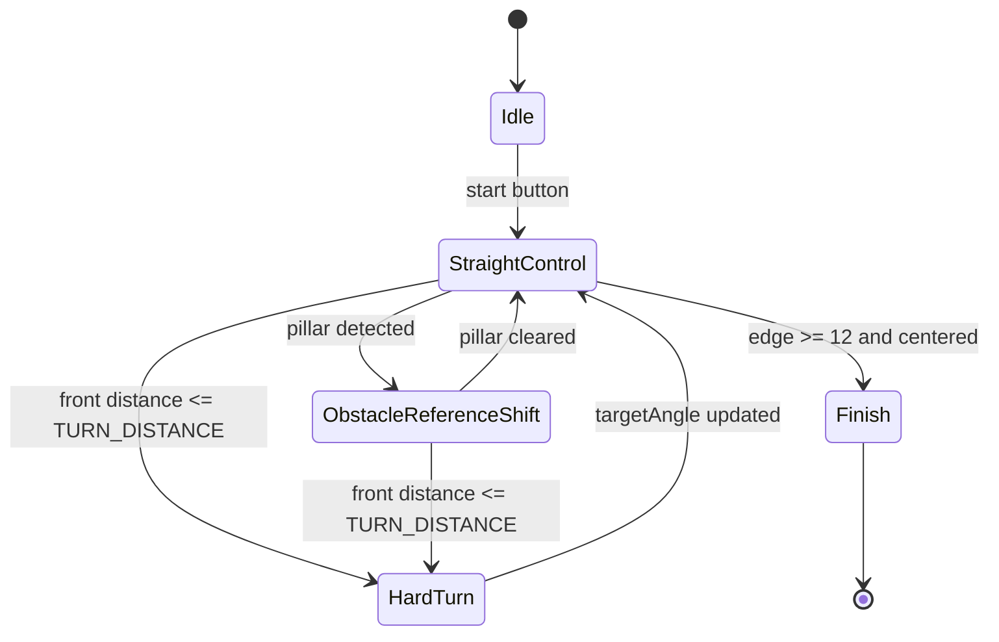

# Software Flow And State Logic

The low-level software in `src/src/main.cpp` is small enough to describe as a simple state machine.

## Main Flow

The loop is:

1. initialize sensors and actuators;
2. wait for the start button;
3. store the current yaw as `targetAngle`;
4. read yaw and distance sensors;
5. choose between straight control and hard-turn mode;
6. update steering;
7. stop after the required edge count.

If the camera layer is active, it fits into that flow by shifting the driving reference before the straight-control steering calculation.

## Startup Sequence

During startup the controller:

1. starts serial and I2C;
2. sets up lights, motor pins, and the start button;
3. brings the ToF shutdown pins low;
4. initializes front, left, and right distance sensors;
5. initializes the compass;
6. starts PWM and attaches the servo.

If any critical sensor fails, the robot stays halted.

## Practical States

### Idle

Conditions:

- `started == false`

Behavior:

- motor stopped;
- waiting for button press.

### Straight Control

Conditions:

- `started == true`
- front sensor above the turn threshold

Behavior:

- drive forward;
- calculate heading error;
- apply side-distance correction;
- apply damping;
- write constrained servo angle.

If camera guidance is active, this is the state where the reference line can shift left or right.

### Hard Turn

Conditions:

- `frontDistance.distance <= TURN_DISTANCE`

Behavior:

- choose turn direction;
- steer fully left or fully right;
- stay in the turn loop until space opens again;
- rotate the heading reference by `90` degrees;
- increment `edge`.

### Finish

Conditions:

- `edge >= 12`
- `abs(angle) < 3`

Behavior:

- stop the motor;
- center the steering;
- return to the idle state without restarting the controller.

## Obstacle-Layer Extension

The clean way to add obstacle logic is not to build a second steering controller. It is to insert one extra step inside straight control:

- detect the pillar color;
- choose the legal side;
- shift the reference line;
- let the same low-level controller execute it.

The rule itself stays simple:

- `red pillar -> pass right`
- `green pillar -> pass left`

## State Diagram

For the clearest single-picture judge view, see [Software State Machine And Obstacle Flow](software_state_machine_and_obstacle_flow.md).



## Text Flowchart

```text
Power on
  -> initialize sensors and actuators
  -> wait for button
  -> read yaw and distances
  -> optional camera layer shifts reference line
  -> front blocked?
      yes -> hard turn and update targetAngle
      no  -> heading + distance correction
  -> write servo
  -> finished?
      yes -> stop and wait for the next start
      no  -> continue
```
