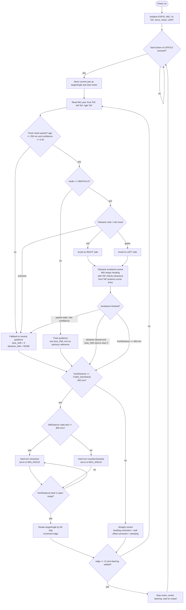

# Software State Machine And Obstacle Flow

This page is the single judge-facing software picture for the robot. It combines the current `ESP32` runtime, the `Raspberry Pi Zero` obstacle-decision layer, and the exact fallback behavior.

## One-Picture Flowchart

## State Summary

| State | Main inputs | Main output | Exit condition |
| --- | --- | --- | --- |
| `Idle` | start button | motor off, steering centered | button press |
| `StraightControl` | yaw, front ToF, side ToF | heading hold plus wall-offset correction | obstacle packet or corner trigger |
| `ObstacleDecision` | camera result, `mode`, `obstacle_side`, `confidence`, `age_ms` | choose legal passing side | enter `AvoidLeft`, `AvoidRight`, or fallback |
| `AvoidLeft` | camera command + IMU + ToF | shift reference left while maintaining clearance | obstacle cleared, stale packet, or corner trigger |
| `AvoidRight` | camera command + IMU + ToF | shift reference right while maintaining clearance | obstacle cleared, stale packet, or corner trigger |
| `HardTurn` | front ToF, left ToF, yaw | full-lock corner turn and `targetAngle` update | open space detected ahead |
| `Finish` | `edge`, steering error | safe stop | controller waits for next start |

## Obstacle Obedience Logic

### 1. How left/right is decided

- `Raspberry Pi Zero` classifies the obstacle and sends `VISION,<mode>,<lane_shift_mm>,<obstacle_side>,<confidence>,<age_ms>`.
- Rule used by the software architecture:
  - `red pillar -> pass right`
  - `green pillar -> pass left`
- The `ESP32` does not re-classify color. It checks whether the command is fresh and trustworthy, then executes the requested side shift inside the normal controller.

### 2. Which sensors participate

- camera: obstacle color and preferred side;
- `BNO085`: keeps the robot aligned with `targetAngle`;
- front `VL53L1X`: prevents late entry into a wall or corner and can interrupt avoidance for a hard turn;
- left and right `VL53L1CD`: maintain local clearance during the offset maneuver;
- start button: arms the whole state machine.

### 3. Fallback behavior

If obstacle guidance is missing, stale, or weak, the controller falls back immediately to neutral guidance:

- `age_ms > 250` -> ignore obstacle guidance;
- `confidence < 0.40` -> treat obstacle guidance as advisory only;
- `mode == NEUTRAL` or `obstacle_side == NONE` -> return to standard straight control.

In fallback mode the robot still has local protection from:

- front-wall turn trigger: `frontDistance <= 400 mm`;
- IMU heading correction;
- side-distance correction.

### 4. When avoidance ends

Obstacle avoidance is considered complete when one of these becomes true:

1. the obstacle is cleared and the perception layer returns the lane shift toward neutral;
2. the packet becomes stale or low-confidence, so the controller drops back to neutral guidance;
3. the front sensor reaches the normal corner-turn threshold, so the robot leaves avoidance and executes the sector turn.

## Current-Code Mapping

The low-level runtime already visible in [main.cpp](../../src/src/main.cpp) implements:

- `Idle`
- `StraightControl`
- `HardTurn`
- `Finish`

The obstacle layer shown here is the documented full-system extension defined by:

- [Vision Interface](vision_interface.md)
- [Pi Zero Runtime](../../src/pi-zero/README.md)
- [Pi Zero Protocol](../../src/pi-zero/protocol.md)

This is why the picture above shows both the current embedded controller and the intended obstacle-decision layer in one place.
