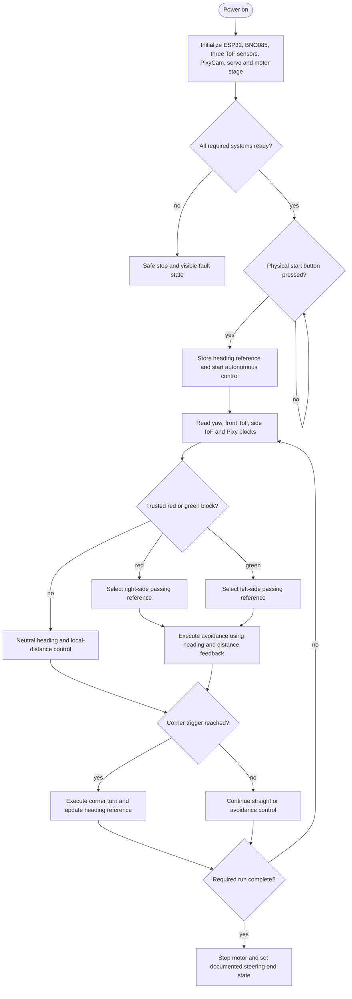

# Hardware V2 State Machine And Obstacle Flow

## Status

The previous Raspberry Pi/UART state-machine text was archived at [`archivo/hardware-v1-esp32-250rpm/docs/code/software_state_machine_and_obstacle_flow.md`](../../archivo/hardware-v1-esp32-250rpm/docs/code/software_state_machine_and_obstacle_flow.md).

This page describes the confirmed Hardware V2 control concept. Exact transition thresholds remain `TBD` until PixyCam SPI and the final motor are implemented and measured.

## Target flow

## Logical states

| State | Main inputs | Main action | Exit condition still to document |
|---|---|---|---|
| `Init` | startup results | initialize buses, sensors, camera and outputs | all required systems ready or fault |
| `Idle` | start button | motor stopped | physical start command |
| `StraightControl` | yaw and ToF | heading and local-distance correction | trusted obstacle or corner condition |
| `ObstacleDecision` | Pixy signature, position, size and age | select legal passing side or reject result | valid decision, no block or fault |
| `AvoidLeft` / `AvoidRight` | camera reference, yaw and ToF | maintain an offset path with local protection | obstacle cleared, stale data or corner condition |
| `HardTurn` | front/side ToF and yaw | execute corner and update heading target | open-space / heading exit condition |
| `Finish` | lap/sector count and alignment | stop safely | power cycle or documented restart action |
| `Fault` | initialization or runtime fault | stop or restricted fallback | documented recovery condition |

## Obstacle rule

- red pillar → pass on the right side;
- green pillar → pass on the left side.

PixyCam classifies the colour signature. ESP32 validates the block and creates the steering reference. PixyCam does not directly control the servo.

## Data-validity requirements

The final code must define and publish:

- accepted signature numbers;
- minimum block size;
- rule for choosing among multiple blocks;
- maximum age of the last valid block;
- how ambiguous red/green detections are handled;
- when avoidance begins and ends;
- how camera failure changes the state;
- how a front-distance corner condition overrides obstacle guidance.

## Current Hardware V1 code mapping

The current published ESP32 firmware already contains low-level elements such as startup, heading/distance control, corner execution and run completion. It still uses legacy UART vision code and does not implement the PixyCam SPI path.

The current code also differs from older documentation in several details:

- the start button is defined as `GPIO14` in code, while old text used `GPIO13`;
- the legacy UART is opened at `9600`, while old text also claimed `115200`;
- corner entry is calculated dynamically rather than by one fixed `400 mm` constant;
- the finish path currently calls `ESP.restart()` after stopping instead of clearly returning to an idle state.

These differences must be resolved in firmware and then copied exactly into the final state diagram. This page does not choose values that the team has not yet implemented and tested.
