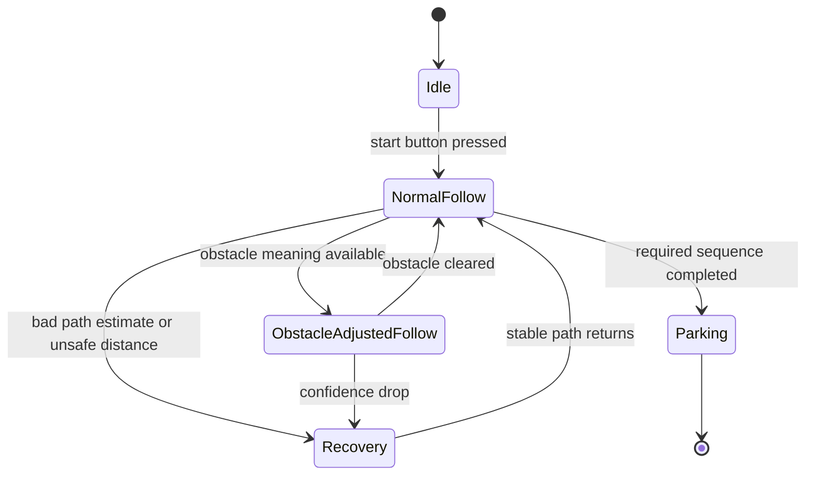

# Software Architecture

## Scope and Evidence

In this document, we combine two levels of evidence:

- the implemented low-level controller that is visible in `src/src/main.cpp` and the libraries under `src/lib/`;
- the final two-board system architecture described across the repository, where `Raspberry Pi Zero` is responsible for camera perception and `ESP32` for real-time control.

Our repository currently contains the `ESP32` control code in detail. We document the `Raspberry Pi Zero` side architecturally, but its source files are not included in this repository. For that reason, we use real file and variable names for the `ESP32` side and explain the `Pi Zero` role at module level.

## Evidence Map

To keep the documentation honest and reproducible, we separate what is already visible in code from what is currently documented at interface level.

| Area | Evidence level | Where the evidence exists |
| --- | --- | --- |
| ESP32 startup and control loop | implemented in code | `src/src/main.cpp` |
| motor actuation | implemented in code | `src/lib/Engine/Engine.h` |
| IMU yaw reading | implemented in code | `src/lib/IMU/Compass.h` |
| dual-ToF initialization and reading | implemented in code | `src/lib/Lidar/Lidar.cpp` |
| filtering / dominant cluster estimate | implemented in code | `src/lib/utils/Sorting.cpp` |
| Pi Zero high-level perception role | documented architecture | this file and `docs/code/message_protocol.md` |
| obstacle color interpretation | documented architecture | this file and `docs/code/navigation_strategy_improved.md` |
| parking transition | documented architecture | this file and `docs/code/software_flow_and_state_logic.md` |

## Board Roles

### Raspberry Pi Zero

In our final robot, the `Raspberry Pi Zero`:

- reads the camera;
- analyses the visible lane and obstacle region;
- identifies obstacle color;
- estimates the target driving path;
- sends a simplified navigation result to the `ESP32`.

We used this board because:

- camera processing is more computationally flexible on the `Pi Zero`;
- it is better suited for image-based perception than direct actuator timing;
- keeping vision on a separate board prevents camera workload from disturbing steering timing.

### ESP32

In our implemented controller, the `ESP32`:

- reads local sensors through `read_lidar_data()`;
- reads heading through `robotCompass.getYaw()`;
- computes the control error and PD correction in `loop()`;
- drives the motor through the `Engine` class;
- writes the steering angle through `Servo myservo`.

The visible implementation files are:

- `src/src/main.cpp`
- `src/lib/Lidar/Lidar.cpp`
- `src/lib/Lidar/Lidar.h`
- `src/lib/Engine/Engine.h`
- `src/lib/IMU/Compass.h`
- `src/lib/utils/Sorting.cpp`
- `src/lib/utils/Sorting.h`

We used this board because:

- it provides predictable actuator control timing;
- it interfaces directly with servo, motor driver, IMU, and ToF sensors;
- it is a better place for the fast repeatable control loop.

## Why We Chose a Split Architecture

We did not want one controller to do both image processing and low-level actuation. Those tasks have different engineering requirements.

- Vision needs flexible processing and can tolerate slightly less deterministic timing.
- Steering and motor control need short, repeatable loop timing.

If camera processing blocks the same controller that drives the servo, steering quality becomes less predictable. The split architecture reduces that risk and makes debugging easier because perception and actuation can be evaluated separately.

## Main Software Modules

### 1. Perception module on the Pi Zero

In our final architecture, this module interprets the camera image and produces compact navigation information:

- line position or target path estimate;
- obstacle presence;
- obstacle color;
- confidence or validity information.

We already describe this boundary in `docs/code/message_protocol.md` as a proposed message contract between `Pi Zero` and `ESP32`.

### 2. Sensor acquisition module on the ESP32

Real code:

- `read_lidar_data()` in `src/lib/Lidar/Lidar.cpp`
- `robotCompass.getYaw()` from `src/lib/IMU/Compass.h`

Important variables:

- `SENSOR_DISTANCE[2]`
- `newHeading`
- `angle`
- `rad_angle`

In our architecture, this layer converts raw sensor values into the geometric quantities used by the controller.

### 3. Track estimation and filtering

Real code:

- `track_buffer[buffer_size]`
- `track_tracker`
- `get_dominant_cluster_average(buffer_size, track_buffer, 20)`

We do not use a single raw width reading directly on the `ESP32`. Instead, we store repeated corridor-width estimates in `track_buffer` and use `get_dominant_cluster_average()` from `src/lib/utils/Sorting.cpp` to select the dominant stable cluster. This reduces the effect of temporary sensor noise or invalid zones.

### 4. Control module

Real code in `src/src/main.cpp`:

- `last_error`
- `last_time`
- `Kp`
- `Kd`
- `error`
- `derivative_delta`
- `turning_angle`
- `final_servo_angle`

In our control loop, this module computes the steering output from the measured tracking error.

### 5. Actuation module

Real code:

- `Engine engine`
- `engine.begin()`
- `engine.drive(255)`
- `engine.stop()`
- `myservo.attach(33)`
- `myservo.write(final_servo_angle)`

This layer converts our controller outputs into real motor and servo commands.

## Data Flow from Sensors to Steering and Motor

The actual low-level data path that we can show from the repository is:

1. `setup_lidar_sensors()` initializes the two distance sensors.
2. `read_lidar_data()` updates `SENSOR_DISTANCE[0]` and `SENSOR_DISTANCE[1]`.
3. `robotCompass.getYaw()` returns the current yaw angle.
4. `targetAngle - newHeading` gives the heading deviation.
5. The code compensates geometry with `cos(rad_angle)`.
6. Corridor width is estimated as `width = (SENSOR_DISTANCE[0] + SENSOR_DISTANCE[1]) * cos(rad_angle)`.
7. Stable width is filtered with `get_dominant_cluster_average(...)` into `track`.
8. Current lateral position is estimated as `distance = SENSOR_DISTANCE[0] * cos(rad_angle)`.
9. Control error is computed as `error = track / 2 - distance`.
10. Steering command is computed from `Kp * error + Kd * derivative_delta`.
11. Servo output is limited with `constrain(...)` and sent using `myservo.write(final_servo_angle)`.
12. Drive power is set by `engine.drive(255)` while the robot is running.

In the final full architecture, the `Pi Zero` provides the high-level target path and obstacle meaning, while the `ESP32` still executes the final control and actuation step.

## Software State View

The control structure is easier to judge as a state-based system than as one long loop.

This state view is important because it shows that the robot behavior is not random branching. The same controller remains active, but the active target and safety policy change by state.

## Why This State Structure Was Chosen

We used this state structure because different parts of the challenge require different priorities:

- in `NormalFollow`, the priority is stable lane-centering and repeatable lap driving;
- in `ObstacleAdjustedFollow`, the priority is obeying obstacle meaning while preserving smooth control;
- in `Recovery`, the priority is preventing unstable continuation when the robot is no longer in a trustworthy state;
- in `Parking`, the priority is precise final positioning rather than lap-speed efficiency.

This is important for the rubric because it shows not only that states exist, but why each state exists and what engineering responsibility it has.

## Startup and Controller Ownership

The implemented startup logic in `src/src/main.cpp` is intentionally simple:

- `setup()` initializes I2C, serial, lights, motor pins, lidar, IMU, and servo;
- button input on `BUTTON_PIN` toggles the `started` flag;
- when not started, `engine.stop()` keeps the robot inactive;
- when started, `targetAngle` is initialized from the current heading and the loop begins closed-loop control.

This means we leave the safety-critical "run or stop" decision to the `ESP32` at the actuator layer.

## Edge Cases And Software Responsibilities

The final software architecture was designed to stay understandable under imperfect conditions, not only in ideal laps.

| Edge case | Main risk | Architecture response |
| --- | --- | --- |
| camera result missing or delayed | stale path command | `ESP32` keeps authority over safe stop / safe output |
| ToF reading unstable | false short-range geometry | filtering and cautious fallback behavior |
| heading support becomes unreliable | false correction bias | controller can reduce dependence on IMU support |
| obstacle meaning uncertain | rapid left-right switching | keep target logic conservative instead of snapping states |
| approach to parking endgame | lap-speed behavior no longer appropriate | separate parking-oriented state responsibility |

This table strengthens reproducibility because another team can see how the system should behave when conditions are not ideal.

## Why This Architecture Fits the Robot

We chose this architecture because it matches the physical robot:

- the front camera is useful for high-level scene understanding;
- the `ESP32` is physically close to the motor, servo, IMU, and ToF sensors;
- the control loop benefits from deterministic timing;
- the separation makes testing easier because we can debug perception and motion separately.

## Important Limitation

Our current repository shows the low-level `ESP32` controller clearly, but it does not yet include the `Pi Zero` source code that would implement camera-based line detection, obstacle color classification, and parking transitions. In judging terms, we should describe that honestly as:

- implemented low-level controller and sensor fusion are present in code;
- final high-level perception architecture is documented and justified at system level.

This honesty is intentional. We prefer a repository that is explicit about evidence boundaries over one that appears more complete than it really is.

## Why The Current Repository Is Still Reproducible

Even with the current limitation, another team can still reproduce several important layers reliably from this repository:

- the complete ESP32 wiring and pin ownership;
- the ToF startup sequence and address assignment;
- the IMU yaw-reading method;
- the corridor-centering controller and steering equation;
- the servo and motor actuation path;
- the intended message boundary between perception and control.

The missing part is not the whole robot. The missing part is the Pi-side perception implementation. We document that boundary explicitly so the repository does not overclaim what is present.
