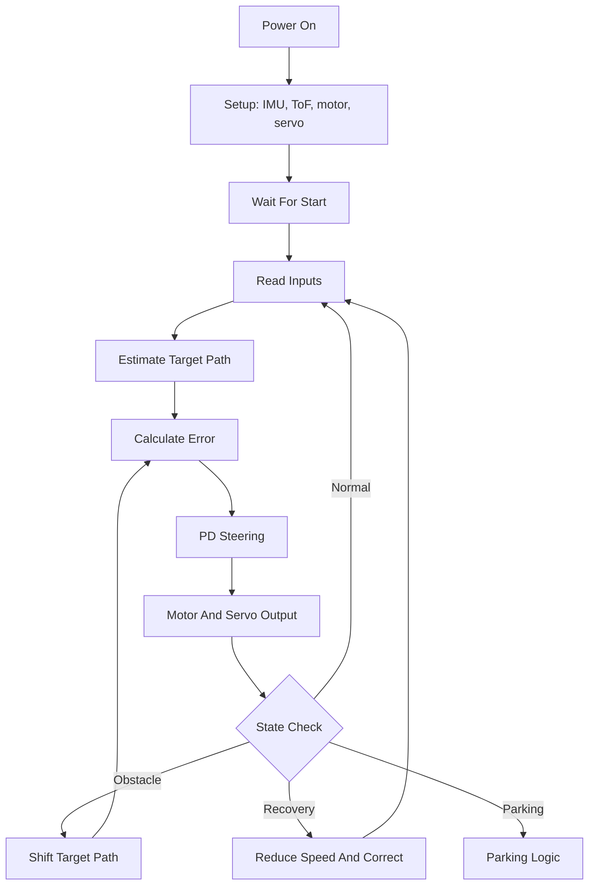
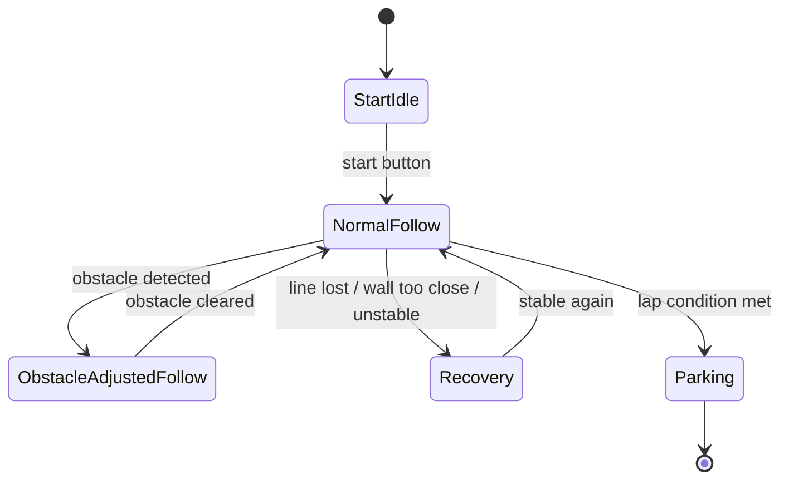

# Software Flow and State Logic

## Scope

In this document, we explain the full intended software pipeline and also mark which parts are already visible in our repository code.

- Implemented in code now: `ESP32` startup, sensor readout, width estimation, center error calculation, proportional steering, servo and motor output.
- Documented as final system behavior: camera input on `Pi Zero`, obstacle-color path shift, recovery logic, parking transition.

## Main Software Pipeline

We describe our full software pipeline like this:

1. start and initialize boards and sensors;
2. wait for run command;
3. read environment input;
4. estimate current target path;
5. calculate line or path error;
6. apply PD steering control;
7. set speed output;
8. check for obstacle, correction, or parking transitions;
9. repeat until parking sequence begins.

## Startup Flow

Our current `ESP32` startup sequence in `src/src/main.cpp` is:

1. `Wire.begin()` and `Wire.setClock(400000)`
2. `Serial.begin(9600)`
3. button setup with `pinMode(BUTTON_PIN, INPUT_PULLUP)`
4. motor pin setup
5. `setup_lidar_sensors()`
6. `engine.begin()`
7. `robotCompass.begin()`
8. `myservo.attach(33)`
9. wait until button press toggles `started`

When `started` is false:

- `engine.stop()` is called;
- the loop exits early;
- the robot stays in a safe idle state.

When the run button is pressed:

- `started = !started`
- `targetAngle = newHeading`

This stores our current heading as the reference direction.

## Input Sources

### Pi Zero inputs in the final architecture

- camera image;
- line position estimate;
- obstacle color;
- obstacle position;
- parking trigger after required laps.

### ESP32 inputs in the implemented code

- `SENSOR_DISTANCE[0]`
- `SENSOR_DISTANCE[1]`
- `newHeading = robotCompass.getYaw()`
- `BUTTON_STATE`

## How the Current Error Is Calculated

The actual error calculation visible in our repository is:

```text
angle = targetAngle - newHeading
rad_angle = radians(angle)
width = (SENSOR_DISTANCE[0] + SENSOR_DISTANCE[1]) * cos(rad_angle)
track = get_dominant_cluster_average(buffer_size, track_buffer, 20)
distance = SENSOR_DISTANCE[0] * cos(rad_angle)
error = track / 2 - distance
```

Meaning:

- `track / 2` is the estimated target center of the corridor;
- `distance` is the robot's current lateral position relative to one side;
- `error` is the difference between desired center and measured position.

In the final full system, this same idea generalizes to visual path following:

- normal mode uses the normal center line;
- obstacle mode shifts the target line left or right;
- parking mode changes the target behavior completely.

## How Steering and Speed Output Are Produced

Current steering output:

```text
derivative_delta = (error - last_error) / delta_t
turning_angle = STRAIGHT_ANGLE + Kp * error + Kd * derivative_delta
final_servo_angle = constrain(turning_angle, STRAIGHT_ANGLE - 45, STRAIGHT_ANGLE + 45)
myservo.write(final_servo_angle)
```

Current speed output:

- while running, the present code uses `engine.drive(255)`;
- while stopped or idle, it uses `engine.stop()`.

In the full architecture, speed would also depend on obstacle proximity, recovery state, and parking phase.

## Obstacle Logic as Part of the Main Flow

We describe the intended obstacle sequence like this:

1. `Pi Zero` detects an object in the drivable corridor.
2. Vision classifies the obstacle as red or green.
3. The selected target line is shifted to the legally correct side.
4. The same PD steering controller follows that shifted target.
5. After passing the obstacle, the target returns to the normal line.

This is important because the controller itself does not need to be replaced. Only the reference path changes.

## Behavior States

Even without a formal state-machine class, we can describe our software through these logical states.

### 1. Start / Idle

Conditions:

- system initialized;
- waiting for user start command.

Visible implementation:

- `started == false`
- `engine.stop()`

### 2. Normal Follow

Conditions:

- no relevant obstacle;
- line or corridor can be estimated normally.

Behavior:

- follow the normal target line;
- keep steering correction continuous;
- keep forward speed stable.

### 3. Obstacle-Adjusted Follow

Conditions:

- obstacle detected and classified;
- passing side is known.

Behavior:

- shift the target path left or right;
- keep using the same steering controller;
- return to normal target when the obstacle is cleared.

### 4. Correction / Recovery

Conditions:

- line confidence drops;
- wall distance becomes unsafe;
- steering saturates for too long;
- robot position becomes inconsistent.

Behavior:

- reduce speed or stop;
- apply a short corrective steering action;
- recover a valid path estimate before returning to normal follow.

Our current code already contains a primitive version of protection through output limiting:

- `constrain(turning_angle, STRAIGHT_ANGLE - 45, STRAIGHT_ANGLE + 45)`

### 5. Parking

Conditions:

- required driving sequence is completed;
- parking trigger is active.

Behavior:

- switch from lap-following target to final parking approach;
- reduce speed;
- prioritize final alignment over lap speed.

We include parking in the final architecture description, but we do not yet have an explicit parking implementation in the repository code.

## Edge Cases

### Obstacle detection is uncertain

Recommended behavior:

- keep the normal target line until confidence is good enough;
- avoid switching left-right rapidly on weak detections.

### Line or corridor estimate is lost

Recommended behavior:

- reduce speed;
- hold the last stable steering direction briefly;
- fall back to recovery logic if the estimate does not return quickly.

### Robot is too close to a wall

Recommended behavior:

- temporarily prioritize collision avoidance;
- shift target away from the wall;
- if needed, reduce speed before applying a stronger correction.

### Steering correction becomes too large

Current code response:

- servo output is clamped by `constrain(...)`.

Engineering meaning:

- this avoids commanding unrealistic angles;
- it also signals that the robot is outside its comfortable control region.

### Just before parking

Recommended behavior:

- stop treating the situation like a normal lap;
- lower speed;
- reduce aggressive corrections;
- prioritize correct final positioning.

## Text Flowchart

```text
Power on
  -> setup sensors and actuators
  -> wait for start button
  -> read camera / ToF / IMU inputs
  -> estimate normal or obstacle-shifted target path
  -> calculate error
  -> PD steering calculation
  -> send servo and motor output
  -> check obstacle / recovery / parking conditions
  -> repeat
```

## Mermaid Flowchart



## Mermaid State Diagram



## Why This State Logic Matters

We do not need a complicated software framework to have state logic. What matters for judging is that our behavior is explainable:

- what input is read;
- what target is chosen;
- how error becomes steering;
- when the robot changes behavior;
- how it handles non-ideal situations.

This state-based explanation makes the software easier to justify, test, and reproduce.
