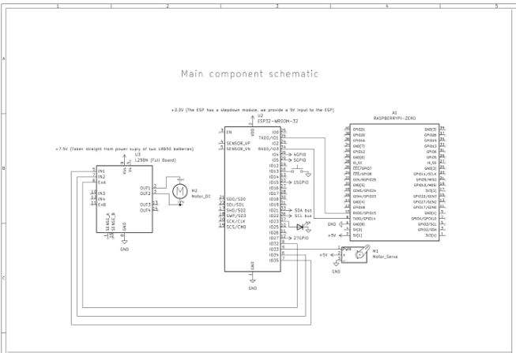
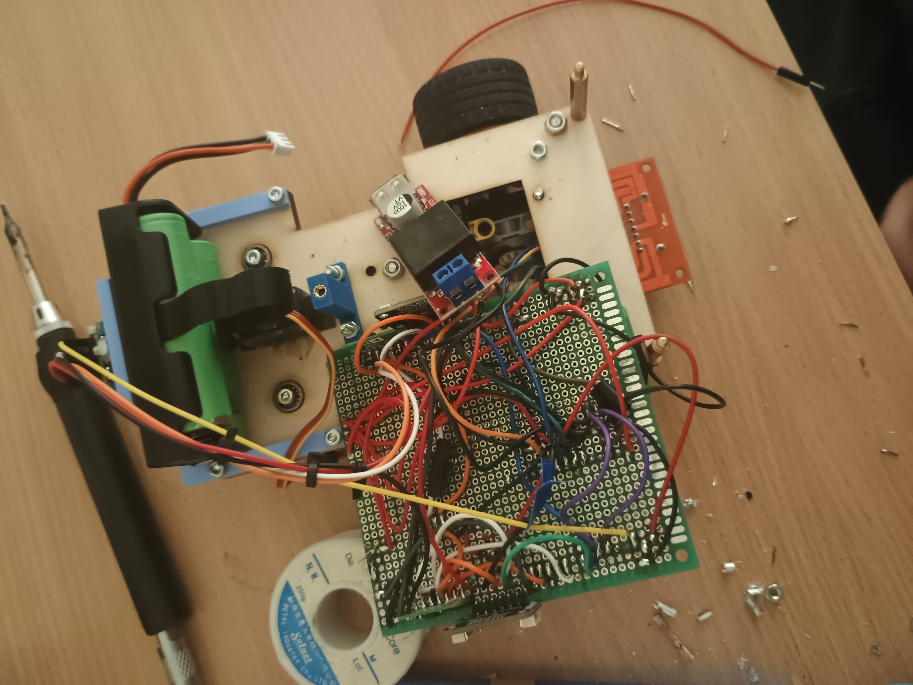

# Electromechanical Schemes

This folder stores the robot's electrical and mechanical schematic material.

## Main Files

- [Wiring Overview](wiring_overview.md)
- [Custom Electronics Schematic PDF](Wro_customPCBs.pdf)
- [Custom Electronics Schematic Description](custom_pcb_description.md)

## Schematic Preview

The images below give a quick visual preview of the main schematic so a reader can understand the structure before opening the full PDF.

### Main System Page

This page shows the main relationship between the `ESP32`, `Raspberry Pi Zero`, `L298N`, steering servo, and the DC drive motor.

### Sensor Bus Detail

This view shows the `BNO085` and the `VL53L4CD` sensor bus structure. In the published `ESP32` code, the visible sensing layout is `front`, `left`, and `right` distance sensing together with yaw feedback.

### Power Regulator Reference

This reference image shows the step-down converter used to reduce the `2x 18650` battery voltage to the regulated `5 V` logic supply for the computing and sensing electronics.

### As-Built Perfboard Wiring

This photo shows the actual perfboard assembly used in the robot. It is useful as build evidence because it connects the clean schematic view to the physical wiring layout.

## What The Scheme Should Show

- all electronic components;
- all motors and actuators;
- power rails and regulators;
- signal connections between the `ESP32`, `Raspberry Pi Zero`, camera, `BNO085`, distance sensors, `MG90S`, and the `N20` drive system.

## How To Use It

Start with the [Wiring Overview](wiring_overview.md) for the block-level map, then open the [Custom Electronics Schematic PDF](Wro_customPCBs.pdf) and the [Custom Electronics Schematic Description](custom_pcb_description.md) for the board-to-board wiring that is documented for this robot.

## Related Documentation

- [Electronics Overview](../docs/hardware/electronics_overview.md)
- [PCB / Wiring Diagrams](../docs/hardware/pcb_wiring_diagrams.md)
- [Parts List](../docs/hardware/parts_list.md)
